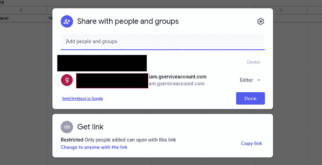
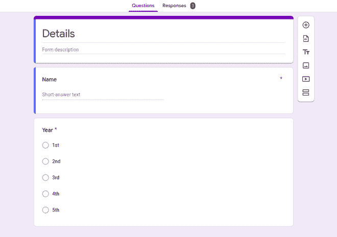
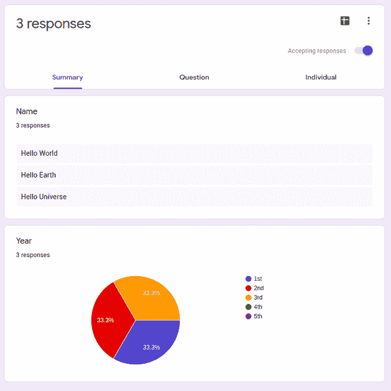
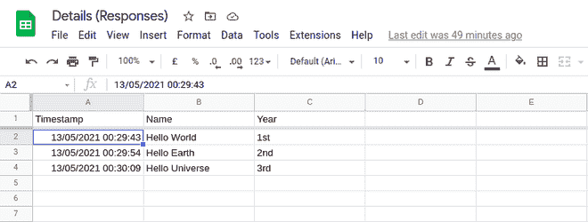

# 使用 Python 将 Google Sheets 数据存储到 SQLite 数据库中

> 原文:[https://www . geesforgeks . org/store-Google-sheets-data-in-SQLite-database-use-python/](https://www.geeksforgeeks.org/store-google-sheets-data-into-sqlite-database-using-python/)

在本文中，我们将使用 python 将 google sheets 数据存储到数据库中。第一步是启用 API 并创建凭据，所以让我们开始吧。

### **启用应用编程接口并创建凭证**

*   前往云控制台中的[市场](https://console.cloud.google.com/marketplace)。
*   点击启用应用编程接口和服务
*   然后搜索谷歌驱动应用编程接口并启用它
*   然后转到屏幕左侧导航栏上的凭据选项卡。
*   然后单击创建凭据，然后选择服务帐户密钥
*   然后通过给服务帐户命名来创建一个新的服务帐户，并将“项目”子字段下的“角色”设置为“编辑器”，并将键类型保持为 JSON，然后单击“创建”按钮。安全保存下载的 JSON。
*   完成所有这些步骤后，您的页面应该如下所示。
*   再次转到仪表板并遵循相同的步骤。这次搜索谷歌表单并启用应用编程接口。


启用应用编程接口后，让我们创建谷歌表单。

### **创建谷歌表单:**

1.  创建一个谷歌表单。这里，我们保留了一个只有两个字段的简单表单。
2.  让谷歌表单接受谷歌表单中的响应。
3.  然后在下载的 JSON 文件中查找字段 *client_email* 并复制该邮件。
4.  打开新创建的电子表格，点击共享选项，在那里输入粘贴*客户端 _ 电子邮件*。

授予访问客户端电子邮件的权限后，它应该看起来像这样。最上面的邮件是你的个人邮件，最下面的是*客户端 _ 邮件*



**谷歌表单:**



所以我们完成了设置。现在，让我们开始编码。在开始之前，让我们先了解一下流程。

1.  我们将根据表单的条目模式创建一个数据库和一个表。
2.  通过应用编程接口连接到工作表，并获取所有行。
3.  执行插入查询，将工作表中的行数据插入数据库。

 

#### 方法:

1.  首先，我们从服务帐户 JSON 初始化凭据。
2.  然后，我们使用这些凭证对象来访问我们从谷歌表单生成的表单。
3.  一旦我们可以访问工作表，我们只需一次提取所有的行，以减少 API 调用的数量。
4.  现在，我们首先连接到数据库。这里，为了简单起见，我们使用 sqlite 数据库。您可以使用任何类型的数据库，您所需要做的就是传递连接字符串。
5.  一旦建立了连接，我们就创建表(如果它不存在的话)
6.  一旦表准备好了，我们就把提取的行传递给表。我们只需遍历获得的所有行，然后将行中的每个列值传递给数据库。

**代码:**

## 蟒蛇 3

```
# imports
import sqlite3
from sqlite3 import Error
import gspread
from oauth2client.service_account import ServiceAccountCredentials

def get_from_sheet():

    # name of the sheet
    # you should replace with the name 
    # of your sheet
    sheet_name = "Details (Responses)"
    config = { Your_API

    # should contain the service account 
    # key JSON as dict here
    }

    # use credentials to create a client to
    # interact with the Google Drive API
    scope = [
        "https://spreadsheets.google.com/feeds",
        "https://www.googleapis.com/auth/drive",
    ]

    # credential object for authenticating
    creds_obj = ServiceAccountCredentials.from_json_keyfile_dict(config, scope)

    # initializing gspread client with the
    # credentials object
    client = gspread.authorize(creds_obj)

    # Find a workbook by name and open the 
    # first sheet Make sure you use the
    # right name here.
    sheet = client.open(sheet_name).sheet1

    # returns all the data in the entire sheet
    return sheet.get_all_values()

class SQLite:

    # change this to your sqlite file path
    # if you keep then, then it will create
    # a sqlite database in your current working 
    # directory
    DB_NAME = "db.sqlite"

    def __init__(self):
        self.conn = self.create_connection()
        self._get_or_create_table()

    @classmethod
    def create_connection(cls):
        """
        create a database connection to the SQLite database specified by db_name
        :return: Connection object or None
        """
        conn = None
        try:

            # connects or creates a sqlite3 file
            conn = sqlite3.connect(cls.DB_NAME)
            return conn
        except Error as e:
            print(e)

        # returns the connection object
        return conn

    def _get_or_create_table(self):
        """Creates the table if it does not exists"""

        # sql query to create a details table
        create_table_sql = """CREATE TABLE IF NOT EXISTS details (
            timestamp varchar(20) PRIMARY KEY,
            name varchar(30) NOT NULL,
            year varchar(3) NOT NULL
        )"""
        try:

            # initializing the query cursor
            c = self.conn.cursor()

            # executes the create table query
            c.execute(create_table_sql)
        except Error as e:

            # prints the exception if any errors 
            # occurs during runtime
            print(e)

    def add_data_to_table(self, rows: list):
        """Inserts the data from sheets to the table"""

        # initializing sql cursor
        c = self.conn.cursor()

        # excluding the first row because it 
        # contains the headers
        insert_table_sql = """INSERT INTO details (timestamp, name, year) 
        VALUES (?, ?, ?);"""
        for row in rows[1:]:

            # inserts the data into the table
            # NOTE: the data needs to be in the order 
            # which the values are provided into the 
            # sql statement
            c.execute(insert_table_sql, tuple(row))

        # committing all the changes to the database
        self.conn.commit()

        # closing the connection to the database
        c.close()

if __name__ == '__main__':

    # fetches data from the sheets
    data = get_from_sheet()

    sqlite_util = SQLite()
    sqlite_util.add_data_to_table(data)
```

**输出:**


如您所见，我们现在已经成功地将数据保存在数据库中。