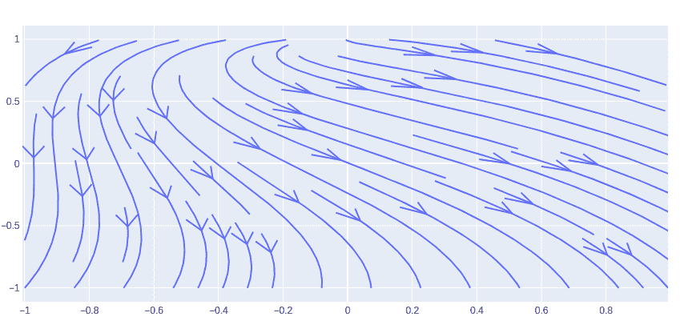
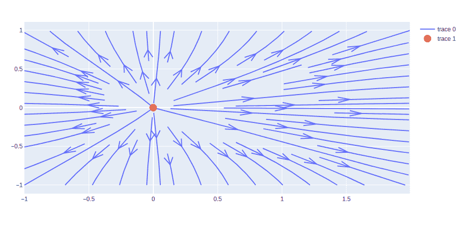

# 使用 Python 绘制流线图

> 原文:[https://www . geeksforgeeks . org/streamline-plot-in-plot-use-python/](https://www.geeksforgeeks.org/streamline-plots-in-plotly-using-python/)

Plotly 是一个 Python 库，用于设计图形，尤其是交互式图形。它可以绘制各种图形和图表，如直方图、条形图、箱线图、展开图等。它主要用于数据分析以及财务分析。plotly 是一个交互式可视化库。

## 情节中的流线图

在图中，流线图基于二维矢量场的表示，该矢量场被解释为速度场，由与速度场相切的闭合曲线组成。精简是获取数据最快、效率更高的技术。确定流线时，速度值是内插的。流线在 x-y 域的边界上初始化。

> **语法:**create _ 流线(x，y，u，v，密度=1，角度=0.3490658503988659，arrow_scale=0.09)
> 
> **参数:**
> 
> **x:** 一维、均匀间隔的列表或数组
> 
> **y:** 一维、均匀间隔的列表或数组
> 
> **u:** 二维数组
> 
> **v:** 二维数组
> 
> **密度:**控制图中流线的密度。这将乘以 30，类似于 matplotlib 等其他可用的流线函数。默认值= 1
> 
> **角度:**箭头角度。默认值= pi/9
> 
> **箭头 _ 缩放:**值缩放箭头长度默认值= .09

**示例:**

## 蟒蛇 3

```
import plotly.figure_factory as ff
import numpy as np

x = np.linspace(-1, 1, 10)
y = np.linspace(-1, 1, 10)
Y, X = np.meshgrid(x, y)
u = 1 - X**2 + Y
v = -1 + X - Y**2

# Create streamline figure
fig = ff.create_streamline(x, y, u, v, arrow_scale=.1)
fig.show()
```

**输出:**



## 绘制源点

可以使用 graph_objects 类的散点图()方法绘制源点。在这种情况下，流线图和标记在散点图中的位置以这样一种方式调整，似乎所有的流都来自特定的源。

**示例:**

## 蟒蛇 3

```
import plotly.figure_factory as ff
import plotly.graph_objects as go
import numpy as np

x = np.linspace(-1, 2, 50)
y = np.linspace(-1, 1, 50)
Y, X = np.meshgrid(x, y)
u = np.cos(X)*Y
v = np.cos(y)*X

# Source for x and y coordinate
# of scatter plot
X, Y = 0, 0

# Create streamline figure
fig = ff.create_streamline(x, y, u, v, arrow_scale=.1)

fig.add_trace(go.Scatter(x=[X], y=[Y],
                          mode='markers',
                          marker_size=15,
                        ))

fig.show()
```

**输出:**

