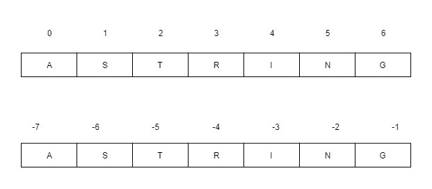

# Python 中的字符串切片

> 原文:[https://www.geeksforgeeks.org/string-slicing-in-python/](https://www.geeksforgeeks.org/string-slicing-in-python/)

**Python 切片**是从给定的[字符串](https://www.geeksforgeeks.org/python-strings/)中获取一个子字符串，从开始到结束分别进行切片。
Python 切片可以通过两种方式完成。

*   切片()构造函数
*   扩展索引

#### 切片()构造函数

`[slice()](https://www.geeksforgeeks.org/python-slice-function/)`构造器创建一个切片对象，表示由范围(开始、停止、步进)指定的一组索引。

> **语法:**
> 
> *   切片(停止)
> *   切片(开始、停止、步进)
> 
> **参数:**
> **开始:**对象切片开始的起始索引。
> **停止:**对象切片停止的结束索引。
> **步骤:**它是一个可选的参数，用于确定切片的每个索引之间的增量。
> 
> **返回类型:**返回仅包含给定范围内元素的切片对象。

**正负指数的指数追踪器:**
反向追踪字符串时会考虑负值。



**例**

```
# Python program to demonstrate
# string slicing

# String slicing 
String ='ASTRING'

# Using slice constructor
s1 = slice(3)
s2 = slice(1, 5, 2) 
s3 = slice(-1, -12, -2)

print("String slicing") 
print(String[s1]) 
print(String[s2]) 
print(String[s3])
```

**Output:**

```
String slicing
AST
SR
GITA

```

#### 扩展索引

在 Python 中，索引语法可以用来替代切片对象。这是一种在语法和执行两方面对字符串进行切片的简单方便的方法。

**语法**

```
string[start:end:step]
```

开始、结束和步骤的机制与`slice()`构造器相同。

**例**

```
# Python program to demonstrate
# string slicing

# String slicing 
String ='ASTRING'

# Using indexing sequence
print(String[:3])
print(String[1:5:2])
print(String[-1:-12:-2])

# Prints string in reverse 
print("\nReverse String")
print(String[::-1])
```

**Output:**

```
AST
SR
GITA

Reverse String
GNIRTSA

```

**注意:**想了解更多琴弦[点击这里](https://www.geeksforgeeks.org/python-strings/)。