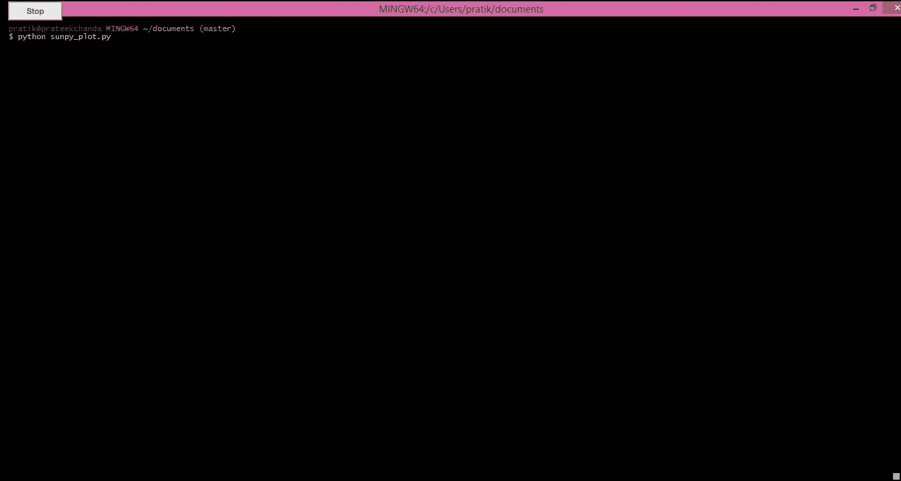

# 太阳|用 Python 绘制太阳图像

> 原文:[https://www . geesforgeks . org/sunpy-标绘-太阳-图像-python/](https://www.geeksforgeeks.org/sunpy-plotting-solar-image-python/)

SunPy 是一个使用 Python 进行太阳数据分析的包。我们将使用这个包来分析太阳数据

**安装**
在命令行上键入:

```
 pip install sunpy

```

**下载样本数据**

SunPy 包包含许多数据文件，这些文件是来自不同太阳观测站和太阳实验室的质子/电子通量的太阳数据。它们存储在模块 sunpy.data 下。
要下载样本数据，只需运行以下命令:

```
import sunpy.data
sunpy.data.download_sample_data()

```

在这个小项目中，我们将看到一种非常简单的方法来绘制样本友邦保险图像。
AIA =大气成像组件(AIA)，是太阳动力学观测站(SDO)设计用于研究太阳日冕的另一个仪器板，在日冕和过渡区的多个波长(太阳翼上方高达太阳半径的一半)同时拍摄完整的圆盘图像，分辨率为 1.5 弧秒，时间节奏为 12 秒或更好。
首先我们尝试探索。
**地图:**地图是 SunPy 中的主要数据类型，它们是空间和/或时间感知的数据阵列。2D 图像、2D 图像的时间序列、1D 光谱或 2D 光谱图都有不同类型的地图。制作数据地图通常是使用 SunPy 处理数据的第一步。

**创建地图**

SunPy 支持来自各种来源的许多不同数据产品‘开箱即用’，我们将在本教程中以 SDO 的 AIA 仪器为例。从支持的数据产品中创建地图的一般方法是使用 sunpy。Map()命令。

阳光。Map()接受文件名、文件名列表、数据数组和标题。我们可以通过以下方式测试地图:

```
import sunpy
aia = sunpy.Map(sunpy.AIA_171_IMAGE)

```

这将返回一个名为 aia 的地图。

**绘制样本太阳数据文件**

让我们从创建一个 AIA 图像的简单图开始。为了使事情变得简单，SunPy 包括几个示例文件。这些文件的名字像 sunpy。AIA_171_IMAGE 和 sunpy。RHESSI _ IMAGE。

```
from sunpy.data.sample import AIA_171_IMAGE
import sunpy.map

# We now create the Map using the sample data.
aiamap = sunpy.map.Map(AIA_171_IMAGE)

# Now we do a quick plot.
aiamap.peek()
```

**输出**


如果一切配置正确，您应该会看到一个带有红色色图的 AIA 图像，右侧有一个颜色条，还有一个标题和一些标签。
为了探测未来的太阳耀斑和太阳风暴，太阳数据绘图是一个至关重要的方面。同样重要的是要注意质子和电子通量在不同时间间隔的变化。

本文由**普拉泰克·昌达**供稿。如果你喜欢 GeeksforGeeks 并想投稿，你也可以使用[contribute.geeksforgeeks.org](http://contribute.geeksforgeeks.org)写一篇文章或者把你的文章邮寄到 contribute@geeksforgeeks.org。看到你的文章出现在极客博客主页上，帮助其他极客。

如果你发现任何不正确的地方，或者你想分享更多关于上面讨论的话题的信息，请写评论。