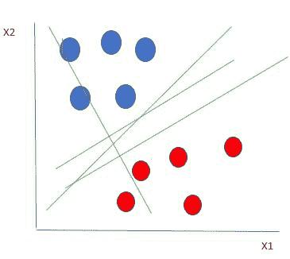
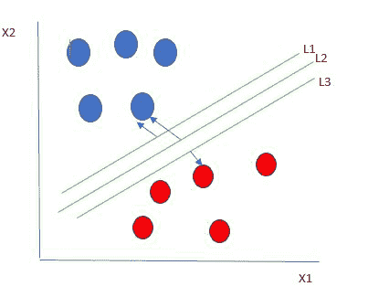
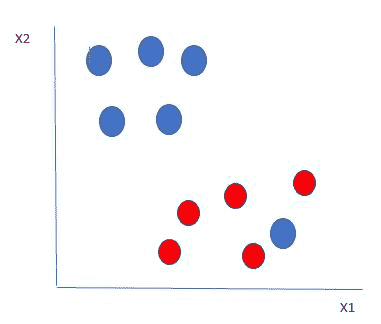
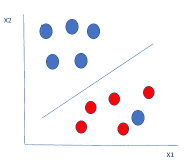
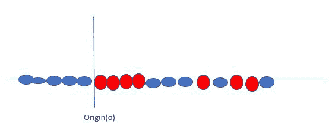
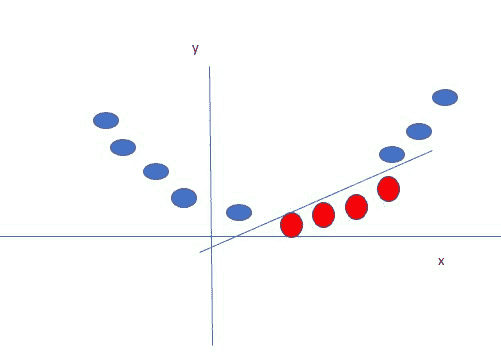

# 支持向量机算法

> 原文:[https://www . geesforgeks . org/support-vector-machine-algorithm/](https://www.geeksforgeeks.org/support-vector-machine-algorithm/)

支持向量机(SVM)是一种用于分类和回归的监督机器学习算法。虽然我们说回归问题也最适合分类。SVM 算法的目标是在 N 维空间中找到一个超平面，该超平面对数据点进行清晰的分类。超平面的维数取决于特征的数量。如果输入特征的数量是两个，那么超平面就是一条线。如果输入特征的数量是三个，则超平面变成二维平面。很难想象当特征的数量超过三个时。

让我们考虑两个自变量 x1，x2 和一个因变量，它要么是蓝色的圆，要么是红色的圆。

<center>

线性可分离数据点

</center>

从上图中可以清楚地看到，有多条线(我们这里的超平面是一条线，因为我们只考虑两个输入要素 x1、x2)分隔我们的数据点，或者在红色和蓝色圆圈之间进行分类。那么，我们如何选择分离数据点的最佳直线或最佳超平面呢？

**选择最佳超平面:**

作为最佳超平面的一个合理选择是代表两类之间最大间隔或余量的超平面。

<center></center>

所以我们选择超平面，它到每一边最近的数据点的距离最大。如果存在这样的超平面，它被称为最大边缘超平面/硬边缘。所以从上图中，我们选择了 L2。

让我们考虑如下所示的场景

<center></center>

这里我们有一个蓝色的球在红色球的边界。那么 SVM 是如何对数据进行分类的呢？很简单！红色球边界的蓝色球是蓝色球的离群值。SVM 算法具有忽略离群点的特点，可以找到使边缘最大化的最佳超平面。SVM 对异常值非常敏感。

<center>
</center>

因此，在这种类型的数据点中，SVM 所做的是，它找到最大的利润，就像以前的数据集一样，并且它在每次一个点越过利润时增加一个惩罚。所以这种情况下的边距称为软边距。当数据集有软裕度时，SVM 试图最小化*(1/裕度+∧(∑)惩罚)*。铰链损失是常用的惩罚。如果没有违规没有铰链损失。如果违规，铰链损失与违规距离成正比。

到目前为止，我们一直在谈论线性可分数据(蓝色球和红色球的组可以被直线/线性线分开)。如果数据不是线性可分的，怎么办？

<center></center>

比方说，我们的数据如上图所示。SVM 通过使用内核创建一个新变量来解决这个问题。我们在线上调用一个点 x <sub>i</sub> ，我们创建一个新的变量 y <sub>i</sub> 作为与原点 o 的距离的函数

<center>
</center>

在这种情况下，新变量 y 被创建为距原点距离的函数。创建新变量的非线性函数称为内核。

**SVM 内核:**

SVM 核是一个函数，它把低维输入空间转换成高维空间，即将不可分问题转换成可分问题。它主要用于非线性分离问题。简单地说，内核执行一些极其复杂的数据转换，然后根据定义的标签或输出找到分离数据的过程。

**SVM 优势:**

*   在高维情况下有效
*   它的内存效率很高，因为它在称为支持向量的决策函数中使用了训练点的子集
*   可以为决策函数指定不同的内核函数，并且可以指定定制内核

**python 中的 SVM 实现:**

**目的:**预测癌症是良性还是恶性。

使用关于被诊断患有癌症的患者的历史数据，使得医生能够区分恶性病例和良性病例，给出独立的属性。

数据集:[https://archive . ics . UCI . edu/ml/datasets/乳腺癌+癌症+威斯康星+(原创)](https://archive.ics.uci.edu/ml/datasets/Breast+Cancer+Wisconsin+(Original))

## 计算机编程语言

```py
# import libraries
import pandas as pd
import numpy as np
import seaborn as sns
import matplotlib.pyplot as plt
%matplotlib inline
# Importing Data file
data = pd.read_csv('bc2.csv')
dataset = pd.DataFrame(data)
dataset.columns
```

**输出:**

```py
Index(['ID', 'ClumpThickness', 'Cell Size', 'Cell Shape', 'Marginal Adhesion',
'Single Epithelial Cell Size', 'Bare Nuclei', 'Normal Nucleoli', 'Bland Chromatin', 
'Mitoses', 'Class'], dtype='object')
```

## 计算机编程语言

```py
dataset.info()
```

**输出:**

```py
<class 'pandas.core.frame.DataFrame'>
RangeIndex: 699 entries, 0 to 698
Data columns (total 11 columns):
ID                             699 non-null int64
ClumpThickness       699 non-null int64
Cell Size                    699 non-null int64
Cell Shape                 699 non-null int64
Marginal Adhesion     699 non-null int64
Single Epithelial Cell Size    699 non-null int64
Bare Nuclei                    699 non-null object
Normal Nucleoli            699 non-null int64
Bland Chromatin           699 non-null int64
Mitoses                         699 non-null int64
Class                             699 non-null int64
dtypes: int64(10), object(1)
memory usage: 60.1+ KB
```

## 计算机编程语言

```py
dataset.describe().transpose()
```

**输出:**

<figure class="table">

|   | 数数 | 意思是 | 标准 | 部 | 25% | 50% | 75% | 最大 |
| 身份证明 | Six hundred and ninety-nine | 1.071704e+06 | 617095.729819 | Sixty-one thousand six hundred and thirty-four | Eight hundred and seventy thousand six hundred and eighty-eight point five | One million one hundred and seventy-one thousand seven hundred and ten | One million two hundred and thirty-eight thousand two hundred and ninety-eight | Thirteen million four hundred and fifty-four thousand three hundred and fifty-two |
| 团块厚度 | Six hundred and ninety-nine | 4.417740e+00 | 2.815741 | One | Two | Four | Six | Ten |
| 孔度 | Six hundred and ninety-nine | 4.417740e+00 | 2.815741 | One | One | One | Five | Ten |
| 细胞形状 | Six hundred and ninety-nine | 3.134478e+00 | 3.051459 | One | One | One | Five | Ten |
| 边缘附着力 | Six hundred and ninety-nine | 2.806867e+00 | 2.971913 | One | One | One | Four | Ten |
| 单个上皮细胞大小 | Six hundred and ninety-nine | 3.216023e+00 | 2.855379 | One | Two | Two | Four | Ten |
| 正常核仁 | Six hundred and ninety-nine | 3.437768e+00 | 2.214300 | One | Two | Three | Five | Ten |
| 淡黄色染色质 | Six hundred and ninety-nine | 2.866953e+00 | 2.438364  | One | One | One | Four | Ten |
| 神话故事 | Six hundred and ninety-nine | 1.589413e+00 | 3.053634  | One | One | One | One | Ten |
| 班级 | Six hundred and ninety-nine | 2.689557e+00 | 1.715078  | Two | Two | Two | Four | Four |

</figure>

## 计算机编程语言

```py
dataset = dataset.replace('?', np.nan)
dataset = dataset.apply(lambda x: x.fillna(x.median()),axis=0)

# converting the hp column from object 'Bare Nuclei'/ string type to float
dataset['Bare Nuclei'] = dataset['Bare Nuclei'].astype('float64')  
dataset.isnull().sum()
```

**输出:**

```py
ID                                               0
ClumpThickness                         0
Cell Size                                      0
Cell Shape                                   0
Marginal Adhesion                     0
Single Epithelial Cell Size            0
Bare Nuclei                                  0
Normal Nucleoli                          0
Bland Chromatin                         0
Mitoses                                        0
Class                                             0
dtype: int64
```

## 计算机编程语言

```py
from sklearn.model_selection import train_test_split

# To calculate the accuracy score of the model
from sklearn.metrics import accuracy_score, confusion_matrix

target = dataset["Class"]
features = dataset.drop(["ID","Class"], axis=1)
X_train, X_test, y_train, y_test = train_test_split(features,target, test_size = 0.2, random_state = 10)
from sklearn.svm import SVC

# Building a Support Vector Machine on train data
svc_model = SVC(C= .1, kernel='linear', gamma= 1)
svc_model.fit(X_train, y_train)

prediction = svc_model .predict(X_test)
# check the accuracy on the training set
print(svc_model.score(X_train, y_train))
print(svc_model.score(X_test, y_test))
```