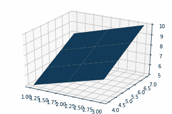
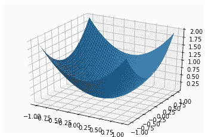
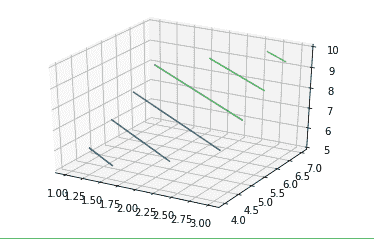
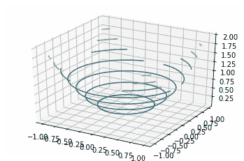

# Python 中的曲面图和等高线图

> 原文:[https://www . geesforgeks . org/surface-plot-and-等高线-plot-in-python/](https://www.geeksforgeeks.org/surface-plots-and-contour-plots-in-python/)

**[Matplotlib](https://www.geeksforgeeks.org/python-introduction-matplotlib/)** 的推出牢记在心，只有二维标绘。但是在 1.0 发布的时候，3d 实用程序是在 2d 的基础上开发的，因此，我们今天有了 3d 的数据实现！通过导入 mplot3d 工具包来启用 3d 绘图。在本文中，我们将详细讨论曲面图和等高线图。

## 表面图

曲面图是三维数据集的表示。它描述了两个自变量 X 和 Z 与一个指定因变量 Y 之间的函数关系，而不是显示单个数据点。这是等高线图的配套图。它类似于线框图，但线框的每个面都是一个填充的多边形。这有助于创建正在可视化的曲面拓扑。

**曲面图用于:**

*   可视化机器学习和深度学习中的损失函数
*   可视化强化学习中的存储或状态值函数

### 创建三维曲面图

Matplotlib 的 mpl_toolkits.mplot3d toolkit 中的 axes3d 提供了用于创建 3d 曲面图的必要功能。使用`ax.plot_surface()`功能创建曲面图。

**语法:**

```
ax.plot_surface(X, Y, Z)
```

其中 X 和 Y 是 X 和 Y 点的 2D 阵列，而 Z 是高度的 2D 阵列。

**例 1:**

```
import numpy as np
import pandas as pd
import matplotlib.pyplot as plt
from mpl_toolkits.mplot3d import Axes3D

a = np.array([1, 2, 3])
b = np.array([4, 5, 6, 7])

a, b = np.meshgrid(a, b)

# surface plot for a + b
fig = plt.figure()
axes = fig.gca(projection ='3d')
axes.plot_surface(a, b, a + b)

plt.show()
```

**输出:**



**例 2:**

```
import numpy as np
import pandas as pd
import matplotlib.pyplot as plt
from mpl_toolkits.mplot3d import Axes3D

a = np.array([1, 2, 3])
b = np.array([4, 5, 6, 7])

a, b = np.meshgrid(a, b)

# surface plot for a**2 + b**2
a = np.arange(-1, 1, 0.02)
b = a
a, b = np.meshgrid(a, b)

fig = plt.figure()
axes = fig.gca(projection ='3d')
axes.plot_surface(a, b, a**2 + b**2)

plt.show()
```



## 等高线图

等高线图也称为水平图，是一种在二维空间中进行多元分析和可视化三维图的工具。如果我们考虑 X 和 Y 作为我们想要绘制的变量，那么响应 Z 将被绘制为 X-Y 平面上的切片，因此轮廓有时被称为 Z 切片或等响应。

等高线图被广泛用于显示密度、海拔或山的高度，在气象部门也是如此。由于如此广泛的使用`matplotlib.pyplot`提供了一种方法轮廓，使我们很容易绘制轮廓图。

### 创建等高线图

当 Z = f(X，Y)即 Z 作为输入 X 和 Y 的函数而变化时，matplotlib.pyplot.contour()通常很有用。还提供了一个 contourf()，允许我们绘制填充轮廓。

**语法:**

```
matplotlib.pyplot.contour([X, Y, ] Z, [levels], **kwargs)
```

哪里，

*   **X，Y:** 与 Z 或一维数组形状相同的二维 NumPy 数组，使得`len(X)==M`和`len(Y)==N`(其中 M 和 N 是 Z 的行和列)
    **Z:** 绘制轮廓的高度值。形状为(M，N)
    **级:**确定轮廓线/区域的数量和位置。

**例 1:**

```
import numpy as np
import pandas as pd
import matplotlib.pyplot as plt
from mpl_toolkits.mplot3d import Axes3D

a = np.array([1, 2, 3])
b = np.array([4, 5, 6, 7])

a, b = np.meshgrid(a, b)

# surface plot for a + b
fig = plt.figure()
axes = fig.gca(projection ='3d')
axes.contour(a, b, a + b)

plt.show()
```

**输出:**



**例 2:**

```
import numpy as np
import pandas as pd
import matplotlib.pyplot as plt
from mpl_toolkits.mplot3d import Axes3D

a = np.array([1, 2, 3])
b = np.array([4, 5, 6, 7])

a, b = np.meshgrid(a, b)

# surface plot for a**2 + b**2
a = np.arange(-1, 1, 0.02)
b = a
a, b = np.meshgrid(a, b)

fig = plt.figure()
axes = fig.gca(projection ='3d')
axes.contour(a, b, a**2 + b**2)

plt.show()
```

**输出:**

