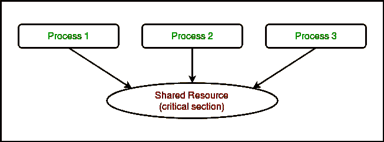
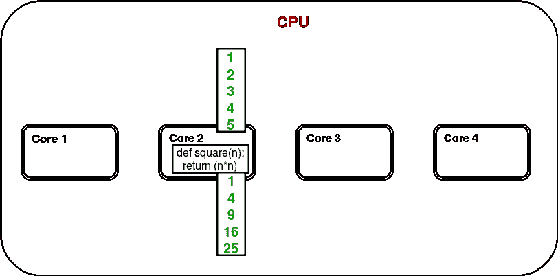
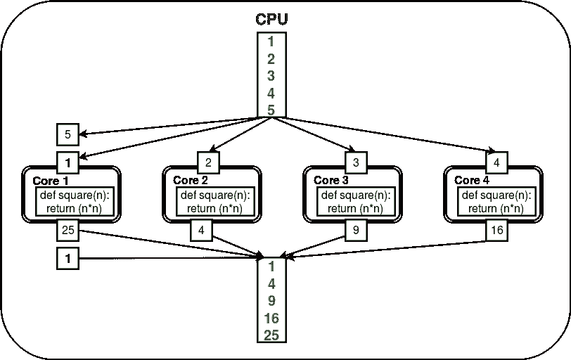

# Python 中进程的同步和池化

> 原文:[https://www . geesforgeks . org/synchronization-pooling-processes-python/](https://www.geeksforgeeks.org/synchronization-pooling-processes-python/)

先决条件–Python 中的多处理| [第 1 集](https://www.geeksforgeeks.org/multiprocessing-python-set-1/)、[第 2 集](https://www.geeksforgeeks.org/multiprocessing-python-set-2/)
本文讨论了与 Python 中的多处理相关的两个重要概念:

*   进程间的同步
*   流程集合

**进程间的同步**

进程同步被定义为一种确保两个或多个并发进程不会同时执行某个特定程序段的机制，该程序段被称为**临界段**。

> 关键部分是指程序中访问共享资源的部分。

例如，在下图中，3 个进程试图同时访问共享资源或关键部分。


对共享资源的并发访问会导致**竞争状态**。

> 当两个或多个进程可以访问共享数据并试图同时更改数据时，就会出现争用情况。因此，变量值可能是不可预测的，并且根据进程上下文切换的时间而变化。

考虑下面的程序来理解比赛状态的概念:

```
# Python program to illustrate 
# the concept of race condition
# in multiprocessing
import multiprocessing

# function to withdraw from account
def withdraw(balance):    
    for _ in range(10000):
        balance.value = balance.value - 1

# function to deposit to account
def deposit(balance):    
    for _ in range(10000):
        balance.value = balance.value + 1

def perform_transactions():

    # initial balance (in shared memory)
    balance = multiprocessing.Value('i', 100)

    # creating new processes
    p1 = multiprocessing.Process(target=withdraw, args=(balance,))
    p2 = multiprocessing.Process(target=deposit, args=(balance,))

    # starting processes
    p1.start()
    p2.start()

    # wait until processes are finished
    p1.join()
    p2.join()

    # print final balance
    print("Final balance = {}".format(balance.value))

if __name__ == "__main__":
    for _ in range(10):

        # perform same transaction process 10 times
        perform_transactions()
```

如果你运行上面的程序，你会得到一些意想不到的值，比如:

```
Final balance = 1311
Final balance = 199
Final balance = 558
Final balance = -2265
Final balance = 1371
Final balance = 1158
Final balance = -577
Final balance = -1300
Final balance = -341
Final balance = 157

```

在上述程序中，进行 10000 次取款和 10000 次存款交易，初始余额为 100。预期的最终余额是 100，但是我们在**execute _ transactions**函数的 10 次迭代中得到的是一些不同的值。

这是由于进程对共享数据**余额**的并发访问造成的。这种平衡值的不可预测性只不过是**比赛状态**。

让我们试着用下面给出的序列图更好地理解它。这些是在上面的例子中对于单个提取和存放动作可以产生的不同序列。

*   这可能是一个给出错误答案的序列，因为两个进程读取相同的值并相应地写回。

    | 第一亲代 | p2 | 平衡 |
    | **读数（平衡)**
    电流=100 |  | 一百 |
    |  | **读数（平衡)**
    电流=100 | 一百 |
    | 余额=当前-1=99
    **写（余额)** |  | 九十九 |
    |  | 余额=当前+1=101
    **写（余额)** | 一百零一 |

*   这是上述场景中需要的两种可能的序列。
    T38】九十九 T40T42T50T52

    | 第一亲代 | p2 | 平衡 |
    | **读数（平衡)**
    电流=100 |  | 一百 |
    | 余额=当前-1=99
    **写（余额)** |  | 九十九 |
    |  | **读数（平衡)**
    电流= 99 |
    | 余额=当前+1=100
    **写（余额)** T47】T48】一百 |

    T54T56】第一亲代 T58】p2T60】平衡

    |  | **读数（平衡)**T68】电流=100 | 一百 |
    |  | 余额=当前+1=101
    **写（余额)** | 一百零一 |
    | **读数（平衡)**
    电流=101 |  | 一百零一 |
    | 余额=当前-1=100
    **写（余额)** |  | 一百 |

**使用锁**

**多处理**模块提供了一个**锁**类来处理比赛情况。**锁定**是使用操作系统提供的**信号量**对象实现的。

> 信号量是一个同步对象，它控制并行编程环境中多个进程对公共资源的访问。它只是操作系统(或内核)存储中指定位置的一个值，每个进程都可以检查并更改它。根据找到的值，进程可以使用该资源，或者会发现它已经在使用中，并且必须等待一段时间才能重试。信号量可以是二进制的(0 或 1)，也可以有其他值。通常，使用信号量的进程会检查该值，如果它正在使用资源，则会更改该值以反映这一点，以便后续的信号量用户知道要等待。

**考虑下面给出的例子:**

```
# Python program to illustrate 
# the concept of locks
# in multiprocessing
import multiprocessing

# function to withdraw from account
def withdraw(balance, lock):    
    for _ in range(10000):
        lock.acquire()
        balance.value = balance.value - 1
        lock.release()

# function to deposit to account
def deposit(balance, lock):    
    for _ in range(10000):
        lock.acquire()
        balance.value = balance.value + 1
        lock.release()

def perform_transactions():

    # initial balance (in shared memory)
    balance = multiprocessing.Value('i', 100)

    # creating a lock object
    lock = multiprocessing.Lock()

    # creating new processes
    p1 = multiprocessing.Process(target=withdraw, args=(balance,lock))
    p2 = multiprocessing.Process(target=deposit, args=(balance,lock))

    # starting processes
    p1.start()
    p2.start()

    # wait until processes are finished
    p1.join()
    p2.join()

    # print final balance
    print("Final balance = {}".format(balance.value))

if __name__ == "__main__":
    for _ in range(10):

        # perform same transaction process 10 times
        perform_transactions()
```

输出:

```
Final balance = 100
Final balance = 100
Final balance = 100
Final balance = 100
Final balance = 100
Final balance = 100
Final balance = 100
Final balance = 100
Final balance = 100
Final balance = 100

```

让我们试着一步步理解上面的代码:

*   首先，使用

    ```
    lock = multiprocessing.Lock()

    ```

    创建一个**锁定**对象
*   然后，**锁定**作为目标函数参数传递:

    ```
     p1 = multiprocessing.Process(target=withdraw, args=(balance,lock))
     p2 = multiprocessing.Process(target=deposit, args=(balance,lock))

    ```

*   In the critical section of target function, we apply lock using **lock.acquire()** method. As soon as a lock is acquired, no other process can access its critical section until the lock is released using **lock.release()** method.

    ```
    lock.acquire()
    balance.value = balance.value - 1
    lock.release()

    ```

    正如你在结果中看到的，最终余额每次都是 100(这是预期的最终结果)。

**进程间的池化**

让我们考虑一个在给定列表中寻找数字平方的简单程序。

```
# Python program to find 
# squares of numbers in a given list
def square(n):
    return (n*n)

if __name__ == "__main__":

    # input list
    mylist = [1,2,3,4,5]

    # empty list to store result
    result = []

    for num in mylist:
        result.append(square(num))

    print(result)
```

输出:

```
[1, 4, 9, 16, 25]

```

这是一个计算给定列表元素平方的简单程序。在多核/多处理器系统中，考虑下图，了解上述程序的工作原理:



只有一个内核用于程序执行，其他内核很可能保持空闲。

为了利用所有内核，**多处理**模块提供了一个**池**类。**池**类代表一个工作进程池。它有允许任务以几种不同的方式卸载到工作进程的方法。考虑下图:



这里，任务由**池**对象自动在内核/进程间卸载/分配。用户不需要担心显式创建流程。

考虑下面给出的程序:

```
# Python program to understand 
# the concept of pool
import multiprocessing
import os

def square(n):
    print("Worker process id for {0}: {1}".format(n, os.getpid()))
    return (n*n)

if __name__ == "__main__":
    # input list
    mylist = [1,2,3,4,5]

    # creating a pool object
    p = multiprocessing.Pool()

    # map list to target function
    result = p.map(square, mylist)

    print(result)
```

输出:

```
Worker process id for 2: 4152
Worker process id for 1: 4151
Worker process id for 4: 4151
Worker process id for 3: 4153
Worker process id for 5: 4152
[1, 4, 9, 16, 25]

```

让我们试着一步步理解上面的代码:

*   We create a **Pool** object using:

    ```
     p = multiprocessing.Pool() 
    ```

    有几个理由支持获得对任务卸载的更多控制。这些是:

    *   **进程:**指定工作进程数。
    *   **maxtasksperchild:** 指定每个子代要分配的最大任务数。

    可以使用以下参数使池中的所有进程执行一些初始化:

    *   **初始化器:**为工作进程指定一个初始化函数。
    *   **initargs:** 要传递给初始值设定项的参数。
*   现在，为了执行某项任务，我们必须将其映射到某个函数。在上例中，我们将 **mylist** 映射到 **square** 函数。因此， **mylist** 的内容和 **square** 的定义将分布在内核中。

    ```
     result = p.map(square, mylist) 
    ```

*   一旦所有的工作进程完成了它们的任务，就会返回一个包含最终结果的列表。

本文由 [**尼基尔·库马尔**](https://www.facebook.com/nikhilksingh97) 供稿。如果你喜欢 GeeksforGeeks 并想投稿，你也可以使用[contribute.geeksforgeeks.org](http://www.contribute.geeksforgeeks.org)写一篇文章或者把你的文章邮寄到 contribute@geeksforgeeks.org。看到你的文章出现在极客博客主页上，帮助其他极客。

如果你发现任何不正确的地方，或者你想分享更多关于上面讨论的话题的信息，请写评论。