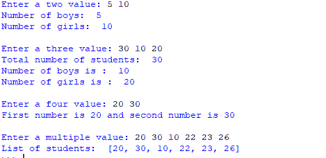
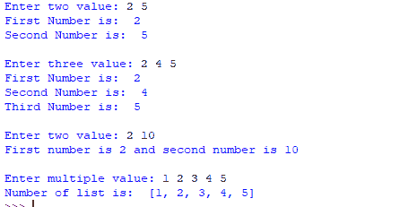

# 在 Python 中从用户处获取多个输入

> 原文:[https://www . geeksforgeeks . org/从 python 中的用户处获取多个输入/](https://www.geeksforgeeks.org/taking-multiple-inputs-from-user-in-python/)

开发人员通常希望用户在一行中输入多个值或输入。在 C++/C 中，用户可以使用 scanf 在一行中获取多个输入，但在 Python 中，用户可以通过两种方法在一行中获取多个值或输入。

*   使用拆分()方法
*   使用列表理解

**使用** [**split()**](https://www.geeksforgeeks.org/python-string-split/) **方法:**
该功能有助于获取用户的多个输入。它通过指定的分隔符中断给定的输入。如果没有提供分隔符，则任何空格都是分隔符。通常，用户使用 split()方法来拆分 Python 字符串，但是可以使用它来获取多个输入。

**语法:**

```py
input().split(separator, maxsplit)
```

**示例:**

## 蟒蛇 3

```py
# Python program showing how to
# multiple input using split

# taking two inputs at a time
x, y = input("Enter a two value: ").split()
print("Number of boys: ", x)
print("Number of girls: ", y)
print()

# taking three inputs at a time
x, y, z = input("Enter a three value: ").split()
print("Total number of students: ", x)
print("Number of boys is : ", y)
print("Number of girls is : ", z)
print()

# taking two inputs at a time
a, b = input("Enter a two value: ").split()
print("First number is {} and second number is {}".format(a, b))
print()

# taking multiple inputs at a time
# and type casting using list() function
x = list(map(int, input("Enter a multiple value: ").split()))
print("List of students: ", x)
```

**输出:**



**使用** [**列表理解**](https://www.geeksforgeeks.org/python-list-comprehension-and-slicing/) **:**
列表理解是 Python 中定义和创建列表的优雅方式。我们可以创建列表，就像一行中的数学语句一样。它也用于从用户那里获得多个输入。

**示例:**

## 蟒蛇 3

```py
# Python program showing
# how to take multiple input
# using List comprehension

# taking two input at a time
x, y = [int(x) for x in input("Enter two value: ").split()]
print("First Number is: ", x)
print("Second Number is: ", y)
print()

# taking three input at a time
x, y, z = [int(x) for x in input("Enter three value: ").split()]
print("First Number is: ", x)
print("Second Number is: ", y)
print("Third Number is: ", z)
print()

# taking two inputs at a time
x, y = [int(x) for x in input("Enter two value: ").split()]
print("First number is {} and second number is {}".format(x, y))
print()

# taking multiple inputs at a time
x = [int(x) for x in input("Enter multiple value: ").split()]
print("Number of list is: ", x)
```

**输出:**



**注意:**以上示例采用空格分隔的输入。如果我们希望采用逗号(，)分隔的输入，我们可以使用以下内容:

## 蟒蛇 3

```py
# taking multiple inputs at a time separated by comma
x = [int(x) for x in input("Enter multiple value: ").split(",")]
print("Number of list is: ", x)
```

请参见[https://ide.geeksforgeeks.org/BHf0Cxr4mx](https://ide.geeksforgeeks.org/BHf0Cxr4mx)了解样本运行。