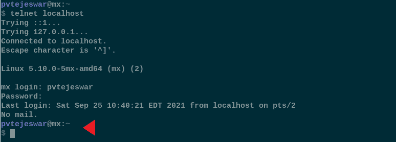

# Telnet–Python 网络编程

> 原文:[https://www . geesforgeks . org/telnet-python-network-programming/](https://www.geeksforgeeks.org/telnet-python-network-programming/)

Telnet 是一种遵循客户机-服务器模式的网络协议。它使用 TCP 作为其底层通信协议。它通常用于启动和远程命令行会话，通常在服务器上。

### **关于 telnet 的一些事实:**

*   使用传输控制协议进行数据传输。
*   双向 8 位协议
*   协议标准最初在 RFC15 中描述，并在 RFC854 和 RFC855 中进一步扩展。
*   它是在 1969 年开发的。

在 python 中， **telnetlib** 模块促进了 telnet 通信。**远程登录库**模块提供了**远程登录**类，该类实现了 RFC 854 中描述的远程登录协议。

## 远程登录类:

> **语法:**类 telnetlib。Telnet(主机=无，端口=0[，超时]):
> 
> **输入参数:**
> 
> *   **主机**(可选):取服务器名称或 ip 地址。示例:127.0.0.1，“localhost”
> *   **端口**(可选):取端口号，如未提供则使用默认端口号。
> *   **超时**(可选):可以传递一个附加参数来指定超时持续时间，否则使用全局超时持续时间。

如果创建的 Telnet 对象没有任何参数，可以通过调用 **open()** 方法建立连接。或者，用户可以传递**主机**和端口详细信息，在这种情况下，通过建立连接返回对象。

> 警告:**远程登录**类中的很多功能会提升**的 EOFError。**因此，必须进行适当的异常处理。

### 重要功能:

*   Telnet.read _ 直到(应为，超时=无)
*   Telnet.read_all()
*   Telnet.open(主机，端口=0[，超时])
*   Telnet.close()
*   Telnet.write(缓冲区)
*   telnet . interaction()

**我们已经在下面的代码中解释了函数的用法。**

## 复杂性:

当 telnet 被开发时，基本的 ASCII 文本占主导地位。当今的终端通常使用 Unicode 作为标准。此外，颜色编码和格式使屏幕上可见的文本与通过 telnet 传递的字节字符串非常不同。这在使用远程登录类的一些函数时会造成混乱。本文旨在这方面提供帮助。

## 编写 telnet 程序的步骤:

### 步骤 1:启动远程登录服务器

根据要求，您可能需要启动 telnet 服务器，也可能会提供。如果您已经有一台 telnet 服务器在运行，请继续步骤 2，否则启动服务器。

出于说明目的，将使用运行在**“本地主机”**上的远程登录服务器。

### 第二步:找到神奇的序列

请看下图:



```py
$ telnet localhost
Trying ::1...
Trying 127.0.0.1...
Connected to localhost.
Escape character is '^]'.

Linux 5.10.0-5mx-amd64 (mx) (2)

mx login: pvtejeswar
Password:
Last login: Sun Sep 26 05:24:30 EDT 2021 from localhost on pts/2
No mail.
pvtejeswar@mx:~     <=========================
$
```

你可能会期望写在红色三角形处的文本是:**“pvtejeswar @ MX:~ \ n $”**但是请记住，有很多后台处理和格式化正在进行。红三角处的文字是事实:**b " \ x1b[1；35mpvtejeswar \ x1b[0m @ \ x1b[1；36 MMX \ x1b[0m:\ x1b[1；32m ~ \ x1b[0m \ r \ r \ n \ x1b[1；3200 万美元。**现在你可能会问:好吧，我怎么知道这个神奇的绳子在我的情况下是什么样子的。下面的程序会帮助你。

## 蟒蛇 3

```py
import telnetlib
import getpass

HOST = "localhost"
user = input("USERNAME: ")
password = getpass.getpass()

tn = telnetlib.Telnet()
tn.open(HOST)

tn.read_until(b"login: ")
tn.write(user.encode("ascii")+b"\n")
tn.read_until(b"Password: ")
tn.write(password.encode("ascii")+b"\n")
tn.write(b"exit\n")
print(tn.read_all())
tn.close()
```

**输出:**

> pvtejeswar@mx:~/Desktop/telnet
> 
> $ python3 telnet_base.py
> 
> 用户名:pvtejeswar
> 
> 密码:
> 
> ' b ' \ r \首次登录:美国东部时间 2021 年 9 月 26 日 04:56:42，通过 pts/2 上的 localhost \ r \ n 无邮件。\ r \ n \ x1b[1；35mpvtejeswar \ x1b[0m @ \ x1b[1；36 MMX \ x1b[0m:\ x1b[1；32m ~ \ x1b[0m \ r \ r \ n \ x1b[1；32m$\x1b[0m 出口\r\n 出口\ r \ n]

目测一下就可以明白**”\ r \ n“**”和**“退出”**之间的输出是对应**“pvtejeswar @ MX:~ \ n $”的字符串。**现在我们知道所有的输入提示都会有**“pvtejeswar @ MX:“**相当于**b”\ x1b[1；35mpvtejeswar \ x1b[0m @ \ x1b[1；36mmx\x1b[0m:"。**现在我们准备编写实际的程序。

### 第三步:编写实际代码。

有了从步骤 2 中收集到的知识，我们将编写代码，通过命令与 telnet 命令交互:

## 蟒蛇 3

```py
import telnetlib
import getpass

HOST = "localhost"
user = input("USERNAME: ")
password = getpass.getpass()

# MAGIC is the formatted output information
# that we gathered in step 2.
MAGIC = b"\x1b[1;35mpvtejeswar\x1b[0m@\x1b[1;36mmx\x1b[0m:"
tn = telnetlib.Telnet()
tn.open(HOST)

tn.read_until(b"login: ")
tn.write(user.encode("ascii")+b"\n")
tn.read_until(b"Password: ")
tn.write(password.encode("ascii")+b"\n")

# reading untill we reach the
# MAGIC or reading whatever is
# there and timeout after 5 sec.
tn.read_until(MAGIC, 5)

# we write the command to the terminal
tn.write(b"ls -ltr /\n") 
print("="*80)
print("output for 'ls -ltr /': ")

# output needs to be decoded to human readable
print(tn.read_until(MAGIC).decode('ascii'))
print("="*80)
tn.write(b"exit\n")

# read everything there is on the comsole
print(tn.read_all().decode('ascii'))
tn.close()
```

**输出:**

```py
pvtejeswar@mx:~/Desktop/telnet
$ python3 telnet.py
USERNAME: pvtejeswar
Password:
================================================================================
output for 'ls -ltr /':
~
$ ls -ltr /
total 64
lrwxrwxrwx   1 root root     8 Apr  7 23:50 sbin -> usr/sbin
lrwxrwxrwx   1 root root     9 Apr  7 23:50 lib64 -> usr/lib64
lrwxrwxrwx   1 root root     7 Apr  7 23:50 lib -> usr/lib
lrwxrwxrwx   1 root root     7 Apr  7 23:50 bin -> usr/bin
drwxr-xr-x   2 root root  4096 Apr  7 23:50 media
drwxr-xr-x   3 root root  4096 Apr  7 23:56 opt
drwxr-xr-x  14 root root  4096 Apr  7 23:57 usr
drwxr-xr-x  12 root root  4096 Apr  7 23:58 var
drwx------   2 root root 16384 Sep 24 21:34 lost+found
drwxr-xr-x   3 root root  4096 Sep 24 21:38 home
drwxr-xr-x   3 root root  4096 Sep 24 21:39 boot
drwxr-xr-x   2 root root  4096 Sep 24 21:39 mnt
dr-xr-xr-x  13 root root     0 Sep 24 21:39 sys
dr-xr-xr-x 229 root root     0 Sep 24 21:39 proc
drwx------   7 root root  4096 Sep 25 03:24 root
drwxr-xr-x 147 root root 12288 Sep 25 03:27 etc
drwxr-xr-x  15 root root  3360 Sep 26 04:43 dev
drwxr-xr-x  32 root root  1180 Sep 26 04:43 run
drwxrwxrwt   9 root root  4096 Sep 26 05:24 tmp
pvtejeswar@mx:
================================================================================
~
$ exit
logout
```

## 结论

Telnet 是 20 世纪 70 年代发展起来的一种旧协议。它没有意识到现代终端中最近使用的格式和字符集。因此，在使用 telnet 时，我们必须牢记这一点。本指南旨在通过使用 telnet 的命令交互来帮助获取命令，并提供了 **telnetlib** 库的概述。