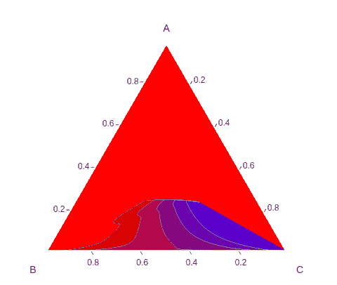
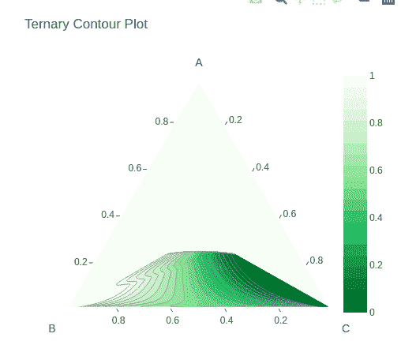
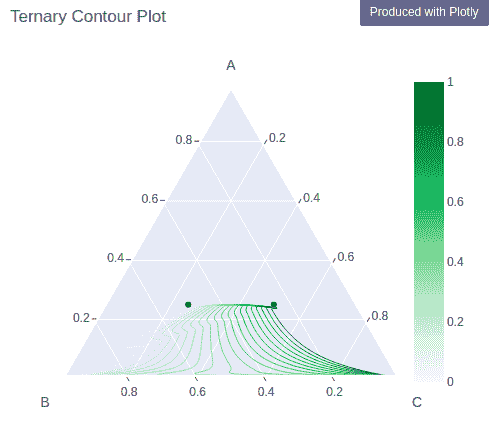

# 使用 Python 中的 Plotly 绘制三元等高线图

> 原文:[https://www . geesforgeks . org/三元-等高线-绘图-使用-绘图-在 python 中/](https://www.geeksforgeeks.org/ternary-contours-plot-using-plotly-in-python/)

Plotly 是一个 Python 库，用于设计图形，尤其是交互式图形。它可以绘制各种图形和图表，如直方图、条形图、箱线图、展开图等。它主要用于数据分析以及财务分析。plotly 是一个交互式可视化库。

## Plotly 中的三元等值线

在绘图中，可以使用 **figure_factory** 类的**create _ 三元 _contour** 方法绘制三元等值线图，该方法有助于表示三元图中定义的等值线，其中三个变量之和是常数。它用图形描绘了三个变量在等边三角形中的位置比例。

> **语法:**create _ 三元 _contour(坐标、值、极点 _ 标签=['a '，' b '，' c']，ncontours=None，interp_mode='ilr '，showmarkers=False)

**示例:**

## 蟒蛇 3

```
import plotly.figure_factory as ff
import numpy as np

test_data = np.array([[0, 0, 1, 0],
                      [0.25, 0.25, 0.5, 0],
                      [0.25, 0.25, 0.5, 0],
                      [0.25, 0.25, 0.5, 1],
                      [0.25, 0.5, 0.25, 1],
                      [0, 1, 0, 1]])

# barycentric coords: (a,b,c)
a = test_data[:, 0]
b = test_data[:, 1]
c = test_data[:, 2]

# values is stored in the last column
v = test_data[:, -1]

fig = ff.create_ternary_contour(
    np.array([a, b, c]), v,
    pole_labels=['A', 'B', 'C'],
)

fig.show()
```

**输出:**



## 定制三元等高线图

使用此函数提供的参数，可以自定义高度、宽度、色阶和许多其他值。

**示例:**

## 蟒蛇 3

```
import plotly.figure_factory as ff
import numpy as np

test_data = np.array([[0, 0, 1, 0],
                      [0.25, 0.25, 0.5, 0],
                      [0.25, 0.25, 0.5, 0],
                      [0.25, 0.25, 0.5, 1],
                      [0.25, 0.5, 0.25, 1],
                      [0, 1, 0, 1]])

# barycentric coords: (a,b,c)
a = test_data[:, 0]
b = test_data[:, 1]
c = test_data[:, 2]

# values is stored in the last column
v = test_data[:, -1]

fig = ff.create_ternary_contour(
    np.array([a, b, c]), v,
    pole_labels=['A', 'B', 'C'],
    ncontours=20,
    colorscale='Greens',
    showscale=True,
    title='Ternary Contour Plot'
)

fig.show()
```

**输出:**



## 带有数据点和线的三元等高线图

只有线可以通过参数**着色**并将其设置为线来显示，数据点可以通过将“真”传递给**显示标记**参数来显示。

**示例:**

## 蟒蛇 3

```
import plotly.figure_factory as ff
import numpy as np

test_data = np.array([[0, 0, 1, 0],
                      [0.25, 0.25, 0.5, 0],
                      [0.25, 0.25, 0.5, 0],
                      [0.25, 0.25, 0.5, 1],
                      [0.25, 0.5, 0.25, 1],
                      [0, 1, 0, 1]])

# barycentric coords: (a,b,c)
a = test_data[:, 0]
b = test_data[:, 1]
c = test_data[:, 2]

# values is stored in the last column
v = test_data[:, -1]

fig = ff.create_ternary_contour(
    np.array([a, b, c]), v,
    pole_labels=['A', 'B', 'C'],
    ncontours=20,
    colorscale='Greens',
    showscale=True,
    title='Ternary Contour Plot',
    coloring='lines',
    showmarkers=True
)

fig.show()
```

**输出:**

