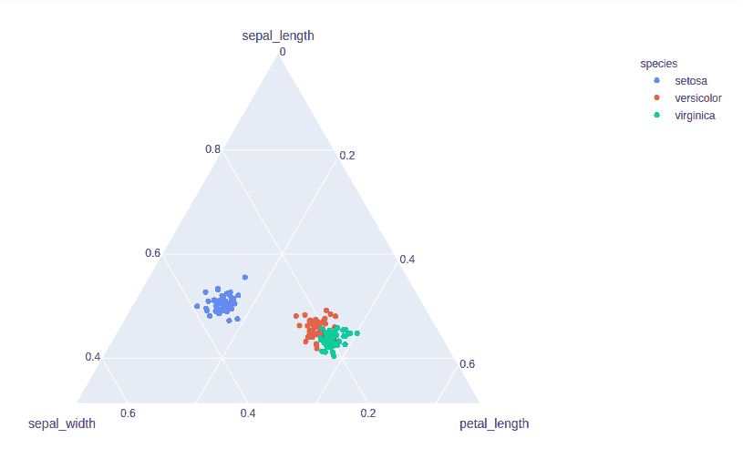
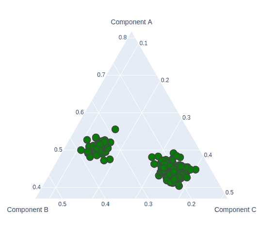

# 图中的三元图

> 原文:[https://www.geeksforgeeks.org/ternary-plots-in-plotly/](https://www.geeksforgeeks.org/ternary-plots-in-plotly/)

Plotly 是一个 Python 库，用于设计图形，尤其是交互式图形。它可以绘制各种图形和图表，如直方图、条形图、箱线图、展开图等。它主要用于数据分析以及财务分析。plotly 是一个交互式可视化库。

## Plotly 中的三元图

三元图也称为三元图、三角图、单形图，它是三个变量的重心图，三个变量之和等于一个常数。它用图形描绘了三个变量在等边三角形中的位置比例。它可以使用两个类创建，即 express 类和 graph_objects 类。

### 使用快速类

通俗地说，express 是一个易于使用的高级界面，有助于操作各种类型的数据并生成简单的样式图形。提供**散点 _ 三元()**方法创建三元图。

> **语法:**散点 _ 三元(a =无，b =无，c =无，颜色=无，标签={}，宽度=无，高度=无)
> 
> **参数:**
> 
> **a:** 来自该列或 array_like 的值用于在三元坐标中沿 a 轴定位标记。
> 
> **b:** 来自该列或 array_like 的值用于在三元坐标中沿 b 轴定位标记。
> 
> **c:** 来自该列或 array_like 的值用于在三元坐标中沿 c 轴定位标记。
> 
> **颜色:**data _ frame 中列的名称，或者 pandas Series 或 array_like 对象。此列或 array_like 中的值用于为标记指定颜色。
> 
> **宽度:**以像素为单位的图形宽度。
> 
> **高度:**以像素为单位的图形高度。

**示例:**

## 蟒蛇 3

```py
import plotly.express as px

df = px.data.iris()
fig = px.scatter_ternary(df, a="sepal_length",
                         b="sepal_width", c="petal_length",
                         color="species", size_max=20)
fig.show()
```

**输出:**



### 使用图形对象类

让我们看一个三元散点图的例子，用图表对象来说明。可以使用**散点图()**方法创建。

**示例:**

## 蟒蛇 3

```py
import plotly.express as px
import plotly.graph_objects as go

df = px.data.iris()
fig = go.Figure(go.Scatterternary({
    'mode': 'markers',
    'a': df['sepal_length'],
    'b': df['sepal_width'],
    'c': df['petal_length'],
    'marker': {
        'color': 'green',
        'size': 14,
        'line': {'width': 2}
    }
}))

fig.show()
```

**输出:**

