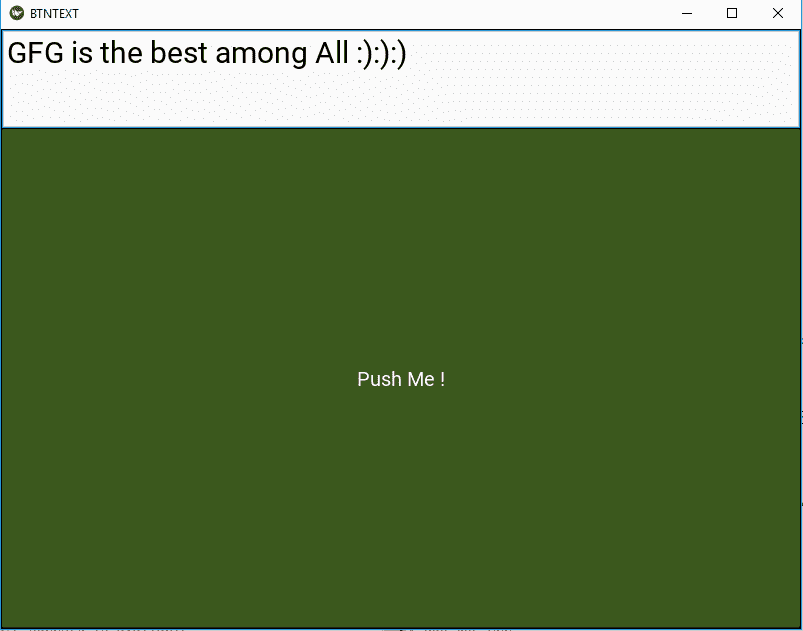
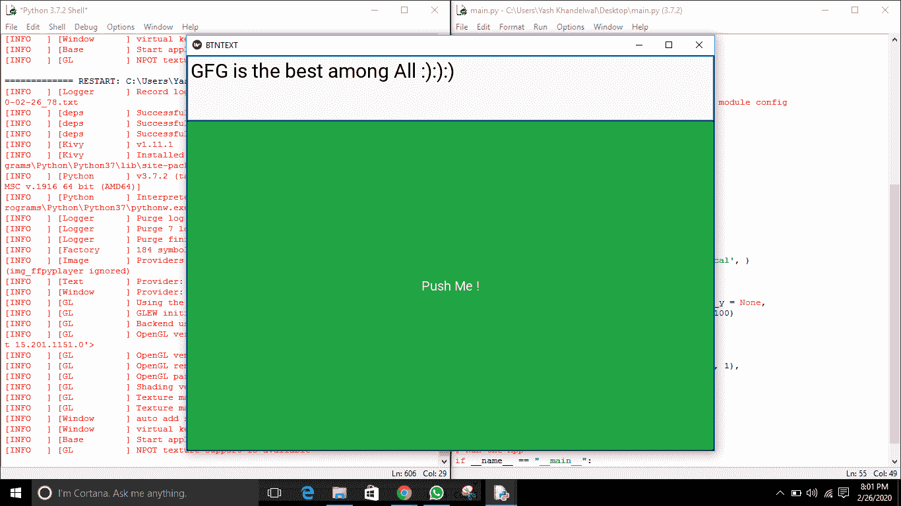

# 带有 kivy 中验证按钮的文本输入框

> 原文:[https://www . geesforgeks . org/text-input-box-with-a-verification-in-button-kivy/](https://www.geeksforgeeks.org/text-input-box-with-a-verification-button-in-kivy/)

Kivy 是 Python 中独立于平台的 GUI 工具。因为它可以在安卓、IOS、linux 和 Windows 等平台上运行。它基本上是用来开发安卓应用程序的，但并不意味着它不能在桌面应用程序上使用。

在本文中，我们将学习如何使用 kivy 中的文本输入添加按钮，就像我们在输入和提交按钮中一样。在继续之前，您必须了解 kivy 中的文本输入小部件和按钮。

> **文本输入:**文本输入小部件为可编辑的纯文本提供了一个框。支持 Unicode、多行、光标导航、选择和剪贴板功能。
> 
> **按钮:**按钮是带有相关动作的标签，当按钮被按下(或在点击/触摸后被释放)时触发。我们可以在按钮后面添加功能，并为按钮设置样式。

要使用文本输入和按钮，您必须通过命令–

```
from kivy.uix.textinput import TextInput
from kivy.uix.button import Button
```

```
Basic Approach:
1) import kivy
2) import kivyApp
3) import Button
4) import Boxlayout
5) import Textinput
6) import BoxLayout
7) Set minimum version(optional)
8) create App class
9) return Layout/widget/Class(according to requirement)
10) Run an instance of the class
```

> [Kivy 教程——用例子学习 Kivy。](https://www.geeksforgeeks.org/kivy-tutorial/)

**方法的实施–**

**主. py 文件**

```
## Sample Python application demonstrating that   
## how to create Text Input with Button in kivy

# import kivy module     
import kivy 

# base Class of your App inherits from the App class.     
# app:always refers to the instance of your application 
from kivy.app import App 

# this restrict the kivy version i.e 
# below this kivy version you cannot 
# use the app or software 
kivy.require('1.9.1') 

# creates the button in kivy 
# if not imported shows the error 
from kivy.uix.button import Button

# The TextInput widget provides a 
# box for editable plain text 
from kivy.uix.textinput import TextInput 

# BoxLayout arranges widgets in either 
# in vertical fashion that 
# is one on top of another or in 
# horizontal fashion that is one after another. 
from kivy.uix.boxlayout import BoxLayout 

# to change the kivy default settings we use this module config 
from kivy.config import Config

# 0 being off 1 being on as in true / false 
# you can use 0 or 1 && True or False 
Config.set('graphics', 'resizable', True)

# Create the App class 
class BTNTEXTApp(App): 

    # defining build() 
    def build(self): 

                # Telling orientation 
        b = BoxLayout(orientation ='vertical', ) 

        # Adding the text input 
        t = TextInput(font_size = 30, 
                    size_hint_y = None, 
                    height = 100) 

        # Adding Button and styling
        f = Button(text ="Push Me !", 
                   font_size ="20sp", 
                   background_color =(.67, 1, .33, 1), 
                   color =(1, 1, 1, 1) )

        b.add_widget(t) 
        b.add_widget(f) 

        return b 

# Run the App 
if __name__ == "__main__": 
    BTNTEXTApp().run() 
```

**输出:**


