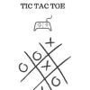

# 使用 PyGame 的 Python 井字游戏图形用户界面

> 原文:[https://www . geesforgeks . org/TIC-tac-toe-GUI-in-python-using-pygame/](https://www.geeksforgeeks.org/tic-tac-toe-gui-in-python-using-pygame/)

本文将为您提供指导，并为您提供使用 Python 的 *pygame* 库设计游戏[井字游戏](https://www.geeksforgeeks.org/python-implementation-automatic-tic-tac-toe-game-using-random-number/)的基本思路。Pygame 是一组跨平台的 Python 模块，旨在编写视频游戏。它包括设计用于 Python 编程语言的计算机图形和声音库。

让我们把任务分成五个部分:

1.  导入所需的库并设置所需的全局变量。
2.  设计游戏显示功能，这将为其他组件在屏幕上显示设置一个平台。
3.  胜负的主要算法
4.  获取用户输入，并在用户点击鼠标的适当位置显示“X”或“O”。
5.  运行无限循环，并在其中包含已定义的方法。

**注意:**所需的 PNG 文件可以在下面下载–

[](https://media.geeksforgeeks.org/wp-content/uploads/20200507204322/modified_cover.png)

已修改 _cover.png

[](https://media.geeksforgeeks.org/wp-content/uploads/20200507204515/X_modified.png)

X_modified.png

[](https://media.geeksforgeeks.org/wp-content/uploads/20200507204429/o_modified.png)

o_modified.png

### 导入所需的库并设置所需的全局变量

我们将使用 Python 的`pygame`、`time`和`sys`库。**时间**库用于跟踪时间和我们将在代码中使用的`sleep()`方法。看看下面的代码。

```py
# importing the required libraries
import pygame as pg
import sys
import time
from pygame.locals import *

# declaring the global variables

# for storing the 'x' or 'o' 
# value as character
XO = 'x'

# storing the winner's value at
# any instant of code
winner = None

# to check if the game is a draw
draw = None

# to set width of the game window
width = 400

# to set height of the game window
height = 400

# to set background color of the 
# game window
white = (255, 255, 255)

# color of the straightlines on that 
# white game board, dividing board 
# into 9 parts
line_color = (0, 0, 0)

# setting up a 3 * 3 board in canvas
board = [[None]*3, [None]*3, [None]*3]
```

### 设计游戏显示器

这是更棘手的部分，这使得游戏开发至关重要。我们可以使用 **display.set_mode()** 方法来设置显示窗口。这需要三个参数，第一个参数是一个元组，它具有我们想要的显示(宽度、高度)，另外两个参数分别是深度和 fps。 **display.set_caption()** ，在我们显示器的名称标签上设置一个标题。 **pg.image.load()** 是加载背景图像以自定义显示的有用方法。此方法将文件名和扩展名一起作为参数。`image.load()`有一个小问题，它以原生大小将图像加载为 Python 对象，这可能不会随着显示进行优化。所以我们在 pygame 中使用了另一种方法 **pg.transform.scale()** 。这个方法有两个参数，一个是图像对象的名称，另一个是一个元组，它有(宽度，高度)，我们希望我们的图像可以缩放到这个值。

最后我们前往第一个功能， **game_initiating_window()** 。第一行有一个 **screen.blit()** 功能。屏幕是 Python 函数，blit 是使 pygame 能够在另一个东西上显示某个东西的方法。在这里，图像对象已经显示在屏幕上，最初设置为白色。 **pg.display.update()** 是游戏开发中的另一个重要功能。当被调用时，它会更新我们窗口的显示。Pygame 还使我们能够绘制像线、圆等几何对象。在这个项目中，我们使用了 **pg.draw.line()** 方法，该方法采用五个参数，即–*(显示、线条颜色、起点、终点、宽度)*。这涉及到一点点坐标几何来正确绘制线条。

这还不够。每次更新显示，我们需要知道游戏状态，天气是赢还是输。 **draw_status()** 帮助我们在主窗口底部显示另一个 100pc 窗口，用户每次点击都会更新状态。

```py
# initializing the pygame window
pg.init()

# setting fps manually
fps = 30

# this is used to track time
CLOCK = pg.time.Clock()

# this method is used to build the
# infrastructure of the display
screen = pg.display.set_mode((width, height + 100), 0, 32)

# setting up a nametag for the 
# game window
pg.display.set_caption("My Tic Tac Toe")

# loading the images as python object
initiating_window = pg.image.load("modified_cover.png")
x_img = pg.image.load("X_modified.png")
y_img = pg.image.load("o_modified.png")

# resizing images
initiating_window = pg.transform.scale(initiating_window, (width, height + 100))
x_img = pg.transform.scale(x_img, (80, 80))
o_img = pg.transform.scale(y_img, (80, 80))

def game_initiating_window():

    # displaying over the screen
    screen.blit(initiating_window, (0, 0))

    # updating the display
    pg.display.update()
    time.sleep(3)                    
    screen.fill(white)

    # drawing vertical lines
    pg.draw.line(screen, line_color, (width / 3, 0), (width / 3, height), 7)
    pg.draw.line(screen, line_color, (width / 3 * 2, 0), (width / 3 * 2, height), 7)

    # drawing horizontal lines
    pg.draw.line(screen, line_color, (0, height / 3), (width, height / 3), 7)
    pg.draw.line(screen, line_color, (0, height / 3 * 2), (width, height / 3 * 2), 7)
    draw_status()

def draw_status():

    # getting the global variable draw
    # into action
    global draw

    if winner is None:
        message = XO.upper() + "'s Turn"
    else:
        message = winner.upper() + " won !"
    if draw:
        message = "Game Draw !"

    # setting a font object
    font = pg.font.Font(None, 30)

    # setting the font properties like 
    # color and width of the text
    text = font.render(message, 1, (255, 255, 255))

    # copy the rendered message onto the board
    # creating a small block at the bottom of the main display
    screen.fill ((0, 0, 0), (0, 400, 500, 100))
    text_rect = text.get_rect(center =(width / 2, 500-50))
    screen.blit(text, text_rect)
    pg.display.update()
```

### 主要算法

主要算法有一个直接的方法。用户可以在行方向、列方向和对角线方向获胜。因此，通过使用多维数组，我们可以轻松设置条件。

```py
def check_win():
    global board, winner, draw

    # checking for winning rows
    for row in range(0, 3):
        if((board[row][0] == board[row][1] == board[row][2]) and (board [row][0] is not None)):
            winner = board[row][0]
            pg.draw.line(screen, (250, 0, 0),
                         (0, (row + 1)*height / 3 -height / 6),
                         (width, (row + 1)*height / 3 - height / 6 ),
                         4)
            break

    # checking for winning columns
    for col in range(0, 3):
        if((board[0][col] == board[1][col] == board[2][col]) and (board[0][col] is not None)):
            winner = board[0][col]
            pg.draw.line (screen, (250, 0, 0), ((col + 1)* width / 3 - width / 6, 0), \
                          ((col + 1)* width / 3 - width / 6, height), 4)
            break

    # check for diagonal winners
    if (board[0][0] == board[1][1] == board[2][2]) and (board[0][0] is not None):

        # game won diagonally left to right
        winner = board[0][0]
        pg.draw.line (screen, (250, 70, 70), (50, 50), (350, 350), 4)

    if (board[0][2] == board[1][1] == board[2][0]) and (board[0][2] is not None):

        # game won diagonally right to left
        winner = board[0][2]
        pg.draw.line (screen, (250, 70, 70), (350, 50), (50, 350), 4)

    if(all([all(row) for row in board]) and winner is None ):
        draw = True

    draw_status()
```

### 获取用户输入并显示“X”或“O”

这部分是关于棋盘的可视化和一点点坐标几何。 **drawXO()** 取两个参数 row 和 col，首先我们要设置正确的几何位置，把我们已经存储为两个 python 对象“x_img”和“y_img”的 X 的图像和 O 的图像分别放进去。看一下代码，以便正确理解。

**user_click()** 是我们设计的一个函数，通过用户鼠标点击获取输入。想象一下，你点击了九个部分中的一个(方框被我们水平和垂直画的线分开)，这个函数将定义你点击的位置的坐标。 **pg.mouse.get_pos()** 获取用户鼠标点击的 x 坐标和 y 坐标，返回一个元组。根据(x，y)，我们可以定义用户单击的确切行和确切列。最后，当我们有行和列时，我们将这两个作为参数传递给函数 **drawXO(行，列)**，以在游戏屏幕上用户的期望位置绘制“X”的图像或“O”的图像。

```py
def drawXO(row, col):
    global board, XO

    # for the first row, the image
    # should be pasted at a x coordinate
    # of 30 from the left margin
    if row == 1:
        posx = 30

    # for the second row, the image 
    # should be pasted at a x coordinate 
    # of 30 from the game line     
    if row == 2:

        # margin or width / 3 + 30 from 
        # the left margin of the window
        posx = width / 3 + 30

    if row == 3:
        posx = width / 3 * 2 + 30

    if col == 1:
        posy = 30

    if col == 2:
        posy = height / 3 + 30

    if col == 3:
        posy = height / 3 * 2 + 30

    # setting up the required board 
    # value to display
    board[row-1][col-1] = XO

    if(XO == 'x'):

        # pasting x_img over the screen 
        # at a coordinate position of
        # (pos_y, posx) defined in the
        # above code
        screen.blit(x_img, (posy, posx))
        XO = 'o'

    else:
        screen.blit(o_img, (posy, posx))
        XO = 'x'
    pg.display.update()

def user_click():
    # get coordinates of mouse click
    x, y = pg.mouse.get_pos()

    # get column of mouse click (1-3)
    if(x<width / 3):
        col = 1

    elif (x<width / 3 * 2):
        col = 2

    elif(x<width):
        col = 3

    else:
        col = None

    # get row of mouse click (1-3)
    if(y<height / 3):
        row = 1

    elif (y<height / 3 * 2):
        row = 2

    elif(y<height):
        row = 3

    else:
        row = None

    # after getting the row and col, 
    # we need to draw the images at
    # the desired positions
    if(row and col and board[row-1][col-1] is None):
        global XO

        drawXO(row, col)
        check_win()
```

### 运行无限循环

这是无限运行我们游戏的最后重要一步，直到用户点击**退出**。在运行无限循环之前，我们需要设置一个函数，该函数可以将所有全局值和参数重置为初始值，以重新开始游戏。
**reset_game()** 就是用于这个目的。它将板值再次重置为 3 * 3 无值，并初始化全局参数。

在游戏开发中，玩家的每一个动作都是一个**事件**。他是点击窗口还是点击退出/关闭图标。为了将这些事件作为一个对象，pygame 有一个内置方法用作 **pg.event.get()** 。如果事件类型是“QUIT”，我们使用 Python 的 sys 库退出游戏。但是如果按下鼠标， **event.get()** 将返回“MOUSEBUTTONDOWN”，我们对 **user_click()** 的调用恰好知道用户点击的板子的确切坐标。

在整个代码中，我们使用了`.sleep()`方法来暂停我们的游戏一段时间，并使其用户友好和流畅。

```py
def reset_game():
    global board, winner, XO, draw
    time.sleep(3)
    XO = 'x'
    draw = False
    game_initiating_window()
    winner = None
    board = [[None]*3, [None]*3, [None]*3]

game_initiating_window()

while(True):
    for event in pg.event.get():

        if event.type == QUIT:
            pg.quit()
            sys.exit()

        elif event.type is MOUSEBUTTONDOWN:
            user_click()

            if(winner or draw):
                reset_game()

    pg.display.update()
    CLOCK.tick(fps)
```

**完整代码:**

```py
# importing the required libraries
import pygame as pg
import sys
import time
from pygame.locals import *

# declaring the global variables

# for storing the 'x' or 'o' 
# value as character
XO = 'x'

# storing the winner's value at
# any instant of code
winner = None

# to check if the game is a draw
draw = None

# to set width of the game window
width = 400

# to set height of the game window
height = 400

# to set background color of the 
# game window
white = (255, 255, 255)

# color of the straightlines on that 
# white game board, dividing board 
# into 9 parts
line_color = (0, 0, 0)

# setting up a 3 * 3 board in canvas
board = [[None]*3, [None]*3, [None]*3]

# initializing the pygame window
pg.init()

# setting fps manually
fps = 30

# this is used to track time
CLOCK = pg.time.Clock()

# this method is used to build the
# infrastructure of the display
screen = pg.display.set_mode((width, height + 100), 0, 32)

# setting up a nametag for the 
# game window
pg.display.set_caption("My Tic Tac Toe")

# loading the images as python object
initiating_window = pg.image.load("modified_cover.png")
x_img = pg.image.load("X_modified.png")
y_img = pg.image.load("o_modified.png")

# resizing images
initiating_window = pg.transform.scale(initiating_window, (width, height + 100))
x_img = pg.transform.scale(x_img, (80, 80))
o_img = pg.transform.scale(y_img, (80, 80))

def game_initiating_window():

    # displaying over the screen
    screen.blit(initiating_window, (0, 0))

    # updating the display
    pg.display.update()
    time.sleep(3)                    
    screen.fill(white)

    # drawing vertical lines
    pg.draw.line(screen, line_color, (width / 3, 0), (width / 3, height), 7)
    pg.draw.line(screen, line_color, (width / 3 * 2, 0), (width / 3 * 2, height), 7)

    # drawing horizontal lines
    pg.draw.line(screen, line_color, (0, height / 3), (width, height / 3), 7)
    pg.draw.line(screen, line_color, (0, height / 3 * 2), (width, height / 3 * 2), 7)
    draw_status()

def draw_status():

    # getting the global variable draw
    # into action
    global draw

    if winner is None:
        message = XO.upper() + "'s Turn"
    else:
        message = winner.upper() + " won !"
    if draw:
        message = "Game Draw !"

    # setting a font object
    font = pg.font.Font(None, 30)

    # setting the font properties like 
    # color and width of the text
    text = font.render(message, 1, (255, 255, 255))

    # copy the rendered message onto the board
    # creating a small block at the bottom of the main display
    screen.fill ((0, 0, 0), (0, 400, 500, 100))
    text_rect = text.get_rect(center =(width / 2, 500-50))
    screen.blit(text, text_rect)
    pg.display.update()

def check_win():
    global board, winner, draw

    # checking for winning rows
    for row in range(0, 3):
        if((board[row][0] == board[row][1] == board[row][2]) and (board [row][0] is not None)):
            winner = board[row][0]
            pg.draw.line(screen, (250, 0, 0),
                         (0, (row + 1)*height / 3 -height / 6),
                         (width, (row + 1)*height / 3 - height / 6 ),
                         4)
            break

    # checking for winning columns
    for col in range(0, 3):
        if((board[0][col] == board[1][col] == board[2][col]) and (board[0][col] is not None)):
            winner = board[0][col]
            pg.draw.line (screen, (250, 0, 0), ((col + 1)* width / 3 - width / 6, 0), \
                          ((col + 1)* width / 3 - width / 6, height), 4)
            break

    # check for diagonal winners
    if (board[0][0] == board[1][1] == board[2][2]) and (board[0][0] is not None):

        # game won diagonally left to right
        winner = board[0][0]
        pg.draw.line (screen, (250, 70, 70), (50, 50), (350, 350), 4)

    if (board[0][2] == board[1][1] == board[2][0]) and (board[0][2] is not None):

        # game won diagonally right to left
        winner = board[0][2]
        pg.draw.line (screen, (250, 70, 70), (350, 50), (50, 350), 4)

    if(all([all(row) for row in board]) and winner is None ):
        draw = True
    draw_status()

def drawXO(row, col):
    global board, XO

    # for the first row, the image
    # should be pasted at a x coordinate
    # of 30 from the left margin
    if row == 1:
        posx = 30

    # for the second row, the image 
    # should be pasted at a x coordinate 
    # of 30 from the game line     
    if row == 2:

        # margin or width / 3 + 30 from 
        # the left margin of the window
        posx = width / 3 + 30

    if row == 3:
        posx = width / 3 * 2 + 30

    if col == 1:
        posy = 30

    if col == 2:
        posy = height / 3 + 30

    if col == 3:
        posy = height / 3 * 2 + 30

    # setting up the required board 
    # value to display
    board[row-1][col-1] = XO

    if(XO == 'x'):

        # pasting x_img over the screen 
        # at a coordinate position of
        # (pos_y, posx) defined in the
        # above code
        screen.blit(x_img, (posy, posx))
        XO = 'o'

    else:
        screen.blit(o_img, (posy, posx))
        XO = 'x'
    pg.display.update()

def user_click():
    # get coordinates of mouse click
    x, y = pg.mouse.get_pos()

    # get column of mouse click (1-3)
    if(x<width / 3):
        col = 1

    elif (x<width / 3 * 2):
        col = 2

    elif(x<width):
        col = 3

    else:
        col = None

    # get row of mouse click (1-3)
    if(y<height / 3):
        row = 1

    elif (y<height / 3 * 2):
        row = 2

    elif(y<height):
        row = 3

    else:
        row = None

    # after getting the row and col, 
    # we need to draw the images at
    # the desired positions
    if(row and col and board[row-1][col-1] is None):
        global XO
        drawXO(row, col)
        check_win()

def reset_game():
    global board, winner, XO, draw
    time.sleep(3)
    XO = 'x'
    draw = False
    game_initiating_window()
    winner = None
    board = [[None]*3, [None]*3, [None]*3]

game_initiating_window()

while(True):
    for event in pg.event.get():
        if event.type == QUIT:
            pg.quit()
            sys.exit()
        elif event.type is MOUSEBUTTONDOWN:
            user_click()
            if(winner or draw):
                reset_game()
    pg.display.update()
    CLOCK.tick(fps)
```

**输出:**

<video class="wp-video-shortcode" id="video-409148-1" width="665" height="374" preload="metadata" controls=""><source type="video/webm" src="https://media.geeksforgeeks.org/wp-content/uploads/20200507213942/python-tic-tac-toe-pygame.webm?_=1">[https://media.geeksforgeeks.org/wp-content/uploads/20200507213942/python-tic-tac-toe-pygame.webm](https://media.geeksforgeeks.org/wp-content/uploads/20200507213942/python-tic-tac-toe-pygame.webm)</video>