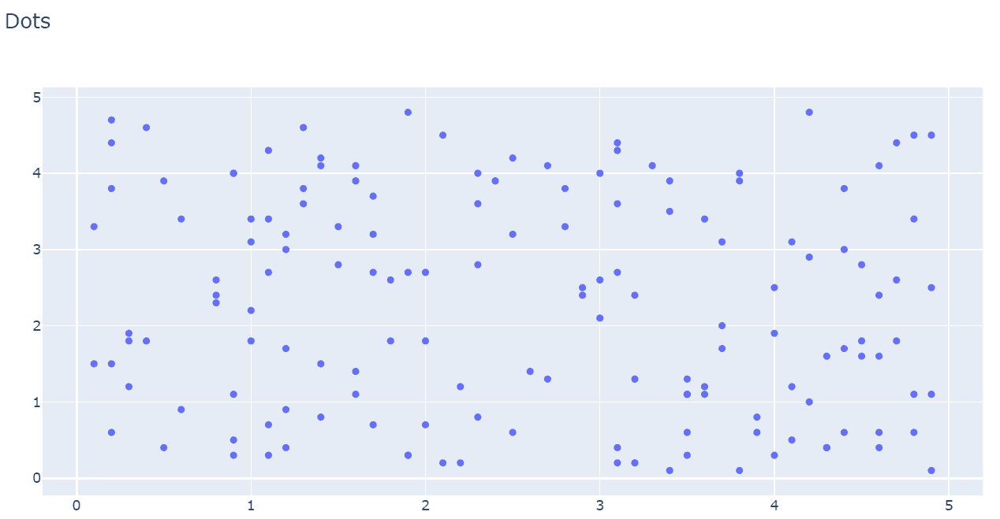
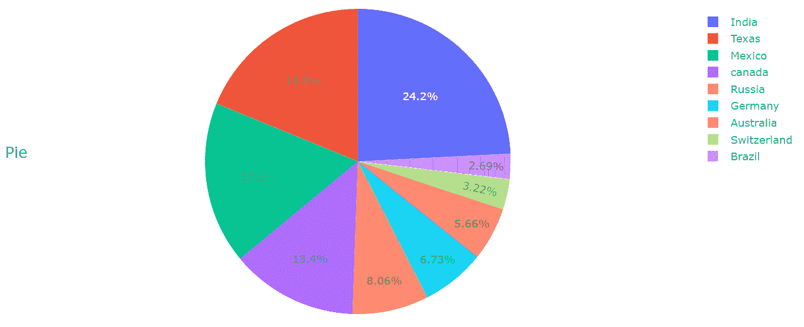
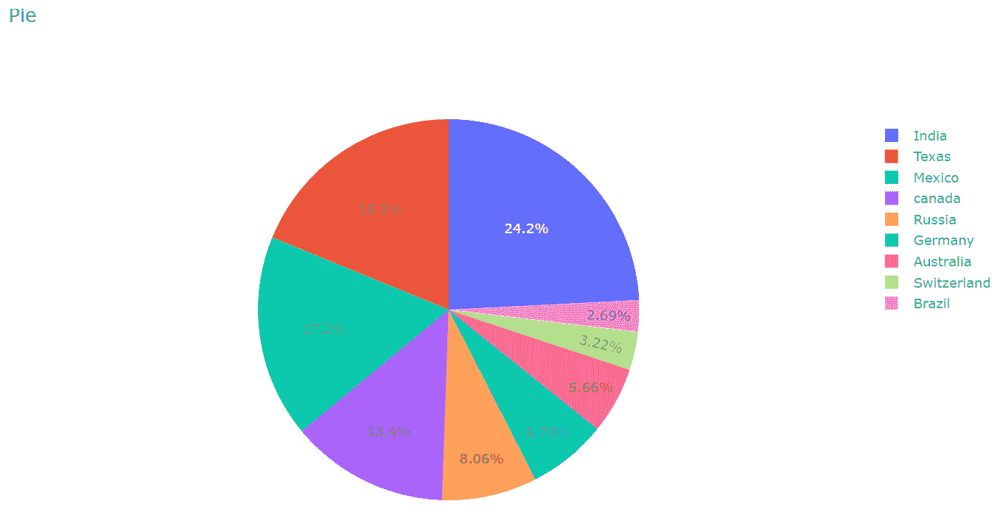

# 剧情中的标题对齐

> 原文:[https://www.geeksforgeeks.org/title-alignment-in-plotly/](https://www.geeksforgeeks.org/title-alignment-in-plotly/)

在本文中，我们将讨论标题分配和对齐使用*绘图*模块。

为了使用*模块在可视化中对齐标题，我们将使用 *update_layout()* 方法。*

***语法:***

> *plotly.graph_objects。图. update_layout(title_text，title_x，title_y)*
> 
> ***参数:***
> 
> *   ***标题:**接受字符串值作为可视化的标题。*
> *   ***title_x:** 此参数用于在水平运动中对齐标题，并接受 0 到 1 之间的值。*
> *   ***title_y:** 此参数用于在垂直运动中对齐标题，并接受 0 到 1 之间的值。*

***我们在下面的例子中实现这个方法:***

***例 1***

## *蟒蛇 3*

```
*# import all required libraries
import numpy as np
import plotly
import plotly.graph_objects as go
import plotly.offline as pyo
from plotly.offline import init_notebook_mode

init_notebook_mode(connected=True)

# generating 150 random integers
# from 1 to 50
x = np.random.randint(low=1, high=50, size=150)*0.1

# generating 150 random integers
# from 1 to 50
y = np.random.randint(low=1, high=50, size=150)*0.1

# plotting scatter plot
fig = go.Figure(data=go.Scatter(x=x, y=y, mode='markers'))

# title alignment
fig.update_layout(title_text='Dots')

fig.show()*
```

***输出:***

**

***例 2***

## *蟒蛇 3*

```
*# import all required libraries
import numpy as np
import plotly
import plotly.graph_objects as go
import plotly.offline as pyo
from plotly.offline import init_notebook_mode

init_notebook_mode(connected = True)

# different individual parts in
# total chart
countries=['India', 'canada',
        'Australia','Brazil',
        'Mexico','Russia',
        'Germany','Switzerland',
        'Texas']

# values corresponding to each
# individual country present in
# countries
values = [4500, 2500, 1053, 500,
        3200, 1500, 1253, 600, 3500]

# plotting pie chart
fig = go.Figure(data=[go.Pie(labels=countries,
                    values=values)])

# title alignment
fig.update_layout(title_text='Pie',title_y=0.5)

fig.show()*
```

***输出:***

**title_y=0.5* 时，标题应该居中。*

**

*当 *title_y = 0.1**

**

*当 *title_y = 1 时**

**

***例 3***

## *蟒蛇 3*

```
*# import required libraries
import dash
import dash_core_components as dcc
import dash_html_components as html
import plotly.express as px
import pandas as pd

external_stylesheets = ['https://codepen.io/chriddyp/pen/bWLwgP.css']

app = dash.Dash(__name__, external_stylesheets=external_stylesheets)

# assume you have a "long-form" data frame
df = pd.DataFrame({
    "Year": ["2015", "2016", "2017", "2015", "2016", "2017"],
    "Revenue": [4, 1, 2, 2, 4, 5],
    "Company": ["ABC Pvt. Ltd.", "ABC Pvt. Ltd.", "ABC Pvt. Ltd.", "XYZ Pvt. Ltd.", "XYZ Pvt. Ltd.", "XYZ Pvt. Ltd."]
})

# depict visualization
fig = px.bar(df, x="Year", y="Revenue", color="Company", barmode="group")

app.layout = html.Div(children=[

    dcc.Graph(
        id='example-graph',
        figure=fig
    )
])

# allign title
fig.update_layout(title_text='Revenue', title_x=0.5)

if __name__ == '__main__':
    app.run_server(debug=True)*
```

***输出:***

**title_x=0.5* 时，标题应该居中。*

**

*当 *title_x = 0.3* 时*

**

*当 *title_x = 1 时**

**