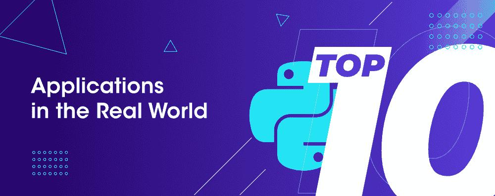

# 现实世界中十大 Python 应用

> 原文:[https://www . geesforgeks . org/top-10-python-现实世界中的应用/](https://www.geeksforgeeks.org/top-10-python-applications-in-real-world/)

我们生活在一个完全由大块代码驱动的数字世界。无论是医疗保健、军事、银行、研究，还是其他行业，每个行业都依赖软件来正常运转。我们有大量的编程语言来促进软件开发过程。其中之一是 Python，它已经成为最赚钱、最令人兴奋的编程语言。据一项调查显示，python 是 80%以上开发人员的主要编码语言。这背后的主要原因是其丰富的库和框架推动了这个过程。

Python 一直处于机器学习、数据科学和人工智能创新的前沿。此外，它还提供了构建大量应用程序、web 开发过程等的便利。在这个博客中，我们将详细讨论现实世界中排名前十的 Python 应用程序。让我们开始吧:

### 1.网络开发

这是 Python 最惊人的应用之一。这是因为 Python 提供了各种各样的框架，比如 Django、Flask、Bottle 等等，为开发人员提供了便利。此外，Python 有内置的库和工具，使得网络开发过程完全不费吹灰之力。使用 Python 进行网络开发还可以提供:

*   *惊人的可视化*
*   *开发方便*
*   *增强安全性*
*   *快速开发流程*

### 2.机器学习和人工智能

[机器学习](https://www.geeksforgeeks.org/machine-learning/)和[人工智能](https://www.geeksforgeeks.org/artificial-intelligence-an-introduction/)是当下最热门的科目。Python 及其内置库和工具促进了人工智能和最大似然算法的发展。此外，它提供了简单、简洁和可读的代码，这使得开发人员更容易编写复杂的算法，并提供了一个通用的流程。增强人工智能和 ML 流程的一些内置库和工具有:

*   *用于复杂数据分析的 Numpy】*
*   *用于机器学习的 Keras】*
*   *用于技术计算的 SciPy】*
*   *数据可视化的 Seaborn】*

### **3。数据科学**

数据科学涉及数据收集、数据分类、数据分析和数据可视化。Python 提供了惊人的功能来处理统计和复杂的数学计算。内置库的存在为数据科学专业人员提供了便利。一些在数据科学过程中提供便利的流行库是 TensorFlow、Pandas 和 Socket 学习。这些库为微调数据模型、数据预处理和执行复杂的数据分析提供了一个生态系统。

### 4.游戏开发

随着游戏行业[的快速发展，Python](https://www.geeksforgeeks.org/python-programming-language/) 已经被证明是游戏开发的一个绝佳选择。像《加勒比海盗》、《桥牌指挥官》和《战地 2》这样的热门游戏使用 Python 编程来实现广泛的功能和插件。流行的 2D 和 3D 游戏库(如 pygame、panda3D 和 Cocos2D)的存在使得游戏开发过程完全不费吹灰之力。

### 5.音频和视频应用

音频和视频应用无疑是 Python 最惊人的特性。Python 配备了许多工具和库来完美地完成您的任务。用 Python 编码的应用程序包括网飞、Spotify 和 YouTube 等流行的应用程序。这可以由像

*   *留下*
*   *Pyo*
*   *明格斯*
*   *轨道*轨道
*   *OpenCV*

### 6.软件开发

Python 正是软件开发的完美选择。像谷歌、网飞和 Reddit 这样的流行应用程序都使用 Python。这种语言提供了惊人的功能，例如:

*   *平台独立性*
*   *内置的库和框架提供了开发的便利性。*
*   *增强的代码可重用性和可读性*
*   *高兼容性*

除了这些之外，Python 还提供了增强的功能，可以与快速发展的技术(如机器学习和人工智能)一起工作。所有这些嵌入式特性使其成为软件开发的热门选择。

### 7.计算机辅助设计应用

计算机辅助设计是指计算机辅助设计；这是数字化创建 3D 和 2D 模型的过程。这个应用程序已经取代了人工漂移，被建筑师、产品设计师和施工经理用来设计具有极高一致性的产品。Python 嵌入了惊人的应用程序，如 Blender、FreeCAD、open cascade 等，以更高效地设计产品。这些提供了增强的功能，如技术绘图、动态系统开发、录制、文件导出和导入。

### 8.商业应用

Python 提供了出色的安全性和可扩展性，非常适合交付高性能的业务应用程序。它有内置的库和工具，如:

*   *Odoo 是一款业务管理软件，为您的业务流程提供自动化解决方案。*
*   *Tryton 是易于使用的开源商业软件。它具有完全集成的功能，如财务会计、销售、客户关系管理、采购、运输等。*

所有这些显著的特性使它适合创建业务应用程序。

### 9.桌面图形用户界面

Python 是一种交互式编程语言，可以帮助开发人员轻松高效地创建图形用户界面。它有大量内置工具，如 PyQT、kivy、wxWidgets 和许多其他类似的库，以极其安全和高效的方式构建一个功能齐全的图形用户界面。

### 10.网页抓取应用程序

网页抓取是一个自动化的过程，用于以更简单快捷的方式从网站中提取信息。研究人员、组织和分析师将这些信息用于各种各样的任务。Python 有一系列适合网页抓取的特性，其中包括:

*   *简洁的语法，增强可读性，节省时间。*
*   *熊猫、matplotlib 和 Selenium 等广泛的库和工具使网页抓取过程变得简单高效。*
*   *易于使用和理解*

**Python 的其他一些真实应用有:**

*   *通过使用内置的库和工具，如 PyDy、Dart、PyRobot 和 pyro，实现机器人和自动化。*
*   *图像处理:一些惊人的图像处理库和工具有 Blender、OpenCV、Houdini 和 PIL。*
*   科学应用得到了熊猫、Matplotlib、SciPy 等流行库的支持

**结论:** Python 是一种简洁且极其强大的语言，正在迅速普及。它一直是人工智能、自动化和机器学习等最令人惊叹的技术的中心。此外，它还用于促进数据分析和数据可视化等热门主题。在这个博客中，我们试图给你一个关于现实世界中十大 python 应用的基本概念。我们希望您觉得这很有帮助！