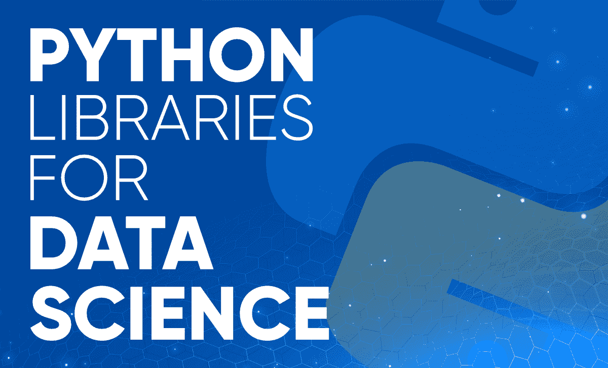

# 2021 年数据科学十大 Python 库

> 原文:[https://www . geesforgeks . org/top-10-python-libraries-for-data-science-in-2021/](https://www.geeksforgeeks.org/top-10-python-libraries-for-data-science-in-2021/)

数据科学是当今时代极其重要的领域！以至于数据科学家现在被称为“21 世纪最性感的工作”，当时没有人认为极客工作会性感！但是数据科学现在很性感，这是因为数据的巨大价值。Python 是从这些数据中提取价值的最佳编程语言之一，因为它能够进行**统计分析、数据建模、**和**易读性**。

此次[**Python**](https://www.geeksforgeeks.org/python-programming-language/)在[**Data Science**](https://www.geeksforgeeks.org/overview-of-data-science/)取得巨大成功的另一个原因是其对数据科学和分析的广泛库支持。有许多 Python 库包含大量管理和分析数据的函数、工具和方法。这些库中的每一个都有特定的焦点，其中一些库管理图像和文本数据、数据挖掘、神经网络、数据可视化等等。这里我们把数据科学的前 **10 个 Python 库**分成了分别专注于数据处理和数据可视化的库。所以现在让我们来看看这些图书馆吧！

### 用于数据处理和建模的 Python 库

### 1。 [熊猫](https://www.geeksforgeeks.org/python-pandas-series/)

[**熊猫**](https://pandas.pydata.org/)**是一个用于数据分析和数据处理的免费 Python 软件库。它是作为一个社区图书馆项目创建的，最初发布于 2008 年左右。Pandas 提供各种高性能且易于使用的数据结构和操作，用于以数值表和时间序列的形式操作数据。Pandas 还拥有多种工具，可在内存数据结构和不同文件格式之间读写数据。简而言之，它非常适合快速简单的数据操作、数据聚合、读取和写入数据以及数据可视化。熊猫还可以从不同类型的文件(如 CSV、excel 等)或 SQL 数据库中获取数据，并创建一个名为数据框的 Python 对象。数据框包含行和列，可用于数据操作，如连接、合并、分组、连接等。**

### **2。 [NumPy](https://www.geeksforgeeks.org/numpy-in-python-set-1-introduction/)**

**[**NumPy**](https://numpy.org/)是一个免费的 Python 软件库，用于对可以是大数组和多维矩阵形式的数据进行数值计算。这些多维矩阵是 NumPy 中的主要对象，其中它们的维度称为轴，轴的数量称为秩。NumPy 还提供了各种工具来处理这些数组和高级数学函数，通过线性代数、傅立叶变换、随机数处理等来处理这些数据。可以使用 NumPy 执行的一些基本数组操作包括添加、切片、乘法、展平、整形和索引数组。其他高级功能包括堆叠阵列、将阵列分成多个部分、广播阵列等。**

### **3。 [SciPy](https://www.geeksforgeeks.org/data-analysis-with-scipy/)**

**[**SciPy**](https://www.scipy.org/)是一个对数据进行科学计算和技术计算的自由软件库。它是作为一个社区图书馆项目创建的，最初发布于 2001 年左右。SciPy 库建立在 NumPy 数组对象上，它是 NumPy 堆栈的一部分，该堆栈还包括其他科学计算库和工具，如 Matplotlib、SymPy、pandas 等。 这个 NumPy 栈有用户也使用类似的应用，比如 GNU Octave、MATLAB、GNU Octave、Scilab 等。 SciPy 允许使用线性代数、 傅里叶变换 、随机数生成、 特殊函数 等处理数据优化、数据集成、数据插值和数据修改的各种科学计算任务。就像 NumPy 一样，多维矩阵是 SciPy 中的主要对象，由 NumPy 模块本身提供。**

### **4.科学学习**

**[**Scikit-learn**](https://scikit-learn.org/stable/)是一个主要用 Python 编程语言进行机器学习编码的自由软件库。它最初是由大卫·库纳波作为谷歌代码之夏项目开发的，最初发布于 2007 年 6 月。Scikit-learn 是建立在其他 Python 库之上的，比如 NumPy、SciPy、Matplotlib、Pandas 等。因此它提供了与这些库的完全互操作性。虽然 Scikit-learn 主要是用 Python 编写的，但为了提高性能，它也使用了 Cython 编写了一些核心算法。你可以在 Scikit 上实现各种有监督和无监督的机器学习模型——像分类、回归、支持向量机、随机森林、最近邻、朴素贝叶斯、决策树、聚类等等。用 Scikit-learn。**

### **5。 [TensorFlow](https://www.geeksforgeeks.org/introduction-to-tensorflow/)**

**[**TensorFlow**](https://www.tensorflow.org/)是一个免费的端到端开源平台，拥有各种各样的人工智能工具、库和资源。它由谷歌大脑团队开发，最初于 2015 年 11 月 9 日发布。您可以使用 TensorFlow 使用高级应用编程接口(如 Keras)轻松构建和训练机器学习模型。它还提供了多层次的抽象，因此您可以选择模型所需的选项。TensorFlow 还允许您在任何地方部署机器学习模型，例如云、浏览器或您自己的设备。如果您想要完整的体验，应该使用 TensorFlow Extended (TFX)，如果您想要在移动设备上使用，应该使用 TensorFlow Lite，如果您想要在 JavaScript 环境中训练和部署模型，应该使用 TensorFlow.js。TensorFlow 可用于【Python】和 C APIs，也可用于 C++、Java、JavaScript、Go、Swift 等。但是没有 API 向后兼容性保证。MATLAB 、 C# 、Julia、Scala、R、[Rust](https://en.wikipedia.org/wiki/Rust_(programming_language))等也有第三方软件包。**

### **6.硬型**

**[**Keras**](https://keras.io/)是一个用 Python 编写的免费开源神经网络库。它主要由谷歌工程师弗朗索瓦·乔莱特创建，最初于 2015 年 3 月 27 日发布。Keras 的创建是为了用户友好、可扩展和模块化，同时支持深度神经网络的实验。因此，它可以运行在其他库和语言之上，如 TensorFlow、antao、微软认知工具包等。Keras 有多种工具，可以更容易地处理不同类型的图像和文本数据，以便在深度神经网络中编码。它还具有神经网络构建块的各种实现，例如层、优化器、激活函数、目标等。您可以使用 Keras 执行各种操作，例如创建自定义函数层、使用多层深的重复代码块编写函数等。**

### **数据可视化 Python 库**

### **1。 [马特普洛特利](https://www.geeksforgeeks.org/python-introduction-matplotlib/)**

**[**【Matplotlib】**](https://matplotlib.org/)是 Python 的数据可视化库和二维标绘库，最初发布于 2003 年，是 Python 社区中最流行、使用最广泛的标绘库。它提供了跨多个平台的交互环境。Matplotlib 可用于 Python 脚本、Python 和 IPython 外壳、Jupyter 笔记本、网络应用服务器等。它可以使用各种 GUI 工具包，如 Tkinter、【GTK+ 、【Wxpython】、Qt 等，将地块嵌入到应用程序中。所以你可以使用 Matplotlib 来 创建曲线图、条形图、饼图、直方图、散点图、误差图、功率谱、百部图，以及你想要的任何其他可视化图表！Pyplot 模块还提供了一个类似于 MATLAB 的界面，它和 MATLAB 一样通用和有用，同时完全免费和开源。**

### **2。海鸟**

**[**【海鸟】**](https://seaborn.pydata.org/) 是一个基于 Matplotlib 的 Python 数据可视化库，与 numpy 和 pandas 数据结构紧密集成。Seaborn 具有各种面向数据集的绘图功能，这些功能可以对包含完整数据集的数据框和数组进行操作。然后，它在内部执行必要的统计聚合和映射功能，以创建用户所需的信息图。它是一个高级界面，用于创建美观且信息丰富的统计图形，这些图形是探索和理解数据所不可或缺的。Seaborn 数据图形可以包括条形图、饼图、直方图、散点图、误差图等。Seaborn 也有各种工具来选择调色板，可以揭示数据中的模式。**

### **3。剧情**

****是一个免费的开源图形库，可以用来形成数据可视化。Plotly (plotly.py)构建在 Plotly JavaScript 库(plotly.js)之上，可用于创建基于 web 的数据可视化，这些数据可视化可使用 Dash 显示在 Jupyter 笔记本或 web 应用程序中，也可保存为单独的 HTML 文件。Plotly 提供了 40 多种独特的图表类型，如散点图、直方图、折线图、条形图、饼图、误差线、箱线图、多轴图、迷你图、树形图、三维图表等。Plotly 还提供等高线图，这在其他数据可视化库中并不常见。除此之外，Plotly 还可以在没有互联网连接的情况下离线使用。****

### ****4 .ggplot〔t1〕****

****[**【gplot】**](http://ggplot.yhathq.com/)是一个 Python 数据可视化库，它基于为编程语言 R. Ggplot 创建的 gplot2 的实现。Gplot 可以创建数据可视化，如条形图、饼图、直方图、散点图、误差图等。使用高级 API。它还允许您在单个可视化中添加不同类型的数据可视化组件或层。一旦 ggplot 被告知哪些变量映射到图中的哪个美学，它就完成剩下的工作，这样用户就可以专注于解释可视化，并花更少的时间创建它们。但这也意味着在 ggplot 中创建高度定制的图形是不可能的。Ggplot 与熊猫也有很深的联系，所以最好将数据保存在数据帧中。****