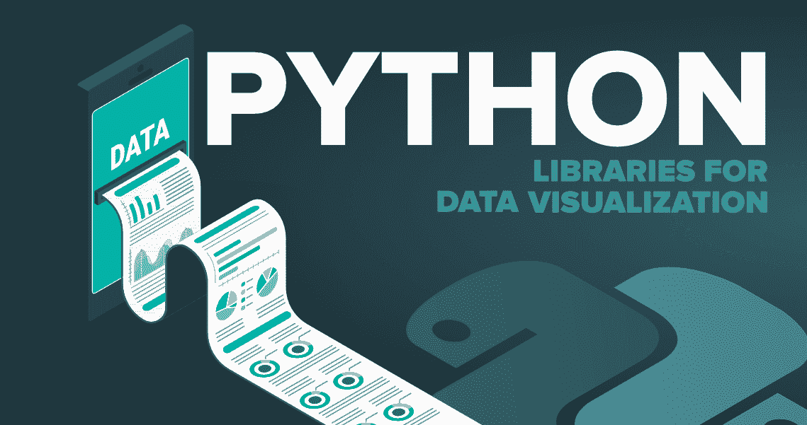

# 数据可视化的 8 大 Python 库

> 原文:[https://www . geesforgeks . org/top-8-python-libraries-for-data-visualization/](https://www.geeksforgeeks.org/top-8-python-libraries-for-data-visualization/)

数据可视化是数据分析中极其重要的一部分。毕竟，没有比以可视化格式看到数据中隐藏的模式和图层更好的方式来理解它们了！不信任我？假设你分析了你公司的数据，发现某个特定的产品一直在亏损。你的老板可能不太注意书面报告，但是如果你呈现一个以利润为红线持续下降的折线图，那么你的老板可能会更加注意！由此可见**数据可视化**的威力！

人类是视觉生物，因此，数据可视化图表如**条形图、散点图、折线图、地理地图、**等。非常重要。他们只是通过查看信息来告诉你信息，而通常你必须阅读电子表格或文本报告来理解数据。**Python 是数据分析和数据可视化最流行的编程语言之一。近年来，有几个库可以创建美观而复杂的数据可视化。这些库之所以如此受欢迎，是因为它们允许分析师和统计学家通过方便地在一个地方提供界面、数据可视化工具，根据他们的规范轻松创建可视化数据模型！本文展示了目前常用的**十大数据可视化 Python 库**。**

### **[1 .matplot lib〔t1〕](https://matplotlib.org/)**

**Matplotlib 是 Python 的数据可视化库和二维绘图库，最初发布于 2003 年，是 Python 社区中最流行、使用最广泛的绘图库。它提供了跨多个平台的交互环境。Matplotlib 可用于 Python 脚本、Python 和 IPython 外壳、Jupyter 笔记本、网络应用服务器等。它可以用来使用各种图形用户界面工具包(如 Tkinter、GTK+、wxPython、Qt 等)将地块嵌入到应用程序中。因此，您可以使用 Matplotlib 创建曲线图、条形图、饼图、直方图、散点图、误差图、功率谱、百部图以及任何其他您想要的可视化图表！Pyplot 模块还提供了一个类似于 MATLAB 的界面，它与 MATLAB 一样通用和有用，同时是免费和开源的。**

### **[2。剧情](https://plotly.com/)**

**Plotly 是一个免费的开源图形库，可以用来形成数据可视化。Plotly (plotly.py)构建在 Plotly JavaScript 库(plotly.js)之上，可用于创建基于 web 的数据可视化，这些数据可视化可使用 Dash 显示在 Jupyter 笔记本或 web 应用程序中，或保存为单独的 [HTML](https://www.geeksforgeeks.org/html-tutorials/) 文件。Plotly 提供了 40 多种独特的图表类型，如散点图、直方图、折线图、条形图、饼图、误差线、箱线图、多轴图、迷你图、树形图、三维图表等。Plotly 还提供等高线图，这在其他数据可视化库中并不常见。除此之外，Plotly 还可以在没有互联网连接的情况下离线使用。**

### **[3。海鸟](https://seaborn.pydata.org/)**

**Seaborn 是一个基于 Matplotlib 的 Python 数据可视化库，与 NumPy 和 pandas 数据结构紧密集成。Seaborn 具有各种面向数据集的绘图功能，这些功能可以对包含完整数据集的数据框和数组进行操作。然后，它在内部执行必要的统计聚合和映射功能，以创建用户所需的信息图。它是一个高级界面，用于创建美观且信息丰富的统计图形，这些图形是探索和理解数据所不可或缺的。Seaborn 数据图形可以包括条形图、饼图、直方图、散点图、误差图等。Seaborn 也有各种工具来选择调色板，可以揭示数据中的模式。**

### **[4 .ggplot〔t1〕](http://ggplot.yhathq.com/)**

**ggplot 是一个 Python 数据可视化库，它基于为编程语言 r .创建的 ggplot2 的实现。Ggplot 可以创建数据可视化，如条形图、饼图、直方图、散点图、误差图等。使用高级 API。它还允许您在单个可视化中添加不同类型的数据可视化组件或层。一旦 ggplot 被告知哪些变量映射到图中的哪个美学，它就完成剩下的工作，这样用户就可以专注于解释可视化，并花更少的时间创建它们。但这也意味着无法在 ggplot 中创建高度定制的图形。Ggplot 与熊猫也有很深的联系，所以最好将数据保存在数据帧中。**

### **[5。牛郎星](https://altair-viz.github.io/)**

**阿尔泰是 Python 中的统计数据可视化库。它基于 Vega 和 Vega-Lite，这是一种声明性语言，用于创建、保存和共享也是交互式的数据可视化设计。Altair 可用于创建漂亮的数据可视化图，如条形图、饼图、直方图、散点图、误差图、功率谱、百分图等。使用最少的编码。阿尔泰有依赖项，包括 python 3.6、entrypoints、jsonschema、NumPy、Pandas 和 Toolz，它们是用阿尔泰安装命令自动安装的。您可以打开 Jupyter 笔记本或 JupyterLab，并执行任何代码来获得阿尔泰中的数据可视化。目前，阿尔泰星的源代码可以在 GitHub 上找到。**

### **[6。博克](https://bokeh.org/)**

**Bokeh 是一个数据可视化库，它跨各种数据集(无论大小)提供具有高级交互性的详细图形。Bokeh 基于像 ggplot 这样的 Graphics 的语法，但它是 Python 的原生语言，而 ggplot 基于 r .的 ggplot2。数据可视化专家可以使用 bokeh 为现代网络浏览器创建各种交互图，这些图可以用在交互式网络应用程序、HTML 文档或 JSON 对象中。Bokeh 有 3 个级别可用于创建可视化。第一级只专注于快速创建数据图，第二级控制图的基本构建块，而第三级为创建没有预设默认值的图表提供完全的自主权。这个级别适合精通创建数据可视化的技术方面的数据分析师和信息技术专业人员。**

### **[7。pygal〔t1〕](http://www.pygal.org/en/stable/)**

**Pygal 是一个 Python 数据可视化库，专为创建性感图表而打造！(根据他们的网站！)虽然 Pygal 与 Plotly 或 Bokeh 的相似之处在于它创建了数据可视化图表，这些图表可以嵌入到网页中并使用网络浏览器进行访问，但主要区别在于它可以以 SVG 或可伸缩矢量图形的形式输出图表。这些 SVG 确保您可以清楚地观察您的图表，而不会失去任何质量，即使您缩放它们。然而，SVG 只对较小的数据集有用，因为太多的数据点难以渲染，图表会变得缓慢。**

### **[8 .geo lotlib〔t1〕](https://github.com/andrea-cuttone/geoplotlib)**

**大多数数据可视化库都没有为创建地图或使用地理数据提供太多支持，这就是为什么 geoplotlib 是如此重要的 Python 库。它支持地理地图的创建，特别是许多不同类型的地图，如点密度地图、地图、符号地图等。需要记住的一点是，安装前需要 NumPy 和 pyglet 作为先决条件，但这并不是很大的缺点。尤其是因为你想创建地理地图，而地理地图库是地图的唯一绝佳选择！**

**总之，所有这些用于数据可视化的 **Python 库**都是创建美观且信息丰富的数据可视化的绝佳选择。每一个都有它的优点和优势，所以你可以选择一个最适合你的数据可视化或项目。例如，Matplotlib 非常受欢迎，非常适合一般的二维图，而 Geoplotlib 则特别适合地理可视化。因此，继续选择您的库，用 Python 创建一个惊人的可视化效果！**