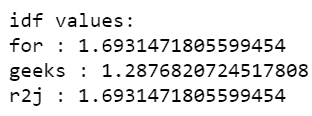
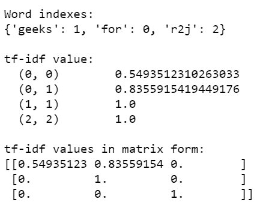
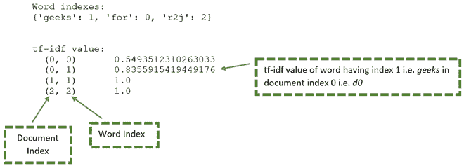
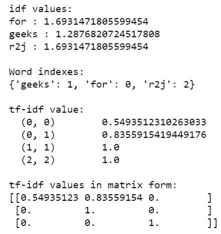

# 理解 TF-IDF(术语频率-逆文档频率)

> 原文:[https://www . geesforgeks . org/understanding-TF-IDF-term-frequency-reverse-document-frequency/](https://www.geeksforgeeks.org/understanding-tf-idf-term-frequency-inverse-document-frequency/)

**TF-IDF** 代表记录的术语频率逆文档频率。它可以被定义为计算一系列或语料库中的一个单词与文本的相关性。词义随着单词在文本中出现的次数成比例地增加，但通过语料库(数据集)中的词频得到补偿。

**术语:**

*   **词频:** 在文档 d 中，频率代表给定单词 t 的实例数量，因此我们可以看到当一个单词出现在文本中时，它变得更加相关，这是理性的。由于术语的排序并不重要，我们可以使用一个向量来描述术语模型包中的文本。对于论文中的每个特定术语，都有一个条目，其值是术语频率。

文档中出现的术语的权重与术语出现的频率成正比。

```py
tf(t,d) = count of t in d / number of words in d
```

*   **文档频率:** 这在整个语料库集合中测试了与 TF 非常相似的文本的含义。唯一不同的是，在文档 d 中，TF 是某个术语 t 的频率计数器，而 df 是该术语 t 在文档集合 N 中出现的次数，换句话说，出现该词的论文数就是 DF。

```py
df(t) = occurrence of t in documents
```

*   **逆文献频率:** 主要是测试这个词的相关程度。搜索的主要目的是找到符合需求的适当记录。由于 tf 认为所有术语都同等重要，因此不仅可以使用术语频率来衡量论文中术语的权重。首先，通过计算包含术语 t 的文档数量，找出术语 t 的文档频率:

```py
df(t) = N(t)
where
df(t) = Document frequency of a term t
N(t) = Number of documents containing the term t
```

术语频率是单个文档中某个术语的实例数；虽然文档的出现频率是术语出现的单独文档的数量，但它取决于整个语料库。现在我们来看看逆纸频率的定义。单词的 IDF 是语料库中文档的数量除以文本的频率。

```py
idf(t) = N/ df(t) = N/N(t)
```

更常见的词应该被认为不太重要，但是元素(大多数确定的整数)似乎太苛刻了。然后我们取纸的逆频率的对数(以 2 为底)。所以 t 项的 if 变成:

```py
idf(t) = log(N/ df(t))
```

*   **计算:** Tf-idf 是确定术语对系列或语料库中的文本有多重要的最佳指标之一。tf-idf 是一种加权系统，它根据单词的词频(tf)和文档频率倒数(tf) (idf)为文档中的每个单词分配权重。权重分数较高的单词被认为更有意义。

通常，tf-idf 权重由两个术语组成-

1.  **【归一化项频率(tf)**
2.  **【逆文档频率(idf)**

```py
tf-idf(t, d) = tf(t, d) * idf(t)
```

在 python 中，tf-idf 值可以使用 *sklearn* 模块中的 *TfidfVectorizer()* 方法来计算。

**语法:**

> sklearn . feature _ extraction . text . tfidfvectorzer(输入)
> 
> **参数:**
> 
> *   **输入** ***:** 指传递的参数文档，可以是文件名、文件或内容本身。*
> 
> **属性:**
> 
> *   **词汇** _ ***:** 它返回作为关键字的术语字典和作为*特征索引的值。
> *   **idf_** ***:** 返回作为参数传递的文档的*逆文档频率向量。
> 
> **返回:**
> 
> *   **fit_transform():** 它返回一个项数组以及 tf-idf 值。
> *   **get_feature_names():** 它返回一个功能名称列表。

**分步方法:**

*   导入模块。

## 蟒蛇 3

```py
# import required module
from sklearn.feature_extraction.text import TfidfVectorizer
```

*   从文档中收集字符串并创建一个语料库，该语料库包含来自文档 *d0、d1、*和 *d2* 的字符串集合。

## 蟒蛇 3

```py
# assign documents
d0 = 'Geeks for geeks'
d1 = 'Geeks'
d2 = 'r2j'

# merge documents into a single corpus
string = [d0, d1, d2]
```

*   从 *fit_transform()* 方法获取 tf-idf 值。

## 蟒蛇 3

```py
# create object
tfidf = TfidfVectorizer()

# get tf-df values
result = tfidf.fit_transform(string)
```

*   显示语料库中单词的 idf 值。

## 蟒蛇 3

```py
# get idf values
print('\nidf values:')
for ele1, ele2 in zip(tfidf.get_feature_names(), tfidf.idf_):
    print(ele1, ':', ele2)
```

**输出:**

<center>
</center>

*   显示 tf-idf 值和索引。

## 蟒蛇 3

```py
# get indexing
print('\nWord indexes:')
print(tfidf.vocabulary_)

# display tf-idf values
print('\ntf-idf value:')
print(result)

# in matrix form
print('\ntf-idf values in matrix form:')
print(result.toarray())
```

**输出:**

<center>
</center>

*结果*变量由唯一的单词和 tf-if 值组成。可以用下图来详细说明:

<center>
</center>

从上图可以生成下表:

<figure class="table">

| 文件 | 单词 | 文件索引 | 字索引 | tf-idf 值 |
| --- | --- | --- | --- | --- |
| d0 | 为 | Zero | Zero | 0.549 |
| d0 | 奇葩 | Zero | one | 0.549 |
| d1 | 奇葩 | one | one | One |
| d2 | r2j | Two | Two | One |

</figure>

**以下是一些描述如何从语料库中计算单词 tf-idf 值的示例:**

**示例 1:** 以下是基于上述方法的完整程序:

## 蟒蛇 3

```py
# import required module
from sklearn.feature_extraction.text import TfidfVectorizer

# assign documents
d0 = 'Geeks for geeks'
d1 = 'Geeks'
d2 = 'r2j'

# merge documents into a single corpus
string = [d0, d1, d2]

# create object
tfidf = TfidfVectorizer()

# get tf-df values
result = tfidf.fit_transform(string)

# get idf values
print('\nidf values:')
for ele1, ele2 in zip(tfidf.get_feature_names(), tfidf.idf_):
    print(ele1, ':', ele2)

# get indexing
print('\nWord indexes:')
print(tfidf.vocabulary_)

# display tf-idf values
print('\ntf-idf value:')
print(result)

# in matrix form
print('\ntf-idf values in matrix form:')
print(result.toarray())
```

**输出:**

<center>
</center>

**示例 2:** 这里，tf-idf 值是从具有唯一值的语料库中计算的。**T3】**

## 蟒蛇 3

```py
# import required module
from sklearn.feature_extraction.text import TfidfVectorizer

# assign documents
d0 = 'geek1'
d1 = 'geek2'
d2 = 'geek3'
d3 = 'geek4'

# merge documents into a single corpus
string = [d0, d1, d2, d3]

# create object
tfidf = TfidfVectorizer()

# get tf-df values
result = tfidf.fit_transform(string)

# get indexing
print('\nWord indexes:')
print(tfidf.vocabulary_)

# display tf-idf values
print('\ntf-idf values:')
print(result)
```