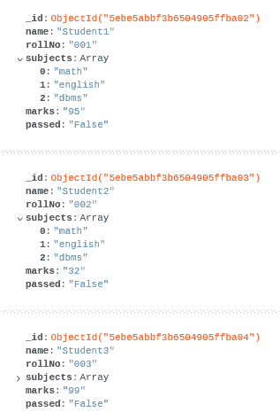
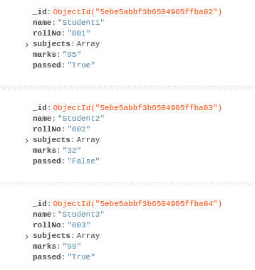

# 使用 PyMongo 更新集合中的所有文档

> 原文:[https://www . geesforgeks . org/update-all-documents-in-a-collection-use-pymongo/](https://www.geeksforgeeks.org/update-all-documents-in-a-collection-using-pymongo/)

[MongoDB](https://www.geeksforgeeks.org/mongodb-and-python/) 是一个开源的面向文档的数据库。MongoDB 以键值对的形式存储数据，是一个 NoSQL 数据库程序。NoSQL 这个术语的意思是非关系的。

PyMongo 包含用于与 MongoDB 数据库交互的工具。现在让我们看看如何更新集合中的所有文档。

## 更新集合中的所有文档

PyMongo 包含一个**update _ multi()**函数，用于更新满足给定查询的所有文档。

update _ multi()接受以下参数–

1.  **过滤器–**是第一个参数，它是更新满足查询的文档的标准。
2.  **更新运算符-** 是包含文档中要更新的信息的第二个参数。
3.  **upsert-** (可选)它是一个布尔值。如果设置为 true，并且没有与筛选器匹配的文档，则会创建一个新文档。
4.  **array _ filters–**(可选)这是一个由过滤器文档组成的 n 数组，用于确定对数组字段进行更新操作时要修改哪些数组元素。
5.  **旁路 _ 文档 _ 验证–**(可选)当设置为**真**时跳过文档验证的布尔值。
6.  **排序规则–**(可选)指定操作的语言特定规则。
7.  **会话–**(可选) a 客户端会话。

**更新 MongoDB 中的操作符**

**设定值:**

*   *$set:* 用于设置字段值。
*   *$ settinsert:*仅在插入新文档时更新值。
*   *$unset:* 删除该字段及其值。

**数值运算符:**

*   *$inc:* 将值增加给定的数量。
*   *$min/$max:* 返回最小值或最大值。
*   *$mul:* 将数值乘以给定的数值。

**其他操作员:**

*   *$currentDate:* 将字段值更新为当前日期。
*   *$重命名*:重命名字段

现在我们通过一些例子来了解一下。

**样本数据库:**



**我们将在本文中看到的一些用例，在这些用例中更新许多记录可能是有用的:**

1.  根据条件改变或增加几个元素。
2.  向多个或所有文档插入新字段。

**例 1:** 成绩大于 35 分的学生全部通过。

## 蟒蛇 3

```py
from pymongo import MongoClient

# Creating an instance of MongoClient 
# on default localhost
client = MongoClient('mongodb://localhost:27017')

# Accessing desired database and collection
db = client.gfg
collection = db["classroom"]

# Update passed field to be true for all
# students with marks greater than 35
collection.update_many(
    {"marks": { "$gt": "35" } },
        {
            "$set": { "passed" : "True" }
        }
)
```

**查询后数据库:**



**示例 2:** 添加到所有文档的名为地址的新字段

## 计算机编程语言

```py
from pymongo import MongoClient

# Creating an instance of MongoClient 
# on default localhost
client = MongoClient('mongodb://localhost:27017')

# Accessing desired database and collection
db = client.gfg
collection = db["classroom"]

# Address filed to be added to all documents
collection.update_many(
        {},
        {"$set":
            {
                "Address": "value"
            }
        },

   # don't insert if no document found
   upsert=False,
   array_filters=None
   )
```

**查询后数据库:**

