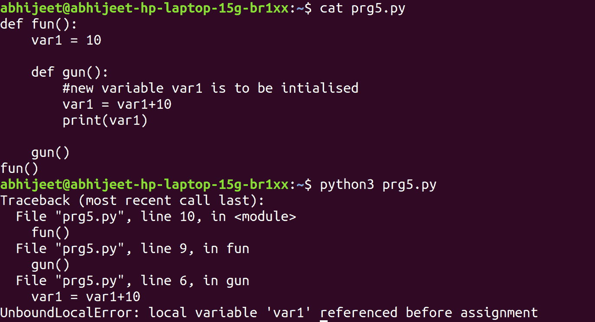

# Python 中非本地关键字的使用与全局关键字的使用

> 原文:[https://www . geeksforgeeks . org/使用非本地 vs .使用 python 中的全局关键字/](https://www.geeksforgeeks.org/use-of-nonlocal-vs-use-of-global-keyword-in-python/)

**先决条件:**[Python 中的全局和局部变量](https://www.geeksforgeeks.org/global-local-variables-python/)
在迁移到 Python 中的非局部和全局之前。让我们考虑嵌套函数中的一些基本场景。

## 蟒蛇 3

```
def fun():
    var1 = 10

    def gun():
        print(var1)
        var2 = var1 + 1
        print(var2)

    gun()
fun()
```

**Output:** 

```
10
11
```

变量 **var1** 的范围**跨越整个乐趣**()。它可以从 fun()的嵌套函数中访问

## 蟒蛇 3

```
def fun():
    var1 = 10

    def gun():
        # gun() initializes a new variable var1.
        var1 = 20
        print(var1, id(var1))

    print(var1, id(var1))
    gun()
fun()
```

**Output:** 

```
10 10853920
20 10854240
```

在这种情况下**枪()** **在枪**的范围内初始化了新变量 var1 **。值为 10 的 var1 和值为 20 的 var1 是两个不同且唯一的变量。默认情况下，值为 20 的 var1 将在 gun()中访问。**



考虑到前面的例子，我们知道 guns 将在其自己的范围内初始化一个新的变量 var1。但是当它要这样做时，它无法找到 var1 **的值，但**、
可以执行算术运算，因为之前在 gun()中没有为 var1 **赋值。**

## 蟒蛇 3

```
def fun():
    var1 = 10

    def gun():
        # tell python explicitly that it
        # has to access var1 initialized
        # in fun on line 2
        # using the keyword nonlocal
        nonlocal var1
        var1 = var1 + 10
        print(var1)

    gun()
fun()
```

**Output:** 

```
20
```

在本例中，在 gun()中初始化 var1 之前。我们已经明确告诉 Python，不要初始化一个新的变量，而是访问第 2 行中已经存在的 var1。使用关键字**非本地**所以当解释器执行加法时，它访问值 10(已经存在)，并且避免了错误。

现在让我们继续讨论全球关键词。考虑下面给出的例子

## 蟒蛇 3

```
var1 = 10
def fun():
    # global variable var1 will
# be read or accessed in fun()
    print('var1 is', var1)

fun()
```

**Output:** 

```
var1 is 10
```