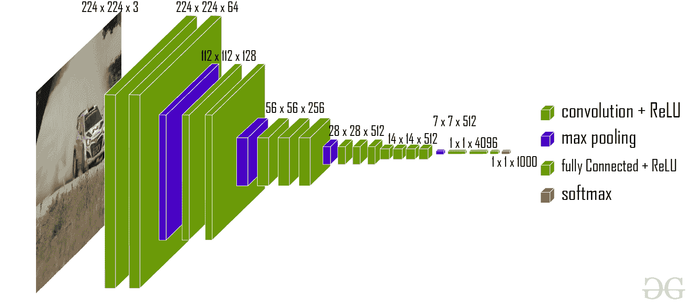
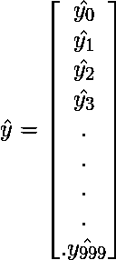
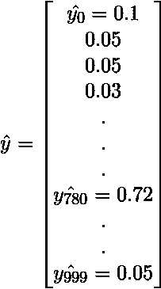
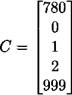
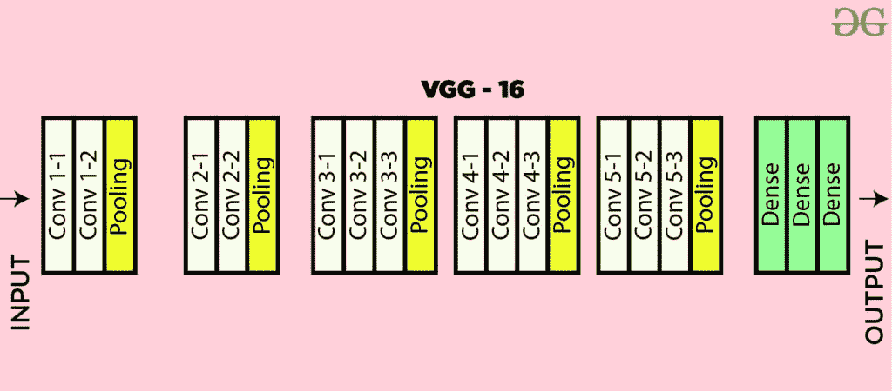

# VGG-16 | CNN 型号

> 原文:[https://www.geeksforgeeks.org/vgg-16-cnn-model/](https://www.geeksforgeeks.org/vgg-16-cnn-model/)

ImageNet 大规模视觉识别挑战赛( [ILSVRC](http://www.image-net.org/challenges/LSVRC/) )是一年一度的计算机视觉比赛。每年，团队会在两项任务上竞争。首先是检测来自 *200* 类的图像中的物体，这被称为物体定位。第二种是对图像进行分类，每个图像标注 *1000* 类中的一个，称为图像分类。VGG 16 是由牛津大学视觉几何组实验室的卡伦·西蒙扬和安德鲁·齐泽曼在 2014 年的论文《用于大规模图像识别的超深度卷积网络》中提出的。该车型在 2014 ILSVRC 挑战赛中获得上述类别第 1 st 和第 2 nd 名。

VGG-16 体系结构

该模型在包含 1000 个类别的 *14* 万幅图像的 ImageNet 数据集上达到了 *92.7%的 top-5* 测试精度。

**目的:**
ImageNet 数据集包含 *224*224* 的固定大小的图像，并且具有 RGB 通道。所以，我们有一个张量 *(224，224，3)* 作为我们的输入。该模型处理输入图像并输出 *1000* 值的矢量。

该向量表示相应类别的分类概率。假设我们有一个模型预测图像属于 0 类概率 *.1* ，*1 类*概率 *0.05* ，*2 类*概率 *0.05* ，3 类 *3* 概率 *0.03* ，*类 780* 概率 *0.72* ，98 类因此，这个的分类向量将是:

为了确保这些概率加到 *1* 上，我们使用 softmax 函数。该 softmax 功能定义为:

在此之后，我们将 5 个最有可能的候选纳入向量。

and our ground truth vector is defined as follows:

然后我们定义我们的误差函数如下:

所以，这个例子的损失函数是:

So,

Since, all the categories in ground truth are in the Predicted top-5 matrix, so the loss becomes 0.

**架构:**
网络的输入是维度的图像 *(224，224，3)* 。前两层有 *64* 通道的 *3*3* 滤镜尺寸和相同的填充。然后经过一个跨步 *(2，2)* 的最大池层，两个具有 256 个滤波器大小的卷积层和滤波器大小 *(3，3)* 。接下来是最大跨度池层 *(2，2)* ，与前一层相同。然后是滤波器尺寸 *(3，3)**256*滤波器的 *2* 卷积层。之后有 *2* 套 *3* 卷积层和一个最大池层。各有 *(3，3)* 尺寸的 *512* 过滤器，填料相同。该图像然后被传递到两个卷积层的堆栈。在这些卷积和最大池层中，我们使用的过滤器大小为 *3*3* ，而不是 AlexNet 中的 *11*11* 和 ZF 网中的 *7*7* 。在某些图层中，它还使用 *1*1* 像素，用于操纵输入通道的数量。在每个卷积层之后有一个 1 像素*(相同填充)的填充，以防止图像的空间特征。*

*

VGG-16 体系结构图* 

*经过卷积和最大池层的叠加，得到了 *(7，7，512)* 特征图。我们展平这个输出，使其成为 *(1，25088)* 特征向量。在此之后有 *3 个完全*连接的层，第一层从最后的特征向量中获取输入并输出一个 *(1，4096)* 向量，第二层也输出一个大小为 *(1，4096)* 的向量，但是第三层输出一个 *1000* 通道用于 *1000* 类的 ILSVRC 挑战，然后在第三个完全连接的层的输出被传递到 softmax 层之后，以便归一化输出分类向量后对前 5 类进行评价。所有隐藏层都使用 ReLU 作为其激活功能。ReLU 的计算效率更高，因为它导致更快的学习，并且它还降低了消失梯度问题的可能性。*

***配置:**
下表列出了不同的 VGG 建筑。我们可以看到 VGG-16 有两个版本(C 和 D)。它们之间没有太大的区别，除了除了一些卷积层之外，使用了 *(3，3)* 滤波器大小卷积来代替 *(1，1)* 。这两个分别包含 *134* 百万和 *138* 百万参数。* 

*

不同的 VGG 构型* 

***图像中的对象定位:**
要执行定位，我们需要用包围盒位置候选来替换类别分数。边界框位置由四维向量(中心坐标、高度、宽度)表示。本地化架构有两个版本，一个是不同候选之间共享的包围盒(输出为 *4* 参数向量)，另一个是类特定的包围盒(输出为 *4000* 参数向量)。本文在 VGG -16 (D)体系结构上试验了这两种方法。这里我们还需要将损失从分类损失改为回归损失函数(如 [MSE](https://www.geeksforgeeks.org/python-mean-squared-error/) )，以惩罚预测损失与地面事实的偏差。*

***结果:**
VGG-16 是 2014 年 ILSVRC 挑战赛中表现最好的建筑之一。它是分类任务的亚军，前 5 名的分类误差为 *7.32%* (仅次于分类误差为 *6.66%* 的 GoogLeNet)。也是 *25.32%* 定位误差的定位任务赢家。
**VGG 16 的挑战:***

*   *训练非常慢(最初的 VGG 模型在 Nvidia Titan GPU 上训练了 2-3 周)。**   *The size of VGG-16 trained imageNet weights is *528* MB. So, it takes quite a lot of disk space and bandwidth that makes it inefficient.

    **参考文献:**

    *   [VGG 纸。](https://arxiv.org/pdf/1409.1556.pdf)
    *   [他们的 VRC 挑战。](https://arxiv.org/pdf/1409.0575)*