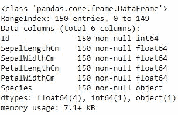
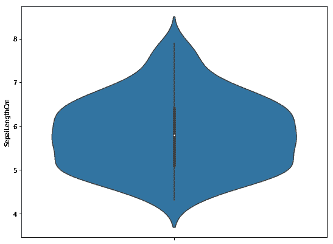
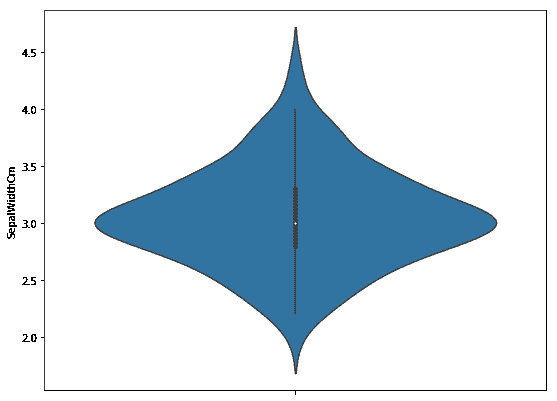
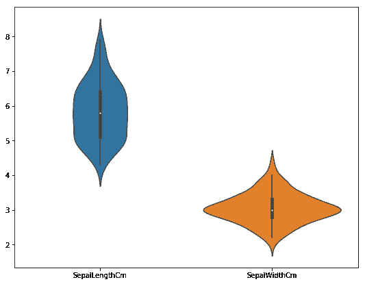
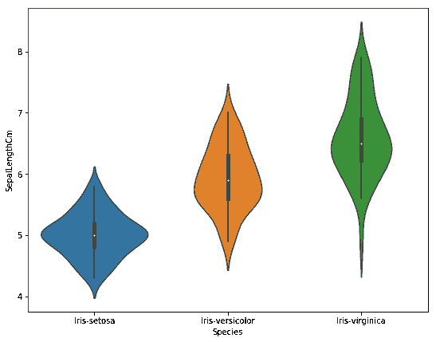

# 数据分析用小提琴图

> 原文:[https://www . geesforgeks . org/violin-plot-for-data-analysis/](https://www.geeksforgeeks.org/violin-plot-for-data-analysis/)

**小提琴图**是一种可视化不同变量数值数据分布的方法。它类似于箱线图，但每侧都有一个旋转图，提供了更多关于 y 轴上密度估计的信息。
密度被镜像和翻转，最终的形状被填充，产生一个类似小提琴的图像。小提琴情节的优势在于，它可以显示出在盒式情节中无法察觉的分布细微差别。另一方面，箱线图更清楚地显示了数据中的异常值。

小提琴情节比盒子情节拥有更多的信息，它们不太受欢迎。由于它们不受欢迎，对于许多不熟悉小提琴情节表现的读者来说，它们的意义可能更难理解。

要获得虹膜数据的链接，请点击这里的–。

**数据集的属性信息:**

```py
Attribute Information:
   -> sepal length in cm
   -> sepal width in cm
   -> petal length in cm
   -> petal width in cm
   -> class: 
              Iris Setosa
              Iris Versicolour
              Iris Virginica

Number of Instances: 150 

Summary Statistics:
             Min  Max   Mean    SD   Class Correlation
   sepal length: 4.3  7.9   5.84  0.83    0.7826   
    sepal width: 2.0  4.4   3.05  0.43   -0.4194
   petal length: 1.0  6.9   3.76  1.76    0.9490  (high!)
    petal width: 0.1  2.5   1.20  0.76    0.9565  (high!)

Class Distribution: 33.3% for each of 3 classes.

```

**加载库**

```py
import numpy as np
import pandas as pd
import seaborn as sns
from matplotlib import pyplot
import seaborn
```

**加载数据**

```py
data = pd.read_csv("Iris.csv")

print (data.head(10))
```

**输出:**


**描述**

```py
data.describe()
```

**输出:**


**信息**

```py
data.info()
```

**输出:**


**描述虹膜数据集的“分离长度”参数。**

```py
data["SepalLengthCm"].describe()
```

**输出:**

```py
count    150.000000
mean       5.843333
std        0.828066
min        4.300000
25%        5.100000
50%        5.800000
75%        6.400000
max        7.900000
Name: SepalLengthCm, dtype: float64
```

**代码#1:** 参数“分离长度”的小提琴图。

```py
fig, ax = pyplot.subplots(figsize =(9, 7))
sns.violinplot( ax = ax, y = data["SepalLengthCm"] )
```

**输出:**

如你所见，我们在 5 到 6 之间有更高的密度。这一点非常重要，因为在赛帕伦厘米的描述中，平均值为 5.43。

**代码#2:** 参数“分离宽度”的小提琴图。

```py
fig, ax = pyplot.subplots(figsize =(9, 7))
sns.violinplot(ax = ax,  y = data["SepalWidthCm"] )
```

**输出:**


这里，更高的密度也是平均值= 3.05

**代码#3:** 小提琴图，比较“分离长度厘米”和“分离宽度厘米”。

```py
fig, ax = pyplot.subplots(figsize =(9, 7))
sns.violinplot(ax = ax, data = data.iloc[:, 1:3])
```

**输出:**


**代码#4:** 小提琴图比较‘separangthcm’物种。

```py
fig, ax = pyplot.subplots(figsize =(9, 7))
sns.violinplot(ax = ax, x = data["Species"], 
                  y = data["SepalLengthCm"] )
```

**输出:**
