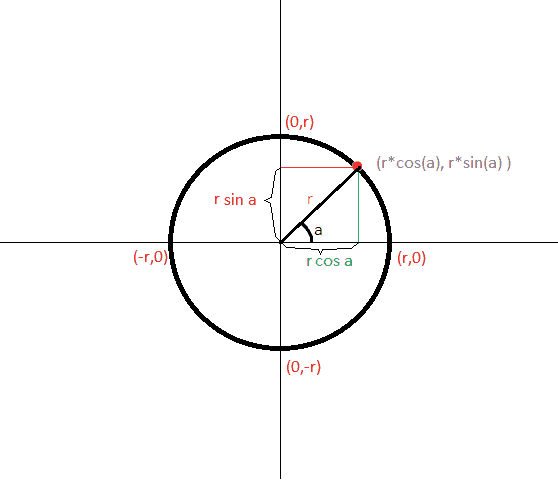
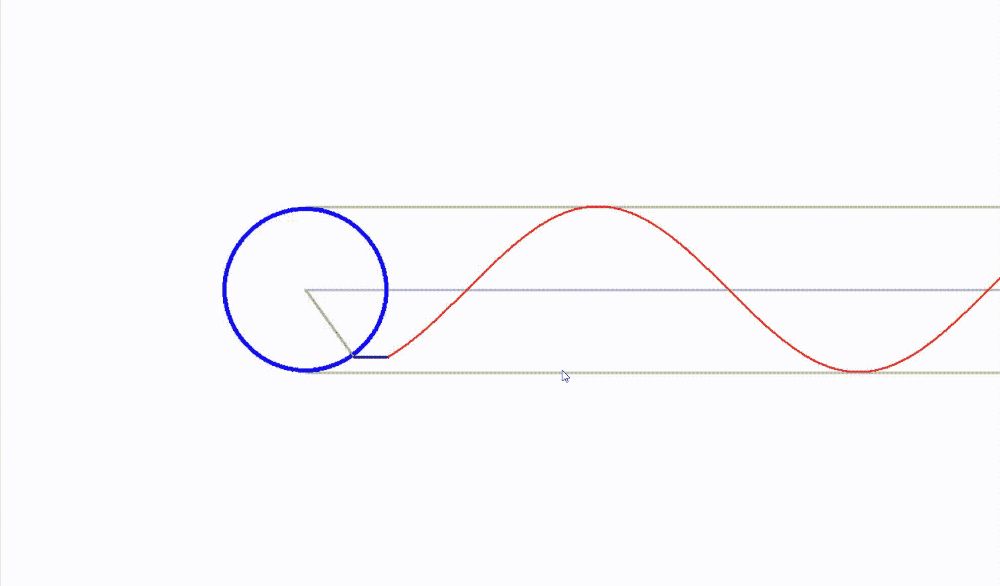

# 使用 Python 可视化正弦波

> 原文:[https://www . geesforgeks . org/visualize-正弦波-使用-python/](https://www.geeksforgeeks.org/visualize-sinusoidal-waves-using-python/)

正弦波是最基本的三角周期曲线，也称为正弦曲线。这里我们将看到正弦函数是如何与圆相关的。尽管正弦函数是三角函数，但它更多的是与圆有关，而不是三角形。

**考虑一个简单的圆方程:**


其中 r 是圆心在原点(0，0)的圆的半径，如下图所示。

**正弦只不过是角度增加时 y-位移相对原点的测量值，如下图所示:**



我们可以使用 **python** 和 **pygame** 模块来可视化正弦的定义。Pygame 是一个开源的 python 包，主要用于创建视频游戏。

### **进场:**

*   创建一个半径为 **r** 的圆。
*   画圆的半径。半径的端点将是(0，0)和(r*cos a，r*sin a)，其中点(r*cos a，r*sin a)将始终是圆的。
*   画正弦曲线
*   然后画一条线，连接正弦波的起点和圆半径的终点。为了简单起见，该长度被称为**间隙**。

**注:**这里半径的位置是指圆的半径的头部的位置。丙烯腈-丁二烯-苯乙烯

## 画正弦曲线

画一个圆并设置其半径的动画，这样半径的端点将覆盖圆圆周上的所有点。这可以通过使用无限 while 循环并从圆心画一条线到( **r** * **cos t，r** * **sin t** )来完成。然后声明一个列表 **Ys** 来存储列表开头的所有 **r*sin t** 值。

这将基本上跟踪从半径的初始位置到其当前新位置的所有 **r*sin t** 值。这些值将在后面用于显示正弦曲线。创建一个 for 循环来循环通过 **Ys** 的元素，然后画一个半径为 1、宽度为 1 的圆，横坐标从 0 开始到 len(Ys)，纵坐标将是相应的 Ys 值，即 **Ys[i]** ，其中索引**I**∑**【0，len(Ys)-1】。**横坐标需要移动一定的量，足以让动画整齐。

在动画中，**间隙**用黑线表示，可以由用户增减。

#### 下面是实现:

## 蟒蛇 3

```py
import numpy as np
import pygame
from pygame.locals import *

class trig:

    # to collect all the ordinates
    Ys = []

    def __init__(self, width=1600, height=900,
                 gap=100, fps=60, radius=100):

        # width of the window
        self.width = width

        # height of the window
        self.height = height

        # frame rate per second
        self.fps = fps
        self.screen = pygame.display.set_mode((self.width,
                                               self.height))

        # setting the screen dimensions
        self.clock = pygame.time.Clock()

        # the distance between the radius
        self.gap = gap

        #  pointer and the starting point of the curve

        # the will be the x axis
        self.t = 0

        # length of the radius of the circle
        self.r = radius

        self.run = True
        while self.run:
            self.clock.tick(self.fps)

            # filling the whole canvas with white background
            self.screen.fill('white')
            for event in pygame.event.get():
                if event.type == pygame.QUIT:
                    self.run = False
            if event.type == KEYDOWN:
                if event.key == K_ESCAPE:
                    pygame.quit()

            # center of the circle
            x, y = 400, 400

            x += (self.r * np.cos(self.t))
            y += (self.r * np.sin(self.t))
            pygame.draw.line(self.screen, 'grey',
                             (400, 400),
                             (400+1000, 400), 3)

            # this will create a horizontal line

            pygame.draw.line(self.screen,
                             'grey',
                             (400, 400 + self.r),
                             (400+1000, 400+self.r), 3)

            # this will create a horizontal line above the circle
            pygame.draw.line(self.screen,
                             'grey',
                             (400, 400 - self.r),
                             (400+1000, 400-self.r),
                             3)

            # this will create a horizontal
            # line below the circle
            pygame.draw.circle(self.screen,
                               'blue',
                               (400, 400),
                               self.r, 5)

            # this will create a circle
            # with center (400,400)
            pygame.draw.line(self.screen,
                             'green',
                             (400, 400),
                             (x, y), 3)

            # this will draw the radius of the circle

            # inserting the y values
            # at the beginning of the Ys list
            self.Ys.insert(0, y)

            if len(self.Ys) > 1100 - self.gap:
                self.Ys.pop()

            # this will restrict the length
            # of the Ys to a certain limit
            # so that the animation
            # doesn't get out of the screen

            pygame.draw.line(self.screen, 'black', (x, y),
                             (400+self.gap, self.Ys[0]), 3)

            # this will create the joining line
            # between the curve and the circle's radius

            for i in range(len(self.Ys)):
                pygame.draw.circle(self.screen, 'red',
                                   (i+400+self.gap, self.Ys[i]), 1, 1)

                # this will create the sin curve
                # it will create bunch of small circles
                # with varying centers in such a
                # way that it will trajectory of
                # the centers of all those small circles
                # will give rise to a sine curve

            if event.type == KEYDOWN:
                if event.key == K_RIGHT:
                    self.gap += 1
                if event.key == K_LEFT:
                    self.gap -= 1

             # this part of code gives the user
             # the freedom to set the speed of the
             # animation and also set the gap
             # between the circle and the sine curve

            self.t += 0.01
            pygame.display.update()

if __name__ == '__main__':
    sin = trig()
    pygame.quit()
```

**输出:**



**注意:**使用左右箭头减小或增大圆与正弦曲线之间的间隙。使用 **ECS** 退出窗口或退出。