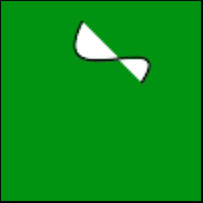

# Python 中的 Wand bezier()函数

> 原文:[https://www . geesforgeks . org/wand-bezier-function in-python/](https://www.geeksforgeeks.org/wand-bezier-function-in-python/)

**贝塞尔()**是魔杖中的另一个绘图功能。这种方法用于绘制贝塞尔曲线。确定一条贝塞尔曲线需要四个点。极值点定义曲线的起点和终点，而在两个点之间用于控制曲线。

> **语法:** wand.drawing.bezier(点)
> T3】参数:
> 
> | 参数 | 输入类型 | 描述 |
> | --- | --- | --- |
> | 点 | 目录 | x，y 元组列表。 |

**例 1:**

```py
# Import required objects from wand modules
from wand.image import Image
from wand.drawing import Drawing
from wand.color import Color

# generate object for wand.drawing
with Drawing() as draw:

    # set stroke color
    draw.stroke_color = Color('black')

    # set width for stroke
    draw.stroke_width = 1

    # points list to determine curve
    points = [(40, 10), # Start point
              (20, 50), # First control
              (90, 10), # Second control
              (70, 40)] # End point 

    # fill white color in arc
    draw.fill_color = Color('white')

    # draw bezier curve using bezier function
    draw.bezier(points) 
    with Image(width = 100,
               height = 100,
               background = Color('green')) as img:

        # draw shape on image using draw() function
        draw.draw(img)
        img.save(filename ='bezier.png')
```

**输出:**


**例 2:**

**输入图像:**


```py
# Import required objects from wand modules
from wand.image import Image
from wand.drawing import Drawing
from wand.color import Color

# generate object for wand.drawing
with Drawing() as draw:
    points = [(20, 100),  # Start point
              (50, 10),  # First control
              (50, 90),  # Second control
              (180, 100)]

    # set stroke color
    draw.stroke_color = Color('black')

    # set width for stroke
    draw.stroke_width = 1

    # fill white color in arc
    draw.fill_color = Color('white')

    # draw bezier curve using bezier function
    # From bottom left around to top right
    draw.bezier(points) 
    with Image(filename ="gog.png") as img:

        # draw shape on image using draw() function
        draw.draw(img)
        img.save(filename ='bezier2.png')
```

**输出:**
