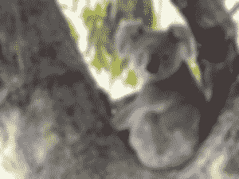

# Python 中的 Wand gaussian_blur()函数

> 原文:[https://www . geesforgeks . org/wand-Gaussian _ blur-function-in-python/](https://www.geeksforgeeks.org/wand-gaussian_blur-function-in-python/)

另一种模糊是**高斯模糊**。高斯模糊与普通模糊的区别在于高斯模糊是用高斯函数实现的。简单地说，任何形式的方程:叫做高斯函数。

> **语法:**
> 
> ```py
> wand.image.gaussian_blur(radius="radius_value", 
>                            sigma="sigma_value", 
>             channel = "optional_channel_value")
>   
> # radius should always be greater than sigma(standard deviation)
> ```
> 
> **参数:**
> 
> | 参数 | 输入类型 | 描述 |
> | --- | --- | --- |
> | 半径 | 数字，真实的 | 的半径，以像素为单位，不计算中心像素。 |
> | 希腊字母表中第十八个字母 | 数字，真实的 | 标准偏差，以像素为单位 |
> | 频道 | 基绳 | 应用模糊的可选颜色通道。 |

**所用图像:**


**示例#1:**

```py
# import display() to show final image
from wand.display import display

# import Image from wand.image module
from wand.image import Image

# read file using Image function
with Image(filename ="koala.jpeg") as img:

    # perform adaptive blur effect using adaptive_blur() function
    img.gaussian_blur(radius = 5, sigma = 4)

    # save final image
    img.save(filename ="gb_koala.jpeg")

    # display final image
    display(img)
```

**输出:**


**例 2:** 半径和σ减小

```py
# import display() to show final image
from wand.display import display

# import Image from wand.image module
from wand.image import Image

# read file using Image function
with Image(filename ="koala.jpeg") as img:

    # perform adaptive blur effect using adaptive_blur() function
    img.gaussian_blur(radius = 2, sigma = 3)

    # save final image
    img.save(filename ="gb_koala.jpeg")

    # display final image
    display(img)
```

**输出:**
