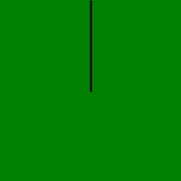

# Python 中的魔杖路径 _start()函数

> 原文:[https://www . geesforgeks . org/wand-path _ start-function-in-python/](https://www.geeksforgeeks.org/wand-path_start-function-in-python/)

我们也可以在`wand.drawing`模块中绘制路径。每个 path 方法都需要一个目标点，并将从当前点绘制到新点。目标点将成为下一个应用路径方法的新当前点。魔杖中的路径由一些其他方法组成，用于在路径中绘制不同的图形。
在本文中我们将学习 path_start()函数。使用 path_start 函数启动路径。

> **语法:** wand.drawing.path_start()

**示例#1:**

```py
from wand.image import Image
from wand.drawing import Drawing
from wand.color import Color

with Drawing() as draw:
    draw.stroke_width = 2
    draw.stroke_color = Color('black')
    draw.path_start()

    # Start middle-left
    draw.path_move(to =(100, 100))
    draw.path_horizontal_line(1)

    # Close first & last points
    draw.path_close()
    draw.path_finish()
    with Image(width = 200, 
               height = 200,
               background = Color('green')) as image:

        draw(image)
        image.save(filename = "pathstart.png")
```

**输出:**


**例 2:**

```py
from wand.image import Image
from wand.drawing import Drawing
from wand.color import Color

with Drawing() as draw:
    draw.stroke_width = 2
    draw.stroke_color = Color('black')
    draw.path_start()

    # Start middle-left
    draw.path_move(to=(100, 100))

    # draw a vertical line from path initial point
    draw.path_vertical_line(1)

    # Close first & last points
    draw.path_close()
    draw.path_finish()
    with Image(width=200,
               height=200,
               background=Color('green')) as image:
        draw(image)
        image.save(filename = "pathstart.png")
```

**输出:**
