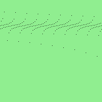

# Python 中的魔杖点()函数

> 原文:[https://www . geesforgeks . org/wand-point-function-in-python/](https://www.geeksforgeeks.org/wand-point-function-in-python/)

**点()**是另一个绘图功能，也是最简单的。point()函数基本上是在图像上的特定点上绘制一个点。对于点坐标，它只需要两个 x，y 参数。

> **语法:**
> 
> ```
> wand.drawing.point(x, y)
> ```
> 
> **参数:**
> 
> <figure class="table">
> 
> | 参数 | 输入类型 | 描述 |
> | --- | --- | --- |
> | x | 数字。真实的 | 点的 x 坐标 |
> | y | 数字。真实的 | 点的 y 坐标 |
> 
> </figure>

**示例#1:**

## 蟒蛇 3

```
# Import different modules of wand
from wand.image import Image
from wand.drawing import Drawing
from wand.color import Color

# object for Drawing
with Drawing() as draw:
    x = 100
    y = 100
    # draw point at (100, 100) using point() function
    draw.point(x, y)

    with Image(width = 200, height = 200,
               background = Color('lightgreen')) as image:

        draw(image)
        image.save(filename ="point.png")
```

**输出:**


**例 2:**

## 蟒蛇 3

```
# Import different modules of wand
from wand.image import Image
from wand.drawing import Drawing
from wand.color import Color
import math

with Drawing() as draw:
    for x in xrange(0, 200):
        y = math.tan(x) * 4
        # draw points at different locations using point() function
        draw.point(x, y + 50)
    with Image(width = 200, height = 200, background = Color('lightgreen')) as image:
        draw(image)
        image.save(filename = "points.png")
```

**输出:**

