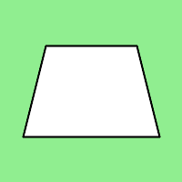

# Python 中的魔杖多边形()函数

> 原文:[https://www . geesforgeks . org/wand-polygon-function-in-python/](https://www.geeksforgeeks.org/wand-polygon-function-in-python/)

**多边形()**功能是 wand.drawing 模块中引入的另一个绘图功能。我们可以使用 polygon()函数绘制复杂的形状。它以多边形中的一系列点作为参数。描边线将在第一个&最后一点之间自动闭合。

> **语法:**
> 
> ```py
> wand.drawing.polygon(points)
> 
> ```
> 
> **参数:**
> 
> | 参数 | 输入类型 | 描述 |
> | --- | --- | --- |
> | 点 | 目录 | x，y 元组列表。 |

**示例#1**

```py
from wand.image import Image
from wand.drawing import Drawing
from wand.color import Color

with Drawing() as draw:
    draw.stroke_width = 2
    draw.stroke_color = Color('black')
    draw.fill_color = Color('white')

    # points list for polygon
    points = [(25, 25), (175, 100), (25, 175)]

    # draw polygon using polygon() function
    draw.polygon(points)
    with Image(width = 200, height = 200, background = Color('lightgreen')) as image:
        draw(image)
        image.save(filename = "polygon.png")
```

**输出:**


**例 2:**

```py
from wand.image import Image
from wand.drawing import Drawing
from wand.color import Color

with Drawing() as draw:
    draw.stroke_width = 2
    draw.stroke_color = Color('black')
    draw.fill_color = Color('white')

    # points list for polygon
    points = [(50, 50), (150, 50), (175, 150), (25, 150)]

    # draw polygon using polygon() function
    draw.polygon(points)
    with Image(width = 200, height = 200, background = Color('lightgreen')) as image:
        draw(image)
        image.save(filename = "polygon2.png")
```

**输出:**
