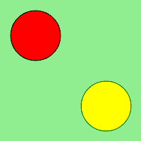

# Python 中的魔杖推送()和弹出()

> 原文:[https://www.geeksforgeeks.org/wand-push-and-pop-in-python/](https://www.geeksforgeeks.org/wand-push-and-pop-in-python/)

我们可以使用 ImageMagick 的内部图形上下文堆栈来管理 Wand 中不同的样式和操作。上下文堆栈总共有四个推送函数。

*   推送()
*   push_clip_path()
*   push_defs()
*   推送模式()

push()函数用于增长上下文堆栈，pop()是另一个函数，用于将堆栈恢复到以前的 push。

> **语法:**
> 
> ```
> # for push()
> wand.drawing.push()
> 
> # for pop()
> wand.drawing.pop()
> ```
> 
> **参数:**没有 push()和 pop()函数的参数

**示例#1:**

## 蟒蛇 3

```
from wand.image import Image
from wand.drawing import Drawing
from wand.color import Color

with Drawing() as ctx:
    ctx.fill_color = Color('RED')
    ctx.stroke_color = Color('BLACK')
    ctx.push()

    ctx.circle((50, 50), (25, 25))
    ctx.pop()

    ctx.fill_color = Color('YELLOW')
    ctx.stroke_color = Color('GREEN')
    ctx.push()

    ctx.circle((150, 150), (125, 125))
    ctx.pop()

    with Image(width = 200, height = 200, background = Color('lightgreen')) as image:
        ctx(image)
        image.save(filename = "push.png")
```

**输出:**



**例 2:**

## 蟒蛇 3

```
from wand.color import Color
from wand.image import Image
from wand.drawing import Drawing
from wand.compat import nested
from math import cos, pi, sin

with nested(Color('lightblue'),
            Color('transparent'),
            Drawing()) as (bg, fg, draw):
    draw.stroke_width = 3
    draw.fill_color = fg

    for degree in range(0, 360, 15):
        draw.push()  # Grow stack
        draw.stroke_color = Color('hsl({0}%, 100 %, 50 %)'.format(degree * 100 / 360))
        t = degree / 180.0 * pi
        x = 35 * cos(t) + 50
        y = 35 * sin(t) + 50
        draw.line((50, 50), (x, y))
        draw.pop()  # Restore stack

    with Image(width = 100, height = 100, background = Color('green')) as img:
        draw(img)
        img.save(filename = "pushpop.png")
```

**输出:**

