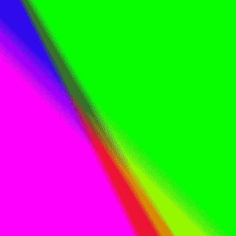

# 魔杖稀疏 _color()函数–Python

> 原文:[https://www . geesforgeks . org/wand-sparse _ color-function-python/](https://www.geeksforgeeks.org/wand-sparse_color-function-python/)

**稀疏 _ 颜色()**函数是 Python Wand ImageMagick 库中的一个内置函数，用于在图像上的点之间插值颜色值。

> **语法:**
> 
> ```
> sparse_color(method, colors)
> ```
> 
> **参数:**该功能接受三个参数，如上所述，定义如下:
> 
> *   **方法:**该参数存储插值的方法。一些可用的方法是'重心'，'双线性'，'谢泼德'，' voronoi '，'逆'，'曼哈顿'。
> *   **颜色:**该参数存储颜色以及具有 x，y 坐标的点。
> 
> **返回值:**该函数返回魔杖图像图像对象。

**原图:**


**例 1:**

## 蟒蛇 3

```
# Import library from Image
from wand.image import Image
from wand.color import Color
colors = {
Color('RED'): (100, 150),
Color('YELLOW'): (250, 150),
Color('ORANGE'): (300, 123)
}

# Import the image
with Image(filename ='../geeksforgeeks.png') as image:
    # Clone the image in order to process
    with image.clone() as sparse_color:
        # Invoke sparse_color function with 'bilinear' method
        sparse_color.sparse_color('bilinear', colors)
        # Save the image
        sparse_color.save(filename ='sparse_color1.jpg')
```

**输出:**


**例 2:**

## 蟒蛇 3

```
# Import libraries from the wand 
from wand.image import Image
from wand.drawing import Drawing
from wand.color import Color
colors = {
Color('GREEN'): (100, 100),
Color('BLUE'): (50, 50),
Color('RED'): (200, 303)
}

with Drawing() as draw:
    # Set Stroke color the circle to black
    draw.stroke_color = Color('black')
    # Set Width of the circle to 2
    draw.stroke_width = 1
    # Set the fill color to 'White (# FFFFFF)'
    draw.fill_color = Color('white')

    # Invoke Circle function with center at 50, 50 and radius 25
    draw.circle((200, 200), # Center point
                (100, 100)) # Perimeter point
    # Set the font style
    draw.font = '../Helvetica.ttf'
    # Set the font size
    draw.font_size = 30

    with Image(width = 400, height = 400, background = Color('# 45ff33')) as pic:
        # Set the text and its location
        draw.text(int(pic.width / 3), int(pic.height / 2), 'GeeksForGeeks !')
        # Draw the picture
        draw(pic)
        # Invoke sparse_color function method as barycentric
        pic.sparse_color('barycentric', colors)
        # Save the image
        pic.save(filename ='sparse_color2.jpg')
```

**输出:**

