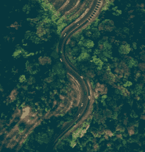

# Python 中的魔杖统计()函数

> 原文:[https://www . geesforgeks . org/wand-statistics-function-in-python/](https://www.geeksforgeeks.org/wand-statistic-function-in-python/)

统计效果类似于扩散效果，唯一的区别是，它用对相邻像素值执行的数学运算的结果来替换每个像素。宽度和高度定义了相邻像素的大小或孔径。

统计操作的类型可以是以下任何一种:

*   “梯度”
*   最大值
*   意思是
*   '中位数'
*   “最小值”
*   “模式”
*   “非峰值”
*   “均方根”
*   标准偏差'

> **语法:**wand . image . statistics(stat，width，height，channel)
> 
> **参数:**
> 
> | 参数 | 输入类型 | 描述 |
> | --- | --- | --- |
> | 斯达 | 基绳 | 要计算的统计数据的类型。请参见统计类型。 |
> | 宽度 | 数字。积分 | X 轴上相邻像素的大小。 |
> | 高度 | 数字。积分 | Y 轴上相邻像素的大小。 |
> | 频道 | 基绳 | 目标可选颜色通道。 |

**输入图像:**


**Example 1:**

```
# Import Image from wand.image module
from wand.image import Image

# Read image using Image function
with Image(filename ="koala.jpeg") as img:
    img.statistic("median", width = 8, height = 5)
    img.save(filename ="kl-statistic.jpeg")
```

**输出:**


**输入图像:**


**例 2:**

```
# Import Image from wand.image module
from wand.image import Image

# Read image using Image function
with Image(filename ="road.jpeg") as img:
    img.statistic("median", width = 8, height = 5)
    img.save(filename ="rd-statistic.jpg")
```

**输出:**
