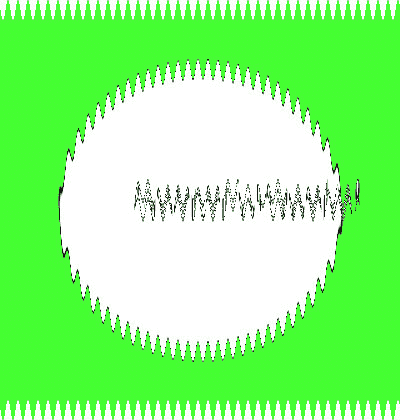

# 魔杖波()函数–Python

> 原文:[https://www.geeksforgeeks.org/wand-wave-function-python/](https://www.geeksforgeeks.org/wand-wave-function-python/)

**wave()** 函数是 Python Wand ImageMagick 库中的一个内置函数，用于随着正弦波改变图像。它会产生连锁反应。

> **语法:**
> 
> ```
> wave(amplitude, wave_length, method)
> ```
> 
> **参数:**该功能接受三个参数，如上所述，定义如下:
> 
> *   **振幅:**该参数存储正弦波的振幅值。
> *   **Wave_length:** 该参数存储正弦波的波长值。
> *   **方法:**此参数用于指定将像素插值方法取为“未定义”、“平均”、“平均 9”、“平均 16”、“背景”、“双线性”、“混合”、“catrom”、“整数”、“网格”、“最近”、“样条”的方法的值
> 
> **返回值:**该函数返回魔杖图像图像对象。

**原图:**


**例 1:**

## 蟒蛇 3

```
# Import library from Image
from wand.image import Image

# Import the image
with Image(filename ='../geeksforgeeks.png') as image:
    # Clone the image in order to process
    with image.clone() as wave:
        # Invoke wave function with amplitude as 12, wavelength as 15
        # method as 'bilinear'
        wave.wave(12, 15, 'bilinear')
        # Save the image
        wave.save(filename ='wave1.jpg')
```

**输出:**


**例 2:**

## 蟒蛇 3

```
# Import libraries from the wand 
from wand.image import Image
from wand.drawing import Drawing
from wand.color import Color

with Drawing() as draw:
    # Set Stroke color the circle to black
    draw.stroke_color = Color('black')
    # Set Width of the circle to 2
    draw.stroke_width = 1
    # Set the fill color to 'White (# FFFFFF)'
    draw.fill_color = Color('white')

    # Invoke Circle function with center at 50, 50 and radius 25
    draw.circle((200, 200), # Center point
                (100, 100)) # Perimeter point
    # Set the font style
    draw.font = '../Helvetica.ttf'
    # Set the font size
    draw.font_size = 30

    with Image(width = 400, height = 400, background = Color('# 45ff33')) as pic:
        # Set the text and its location
        draw.text(int(pic.width / 3), int(pic.height / 2), 'GeeksForGeeks !')
        # Draw the picture
        draw(pic)
        # Invoke wave() function with amplitude as 10, wavelength as 10
        # method as 'blend'
        pic.wave(10, 10, 'blend')
        # Save the image
        pic.save(filename ='wave2.jpg')
```

**输出:**

