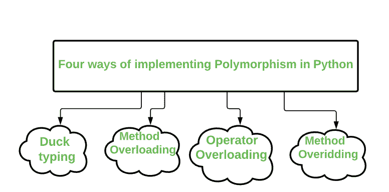
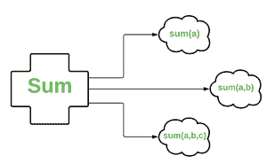

# 在 Python 中实现多态性的方式

> 原文:[https://www . geeksforgeeks . org/python 中实现多态性的方式/](https://www.geeksforgeeks.org/ways-of-implementing-polymorphism-in-python/)

在编程中，多态性是面向对象编程的一个概念。它支持使用单个接口来输入不同的数据类型、不同的类或者不同数量的输入。

**示例:**在这种情况下，函数 **len()** 是多态的，因为它在第一种情况下以字符串作为输入，而在第二种情况下以列表作为输入。

## 蟒蛇 3

```py
# length of string
x = len('Geeks')
print(x)

# length of list
y = len([1, 2, 3, 4])
print(y)
```

输出:

```py
5
4
```

在 Python 中，多态是一种让函数接受行为相似的不同类的对象的方式。

**在 Python 中实现多态有四种方式:**



**1。Duck Typing<u>:</u>**Duck Typing 是一个概念，表示对象的“类型”仅在运行时是一个需要关注的问题，在对该对象执行任何类型的操作之前，您不需要明确提到对象的类型，这与正常的类型不同，正常的类型是由对象的类型决定的。

在 Python 中，我们有动态类型的概念，即我们可以在后面提到变量/对象的类型。其思想是，调用对象上的现有方法不需要类型，如果在对象上定义了方法，则可以调用它。

## 蟒蛇 3

```py
class Geeks1:
  def code (self, ide):
    ide.execute()

class Geeks2:
  def execute (self):
    print("GeeksForGeeks is the best Platform for learning")

# create object of Geeks2   
ide = Geeks2()

# create object of class Geeks1
G1 = Geeks1()

# calling the function by giving ide as the argument.
G1.code(ide)
```

**输出:**

```py
GeeksForGeeks is the best Platform for learning
```

**2。方法重载:**默认情况下 Python 不支持方法重载，但是我们可以通过修改出方法来实现。

给定单个函数 sum()，可以指定参数的数量。这个用不同方式调用同一个方法的过程叫做**方法重载**。



**方法重载概念**

## 蟒蛇 3

```py
class GFG:
    def sum(self, a = None, b = None, c = None):        
        s = 0
        if a != None and b != None and c != None:
            s = a + b + c
        elif a != None and b != None:
            s = a + b
        else:
            s = a
        return s

s = GFG()

# sum of 1 integer
print(s.sum(1))

# sum of 2 integers
print(s.sum(3, 5))

# sum of 3 integers
print(s.sum(1, 2, 3))
```

**输出:**

```py
1
8
6
```

**3。运算符重载<u>:</u>**Python 中的运算符重载是单个运算符基于操作数的类(类型)执行多个操作的能力。因此，基本上为运算符定义方法被称为运算符重载。例如:要对自定义对象使用+运算符，您需要定义一个名为 __add__ 的方法。

我们知道+运算符用于添加数字，同时用于连接字符串。这是可能的，因为+运算符被 **int 类**和 **str 类**重载。运算符实际上是在各自的类中定义的方法。

因此，如果您想使用+运算符来添加某个用户定义类的两个对象，那么您必须自己定义该行为，并通知 Python。

## 蟒蛇 3

```py
class Student:
    def __init__(self, m1, m2):
        self.m1 = m1
        self.m2 = m2

S1 = Student (58, 60)
S2 = Student (60, 58)

# this will generate an error
S3 = S1 + S2
```

**输出:**

```py
TypeError: unsupported operand type(s) for +: 'Student' and 'Student'
```

所以我们可以看到在用户定义的类中不支持+运算符。但是我们可以通过为我们的类重载+运算符来做同样的事情。

## 蟒蛇 3

```py
class Student:

    # defining init method for class
    def __init__(self, m1, m2):
        self.m1 = m1
        self.m2 = m2

    # overloading the + operator
    def __add__(self, other):
        m1 = self.m1 + other.m1
        m2 = self.m2 + other.m2
        s3 = Student(m1, m2)
        return s3

s1 = Student(58, 59)
s2 = Student(60, 65)
s3 = s1 + s2
print(s3.m1)
```

**输出:**

```py
118
```

**4。** **方法重写:**通过使用方法重写，一个类可以“复制”另一个类，避免重复的代码，同时增强或定制它的一部分。因此，方法重写是继承机制的一部分。

在 Python 中，方法重写是通过简单地在与父类中的方法同名的方法中定义子类来实现的。

## 蟒蛇 3

```py
# parent class
class Programming:

    # properties
    DataStructures = True
    Algorithms = True

    # function practice
    def practice(self):
        print("Practice makes a man perfect")

    # function consistency
    def consistency(self):
        print("Hard work along with consistency can defeat Talent")

# child class       
class Python(Programming):

    # function
    def consistency(self):
        print("Hard work along with consistency can defeat Talent.")

Py = Python()
Py.consistency()
Py.practice()
```

**输出:**

```py
Hard work along with consistency can defeat Talent.
Practice makes a man perfect
```