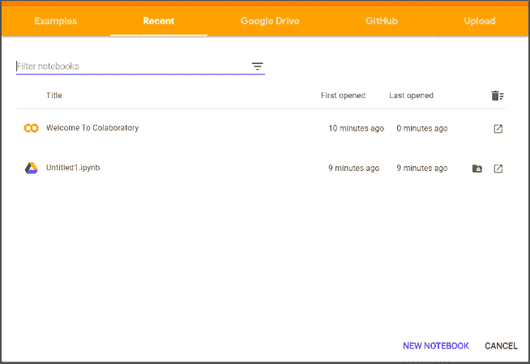
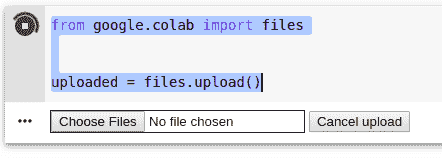
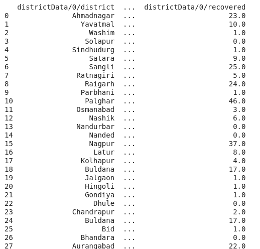
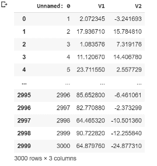

# 在 Google Colab 中导入 CSV 文件的方式

> 原文:[https://www . geesforgeks . org/导入方式-csv-files-in-google-colab/](https://www.geeksforgeeks.org/ways-to-import-csv-files-in-google-colab/)

**Colab(co laboratory 的缩写)**是谷歌的免费平台，用户可以用 Python 进行编码。这是一个基于 Jupyter Notebook 的云服务，由谷歌提供。该平台允许我们直接在云中免费培训机器学习模型。谷歌可乐可以做任何你的 Jupyter Notebook 做的事情，甚至更多，也就是说，你可以免费使用 GPU 和 TPU。谷歌 Colab 的一些优势包括快速安装和用户之间的笔记本实时共享。

然而，当加载 CSV 文件时，它需要编写一些额外的代码行。在本文中，我们将讨论加载 CSV 文件并将其存储在熊猫数据帧中的三种不同方法。首先，登录你的谷歌账户，然后进入[https://colab.research.google.com](https://colab.research.google.com)，点击*【新笔记本】*。



## 导入 CSV 的方法

### **从本地驱动器加载数据**

要从本地驱动器上传文件，请在单元格中编写以下代码并运行它

## 蟒蛇 3

```py
from google.colab import files

uploaded = files.upload()
```

你会得到一个屏幕，如



点击*“选择文件”*，然后从本地驱动器选择并下载 CSV 文件。稍后编写以下代码片段，将其导入熊猫数据帧。

## 蟒蛇 3

```py
import pandas as pd
import io

df = pd.read_csv(io.BytesIO(uploaded['file.csv']))
print(df)
```

**输出:**



### **从 Github**

在 Colab 中上传 CSV 文件是最简单的方法。为此，请转到 github 存储库中的数据集，然后单击*“查看原始数据”*。将链接复制到原始数据集，并将其作为参数传递给 pandas 中的 read_csv()以获取数据帧。

## 蟒蛇 3

```py
url = 'copied_raw_github_link'
df = pd.read_csv(url)
```

**输出:**



### 

**从你的谷歌硬盘**

我们可以通过两种方式导入上传到谷歌硬盘上的数据集:

**1。使用 PyDrive**
这是所有方法中导入数据集最复杂的方法。为此，我们首先需要从 python 安装程序(pip)安装 PyDrive 库，并执行以下操作。

## 蟒蛇 3

```py
!pip install -U -q PyDrive

from pydrive.auth import GoogleAuth
from pydrive.drive import GoogleDrive
from google.colab import auth
from oauth2client.client import GoogleCredentials

# Authenticate and create the PyDrive client.
auth.authenticate_user()
gauth = GoogleAuth()
gauth.credentials = GoogleCredentials.get_application_default()
drive = GoogleDrive(gauth)
```

**输出:**


点击提示获取认证的链接，以允许谷歌访问您的驱动器。你会看到顶部有**“谷歌云 SDK 想访问你的谷歌账号”**。在您允许后，复制给定的验证码并将其粘贴到 Colab 中的框中。

现在，转到驱动器中的 CSV 文件，获取可共享的链接，并将其存储在 Colab 中的字符串变量中。现在，要在 dataframe 中获取该文件，请运行以下代码。

## 蟒蛇 3

```py
link = 'https://drive.google.com/file/d/1KiYk09VqGI6tjNpalom5wI90GrC2p-lz/view'

import pandas as pd

# to get the id part of the file
id = link.split("/")[-2]

downloaded = drive.CreateFile({'id':id}) 
downloaded.GetContentFile('xclara.csv')  

df = pd.read_csv('xclara.csv')
print(df)
```

**输出:**


**2。安装驱动**
这种方法比上述方法简单干净。

*   在你的谷歌驱动器中创建一个文件夹。
*   在此文件夹中上传 CSV 文件。
*   在你的 Colab 笔记本上写下以下代码:

```py
from google.colab import drive

drive.mount(‘/content/drive’)

```

就像前面的方法一样，这些命令将带您进入谷歌认证步骤。稍后完成验证，就像我们在上一个方法中所做的那样。现在在笔记本中，左上角有*文件*菜单，然后点击*定位在驱动*，然后找到你的数据。然后将 CSV 文件的路径复制到笔记本中的一个变量中，并使用 read_csv()读取该文件。

```py
path = "copied path"
df_bonus = pd.read_csv(path)

```

现在，要读取该文件，请运行以下代码。

## 蟒蛇 3

```py
import pandas as pd

df = pd.read_csv("file_path")
print(df)
```

**输出:**

