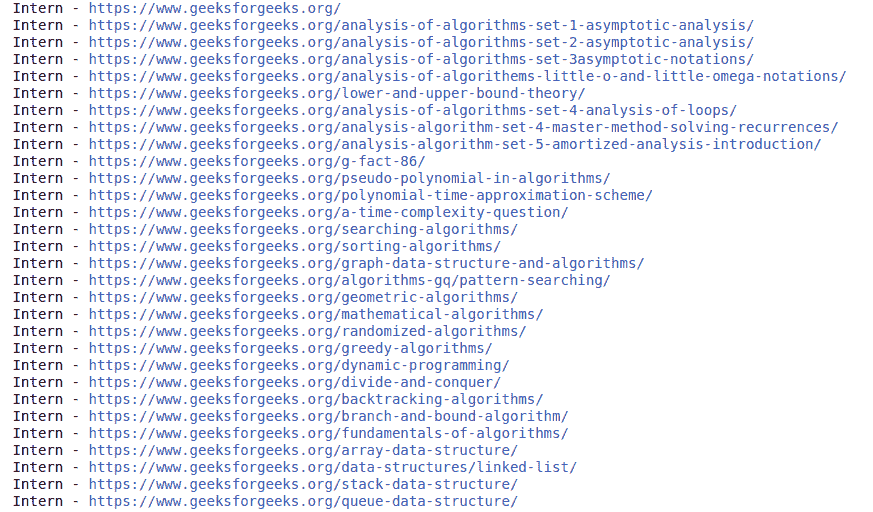
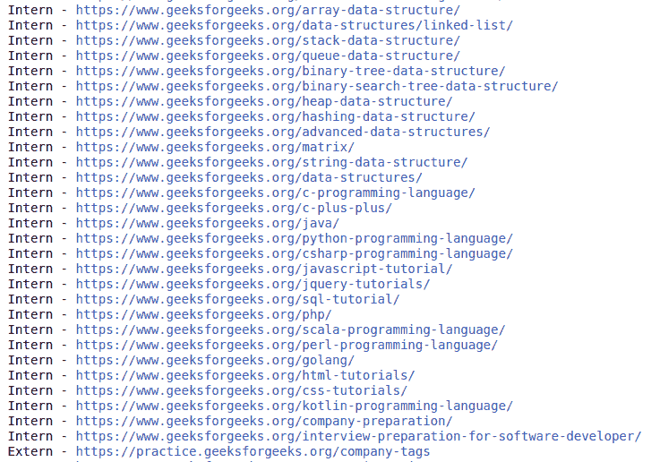

# 在指定深度使用广度优先搜索进行网页抓取

> 原文:[https://www . geesforgeks . org/web-crawling-using-width-first-search-at-a-specific-depth/](https://www.geeksforgeeks.org/web-crawling-using-breadth-first-search-at-a-specified-depth/)

如今，网刮被广泛用于许多工业应用中。无论是在自然语言理解还是数据分析领域，从网站上抓取数据都是许多此类应用的主要方面之一。从网站抓取数据是从一组网站中提取大量上下文文本，用于不同的用途。这个项目还可以扩展为进一步的使用，如基于主题或主题的文本摘要，新闻网站的新闻抓取，用于训练模型的图像抓取等。

**使用的库:**

首先，让我们讨论一下我们将在这个项目中使用的几个库。

*   **请求:**是一个非常容易发送 HTTP 1.1 请求的库。使用 requests.get 方法，我们可以提取一个网址的 HTML 内容。
*   **urlparse:** 它提供了一个标准接口，可以将一个 URL 分解成不同的组件，如网络位置、寻址方案、路径等。
*   **urljoin:** 它允许我们将一个基本 URL 和一个相对 URL 连接起来，形成一个绝对 URL。
*   **美化程序:**是一个从 HTML 和 XML 文件中提取数据的 python 库。我们可以将一个网页转换成一个*漂亮的小组件*对象，然后提取出 HTML 标签和它们的内容

**安装:**

接下来，我们将讨论如何安装这些库。请注意，如果您的系统中安装了 *pip3* ，则需要使用 *pip3* 而不是 pip。

```
pip install requests
pip install bs4

```

**特征:**

接下来，让我们讨论项目的各个方面和特点。

1.  给定一个输入网址和爬虫需要抓取的深度，我们将提取所有的网址，并将它们分为内部和外部网址。
2.  内部网址是那些与输入网址具有相同域名的网址。外部网址是那些与给定输入网址具有不同域名的网址。
3.  我们检查提取的网址的有效性。如果该网址具有有效的结构，则只考虑它。
4.  深度为 0 意味着只打印输入的网址。深度为 1 意味着打印输入网址内的所有网址，以此类推。

**进场:**

1.  首先，我们导入已安装的库。
2.  然后，我们创建两个称为*内部 _ 链接*和*外部 _ 链接*的空集合，它们将分别存储内部和外部链接，并确保它们不包含重复项。
3.  然后，我们创建一个名为 *level_crawler* 的方法，该方法获取一个输入 URL 并对其进行爬网，并使用以下步骤显示所有内部和外部链接–
    *   定义一个名为 *url* 的集合来临时存储这些 url。
    *   使用 *urlparse* 库提取 *url* 的域名。
    *   使用 HTML 解析器创建一个*美化组*对象。
    *   从*美化组*对象中提取所有锚点标签。
    *   从锚点标签中获取 *href* 标签，如果它们是空的，不要包含它们。
    *   使用 *urljoin* 方法，创建绝对 URL。
    *   检查网址的有效性。
    *   如果 *url* 有效，并且 *url* 的域不在 *href* 标签中，并且不在外部链接集中，请将其包含到外部链接集中。
    *   否则，如果不存在，将其添加到内部链接集，并打印并放入临时 *url* 集中。
    *   返回包含已访问内部链接的临时 *url* 集。这套将在以后使用。
4.  如果深度为 0，我们按原样打印 *url* 。如果深度为 1，我们称之为上面定义的 *level_crawler* 方法。
5.  否则，我们执行广度优先搜索(BFS)遍历，将 URL 页面的形成视为树形结构。在第一层，我们有输入网址。在下一个级别，我们有输入网址中的所有网址，等等。
6.  我们创建一个队列，并将输入 *url* 添加到其中。然后我们弹出一个*网址*并将里面所有的*网址*插入队列。我们这样做，直到特定级别的所有 *url* 都没有被解析。我们重复该过程的次数与输入深度相同。

**以下是上述方法的完整程序:**

## 蟒蛇 3

```
# Import libraries
from urllib.request import urljoin
from bs4 import BeautifulSoup
import requests
from urllib.request import urlparse

# Set for storing urls with same domain
links_intern = set()
input_url = "https://www.geeksforgeeks.org/machine-learning/"
depth = 1

# Set for storing urls with different domain
links_extern = set()

# Method for crawling a url at next level
def level_crawler(input_url):
    temp_urls = set()
    current_url_domain = urlparse(input_url).netloc

    # Creates beautiful soup object to extract html tags
    beautiful_soup_object = BeautifulSoup(
        requests.get(input_url).content, "lxml")

    # Access all anchor tags from input 
    # url page and divide them into internal
    # and external categories
    for anchor in beautiful_soup_object.findAll("a"):
        href = anchor.attrs.get("href")
        if(href != "" or href != None):
            href = urljoin(input_url, href)
            href_parsed = urlparse(href)
            href = href_parsed.scheme
            href += "://"
            href += href_parsed.netloc
            href += href_parsed.path
            final_parsed_href = urlparse(href)
            is_valid = bool(final_parsed_href.scheme) and bool(
                final_parsed_href.netloc)
            if is_valid:
                if current_url_domain not in href and href not in links_extern:
                    print("Extern - {}".format(href))
                    links_extern.add(href)
                if current_url_domain in href and href not in links_intern:
                    print("Intern - {}".format(href))
                    links_intern.add(href)
                    temp_urls.add(href)
    return temp_urls

if(depth == 0):
    print("Intern - {}".format(input_url))

elif(depth == 1):
    level_crawler(input_url)

else:
    # We have used a BFS approach
    # considering the structure as
    # a tree. It uses a queue based
    # approach to traverse
    # links upto a particular depth.
    queue = []
    queue.append(input_url)
    for j in range(depth):
        for count in range(len(queue)):
            url = queue.pop(0)
            urls = level_crawler(url)
            for i in urls:
                queue.append(i)
```

**输入:**

```
url = "https://www.geeksforgeeks.org/machine-learning/"
depth = 1

```

**输出:**



