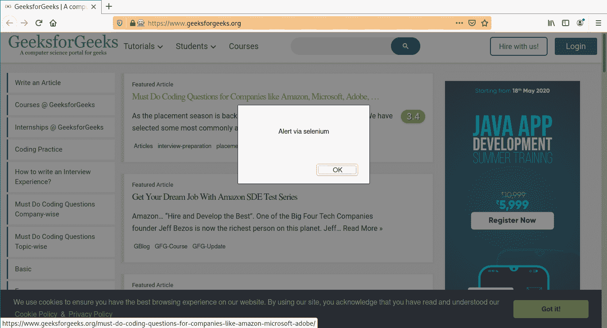

# 硒 Python 中的 Web 驱动方法

> 原文:[https://www . geesforgeks . org/web-driver-methods-in-selenium-python/](https://www.geeksforgeeks.org/web-driver-methods-in-selenium-python/)

Selenium 的 Python 模块是为使用 Python 执行自动化测试而构建的。硒 Python 绑定提供了一个简单的应用编程接口，可以使用硒网络驱动程序编写功能/验收测试。要使用硒 Python 打开网页，请使用获取方法-硒 Python 签出-导航链接。仅仅能够去一些地方并没有多大用处。我们真正想做的是与页面交互，或者更具体地说，与页面中的 HTML 元素交互。使用硒元素有多种策略，结账-定位策略。Selenium WebDriver 提供了各种有用的方法来控制会话，或者换句话说，浏览器。例如，添加 cookie、按后退按钮、在选项卡间导航等。

本文围绕各种网络驱动程序方法和功能展开，人们可以使用这些方法和功能来操纵 DOM，并使用 Python 中的 Selenium 网络驱动程序执行各种其他操作。

## 如何创建网络驱动程序对象？

要创建网络驱动程序的对象，请从文档中导入网络驱动程序类，并基于不同的网络浏览器和功能创建一个对象。之后，可以使用这个对象来执行网络驱动程序的所有操作。例如，要创建火狐的对象，可以使用–

```
# import webdriver
from selenium import webdriver

# create webdriver object
driver = webdriver.Firefox()

```

**参数–**
网络驱动程序接受各种参数来操纵各种特性–

*   **期望 _ 功能**–当
    启动浏览器会话时需要请求的功能字典。必需参数。
*   **browser _ profile**–A selenium . web driver . Firefox . Firefox _ profile。FirefoxProfile 对象。
    仅在请求火狐时使用。可选。
*   **代理**–一个 selenium . web driver . common . proxy . proxy 对象。如果可能的话，浏览器会话将通过给定的代理设置
    启动。可选。
*   **keep _ alive**–是否配置 remote_connection。远程连接使用
    HTTP 保活。默认为假。
*   **文件检测器**–在实例化过程中传递自定义文件检测器对象。如果没有，
    将使用默认的本地文件检测器()。
*   **选项**–驱动程序选项的实例。选项类

## 如何在 Selenium 中使用 Webdriver？

创建一个网络驱动程序对象后，打开一个网页，使用下面的语法和例子执行各种其他方法。用户可以执行各种操作，例如打开新标签、关闭标签、关闭窗口、添加 cookie、执行 javascript 等。

## 项目示例–

让我们尝试使用 https://www.geeksforgeeks.org/实现网络驱动方法，并通过 selenium python 使用 javascript。
**节目–**

```
# import webdriver
from selenium import webdriver

# create webdriver object
driver = webdriver.Firefox()

# get geeksforgeeks.org
driver.get("https://www.geeksforgeeks.org/")

# write script
script = "alert('Alert via selenium')"

# generate a alert via javascript
driver.execute_async_script(script)
```

**输出–**
浏览器生成警报，如下所示–


## 硒 Python 中的网络驱动方法

人们可以使用 Webdriver 方法执行大量操作，如获取 cookie、截图等。下面是 webdriver 中使用的重要方法的列表。

| 方法 | 描述 |
| --- | --- |
| [添加 _ 饼干](https://www.geeksforgeeks.org/add_cookie-driver-method-selenium-python/) | 将 cookie 添加到当前会话中。 |
| --- | --- |
| [后退](https://www.geeksforgeeks.org/back-driver-method-selenium-python/?ref=rp) | 在浏览器历史中倒退一步。 |
| --- | --- |
| [关闭](https://www.geeksforgeeks.org/close-driver-method-selenium-python/?ref=rp) | 关闭当前窗口。 |
| --- | --- |
| [create_web_element](https://www.geeksforgeeks.org/create_web_element-driver-method-selenium-python/?ref=rp) | 使用指定的 element_id 创建 web 元素。 |
| --- | --- |
| [删除 _all_cookies](https://www.geeksforgeeks.org/delete_all_cookies-driver-method-selenium-python/?ref=rp) | 删除会话范围内的所有 cookies。 |
| --- | --- |
| [删除 _cookie](https://www.geeksforgeeks.org/delete_cookie-driver-method-selenium-python/?ref=rp) | 删除具有给定名称的单个 cookie。

 |
| --- | --- |
| [执行 _ async _ 脚本](https://www.geeksforgeeks.org/execute_async_script-driver-method-selenium-python/) | 在当前窗口/框架中异步执行 JavaScript。 |
| --- | --- |
| [执行 _ 脚本](https://geeksforgeeks.org/execute_script-driver-method-selenium-python/) | 在当前窗口/框架中同步执行 JavaScript。 |
| --- | --- |
| [前进](https://www.geeksforgeeks.org/forward-driver-method-selenium-python/) | 在浏览器历史上前进了一步。 |
| --- | --- |
| [全屏 _ 窗口](https://www.geeksforgeeks.org/fullscreen_window-driver-method-selenium-python/) | 调用窗口管理器特定的“全屏”操作 |
| --- | --- |
| [get_cookie](https://www.geeksforgeeks.org/add_cookie-driver-method-selenium-python/?ref=rp) | 通过名字获得一个饼干。如果找到，则返回 cookie，如果没有，则返回无。 |
| --- | --- |
| [get_cookies](https://www.geeksforgeeks.org/get_cookies-driver-method-selenium-python/?ref=rp) | 返回一组字典，对应于当前会话中可见的 cookies。 |
| --- | --- |
| [get_log](https://www.geeksforgeeks.org/get_log-driver-method-selenium-python/?ref=rp) | 获取给定日志类型的日志 |
| --- | --- |
| [get _ 截图 _as_base64](https://www.geeksforgeeks.org/get_screenshot_as_base64-driver-method-selenium-python/?ref=rp) | 以 base64 编码字符串的形式获取当前窗口的屏幕截图，该字符串在 HTML 中的嵌入图像中非常有用。 |
| --- | --- |
| [获取 _ 截图 _as_file](https://www.geeksforgeeks.org/get_screenshot_as_file-driver-method-selenium-python/?ref=rp) | 将当前窗口的截图保存到一个 PNG 图像文件中。 |
| --- | --- |
| [get_screenshot_as_png](https://www.geeksforgeeks.org/get_screenshot_as_png-driver-method-selenium-python/?ref=rp) | 以二进制数据的形式获取当前窗口的屏幕截图。 |
| --- | --- |
| [获取 _ 窗口 _ 位置](https://www.geeksforgeeks.org/get_window_position-driver-method-selenium-python/?ref=rp) | 获取当前窗口的 x，y 位置。 |
| --- | --- |
| [get_window_rect](https://www.geeksforgeeks.org/get_window_rect-driver-method-selenium-python/?ref=rp) | 获取窗口的 x，y 坐标以及当前窗口的高度和宽度。

 |
| --- | --- |
| [get_window_size](https://www.geeksforgeeks.org/get_window_size-driver-method-selenium-python/) | 获取当前窗口的宽度和高度。 |
| --- | --- |
| [隐式 _ 等待](https://www.geeksforgeeks.org/implicitly_wait-driver-method-selenium-python/?ref=rp) | 设置粘性超时以隐式等待元素被找到， |
| --- | --- |
| [最大化 _ 窗口](https://www.geeksforgeeks.org/maximize_window-driver-method-selenium-python/?ref=rp) | 最大化 webdriver 正在使用的当前窗口 |
| --- | --- |
| [最小化 _ 窗口](https://www.geeksforgeeks.org/minimize_window-driver-method-selenium-python/?ref=rp) | 调用窗口管理器特定的“最小化”操作 |
| --- | --- |
| [退出](https://www.geeksforgeeks.org/quit-driver-method-selenium-python/) | 退出驱动程序并关闭所有相关窗口。 |
| --- | --- |
| [刷新](https://www.geeksforgeeks.org/refresh-driver-method-selenium-python/) | 刷新当前页面。 |
| --- | --- |
| [set_page_load_timeout](https://www.geeksforgeeks.org/set_page_load_timeout-driver-method-selenium-python/?ref=rp) | 设置在引发错误之前等待页面加载完成的时间。 |
| --- | --- |
| [set_script_timeout](https://www.geeksforgeeks.org/set_script_timeout-driver-method-selenium-python/?ref=rp) | 设置脚本在抛出错误之前在 execute_async_script 调用期间应该等待的时间。 |
| --- | --- |
| [设置 _ 窗口 _ 位置](https://geeksforgeeks.org/set_window_position-driver-method-selenium-python/) | 设置当前窗口的 x，y 位置。(窗口.移动到) |
| --- | --- |
| [set_window_rect](https://geeksforgeeks.org/set_window_rect-driver-method-selenium-python/) | 设置窗口的 x，y 坐标以及当前窗口的高度和宽度。 |
| --- | --- |
| [当前 _url](https://geeksforgeeks.org/current_url-driver-method-selenium-python/) | 获取当前页面的网址。 |
| --- | --- |
| [当前 _ 窗口 _ 手柄](https://geeksforgeeks.org/current_window_handle-driver-method-selenium-python/) | 返回当前窗口的句柄。 |
| --- | --- |
| [页面 _ 来源](https://geeksforgeeks.org/page_source-driver-method-selenium-python/) | 获取当前页面的源。 |
| --- | --- |
| [标题](https://geeksforgeeks.org/title-driver-method-selenium-python/) | 返回当前页面的标题。 |
| --- | --- |