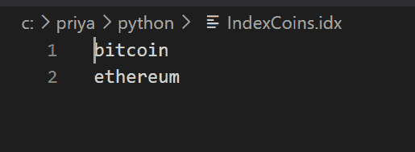
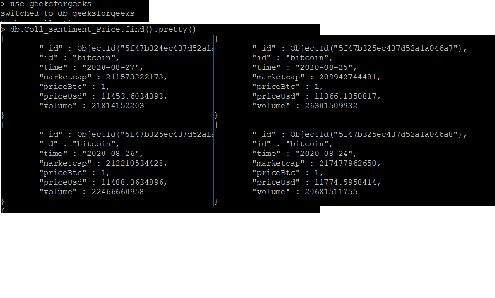
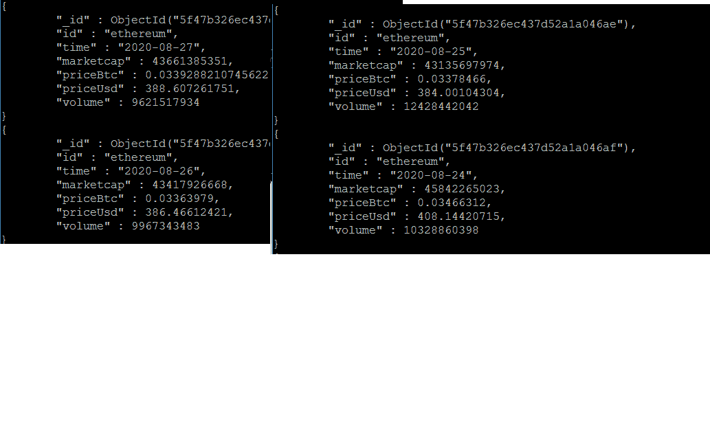

# 网页抓取加密货币价格并使用 Python 存储在 MongoDB 中

> 原文:[https://www . geeksforgeeks . org/web-scratch-crypto currency-price-storing-in-MongoDB-using-python/](https://www.geeksforgeeks.org/web-scraping-cryptocurrency-price-and-storing-it-in-mongodb-using-python/)

让我们看看如何使用**Santium API 获取以美元或 BTC 为单位的历史价格、给定日期范围内的交易量和市值，并将数据存储到 MongoDB 集合中。**

Python 是一种成熟的语言，在加密货币领域得到了广泛的应用。MongoDB 是一个 NoSQL 数据库，在许多项目中与 Python 配对，这有助于保存从 Python 程序中检索到的细节。PyMongo 是一个 Python 发行版，包含了使用 MongoDB 的工具，从 Python 中使用 MongoDB 可以非常方便地进行创建/更新/删除/读取操作。

让我们看看使用桑蒂姆的应用编程接口获取给定日期范围内的加密货币价格的代码

加密货币的例子很少:

```py
bitcoin
ethereum
ripple
bitcoin-cash
litecoin
eos
cardano
stellar
neo
iota
```

1.  在 id 的位置，我们可以传递比特币/以太币或任何密码货币名称，下面的代码可以解析并获取数据
2.  对于有效的加密货币名称，将正确检索数据
3.  需要给出 yyy-mm-dd 模式中有效日期格式的有效日期来代替起始日期和终止日期。为了便于理解，给出了 7 天的数据。我们也可以获得 1 个月前的数据。API 调用可以获取给定日期范围内给定加密货币的数据，否则如果不可用(由于无效的加密货币名称/无效的日期范围规范)，我们可以捕获错误
4.  在下面的程序中，为了更容易理解，将比特币和 ethereum 放在“IndexCoins.idx”文件中，从而代替 id，它们被传递

**示例:**

对于以下输入



对于上面的比特币 API 调用，返回如下数据


同样，对于以太博物馆，我们也将获得价值

检索到的值必须存储在 MongoDB 中

> 数据库:geeksforgeeks
> 
> 收藏:学院 _ 价格

因为我们要获取 7 天的数据，所以必须循环给出

在 MongoDB 中，_id 是 ObjectId()可以获取的默认列。我们的流程有多行，每一行都通过“cryptocurrencyname”和“time”来标识。在我们的代码中，我们将其分别作为“id”和“time”。

让“Coll _ santiation _ Price”创建三列，即 _id、id 和时间优先。然后在成功执行 API 调用后，对于 id 和时间，让 API 调用输出即(验证来自 bitcoinprice.png 的列名)‘priceBtc’‘priceUsd’‘volume’和‘marketcap’循环更新。

Python 中的代码实现

## 蟒蛇 3

```py
# importing the modules
from datetime import date, timedelta, datetime
from pymongo import MongoClient
import san
from bson.objectid import ObjectId

client = MongoClient('mongodb://localhost:27017/')
db1 = client.geeksforgeeks
data = {}

with open("IndexCoins.idx") as openfileobject:
    for line in openfileobject:

        # One by one File's cryptocurrency names are read
        id = line.strip() 
        try:
            print(id)

            # Collecting the data for 7 days and hence range(7) is taken
            for idx in range(7):
                daystr = str(date.today() - timedelta(days = idx))

                # Coll_santiment_Price collection documents need to be created
                # It will have columns namely "_id", "time", "id",
                # "priceBtc", "priceUsd", "volume", "marketcap"
                data['id'] = id
                data['time'] = daystr

                # _id column for unique key and can be generated by using ObjectId()
                data['_id'] = ObjectId()

                # Initially create 3 columns in collection as rest of the
                # columns are updated after running santiment api call              
                db1.Coll_santiment_Price.insert(data) 
            try:
                # Santiment API call to get Cryptocurrency prices
                daa = san.get("prices/" + id,
                              from_date = "2020-08-20",
                              to_date = "2020-08-27",
                              interval = "1d")

                # API call output and for bitcoin it is given in
                # https://media.geeksforgeeks.org/wp-content/uploads/20200827191739/bitcoinprice.png
                print(daa)

            except:
                print("URL error")
                continue;                

            # 7 days output
            for idx in range(7):

                daystr = str(date.today() - timedelta(days=idx))

                # API call output for the above chosen date
                row = daa.loc[daystr]

                # priceBtc, priceUsd, volume and marketcap are
                # collected and stored in seperate variables
                priceBtc = row['priceBtc']
                priceUsd = row['priceUsd']
                volume = row['volume']
                marketcap = row['marketcap']
                print(id, daystr, priceBtc, priceUsd, volume, marketcap)
                try:
                    # Update the collection with above details against
                    # cryptocurrency id and time  i.e. bitcoin and 2020-08-27
                    db1.Coll_santiment_Price.update(
                        {'time': daystr, 'id': id},
                        {"$set": {"priceBtc": priceBtc,
                                  "priceUsd": priceUsd,
                                  "volume": volume,
                                  "marketcap": marketcap,
                                  }
                         },
                        upsert = True
                        )
                except Exception as e:
                    print(e)
        except:
            print("Error")
```

**样本输出:(针对比特币)**



**样本输出:(用于以太网)**



用于获取价格的 Santiment API 调用在加密货币项目中被大量使用。当我们获得历史数据时，对于数据分析来说，这非常有用。此外，它可以自由访问，因此任何初级项目都可以毫无问题地使用它。价格变化不大，因此适合演示和小规模项目。