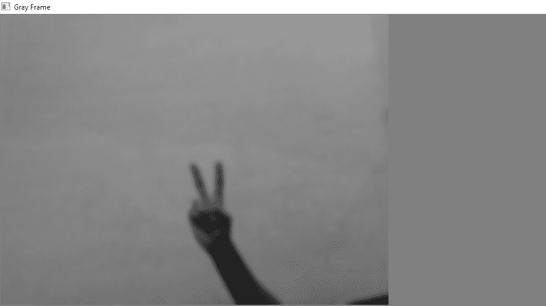
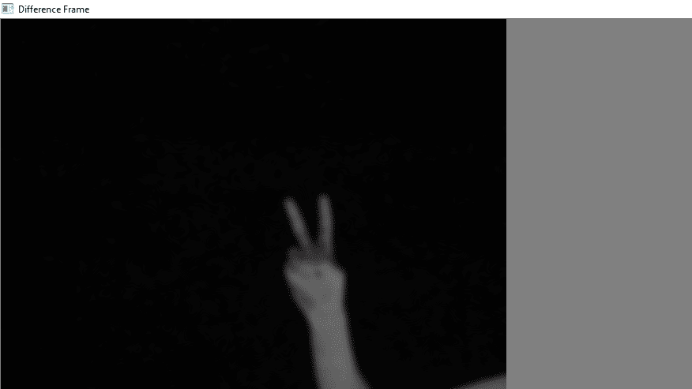
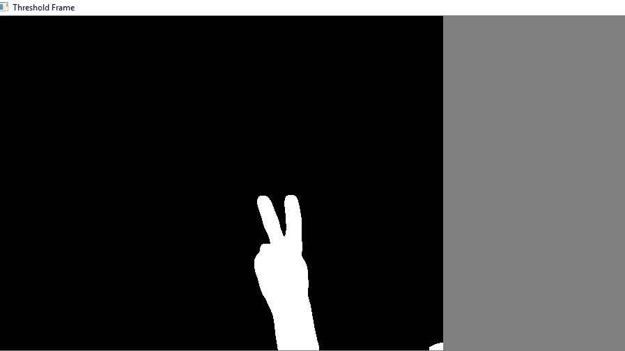
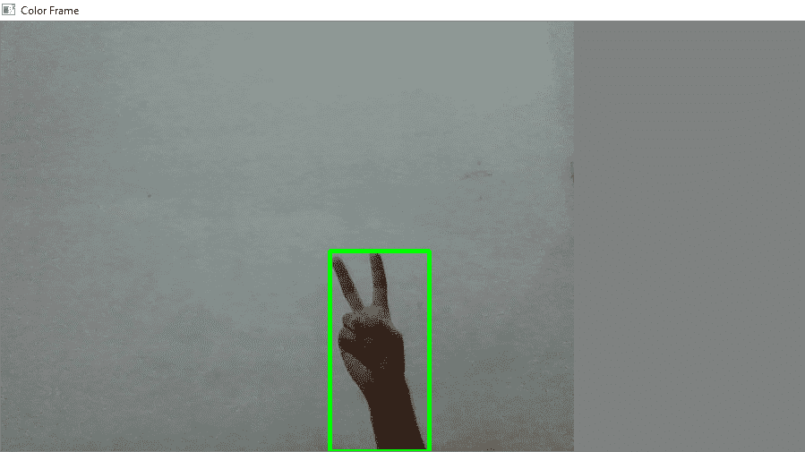
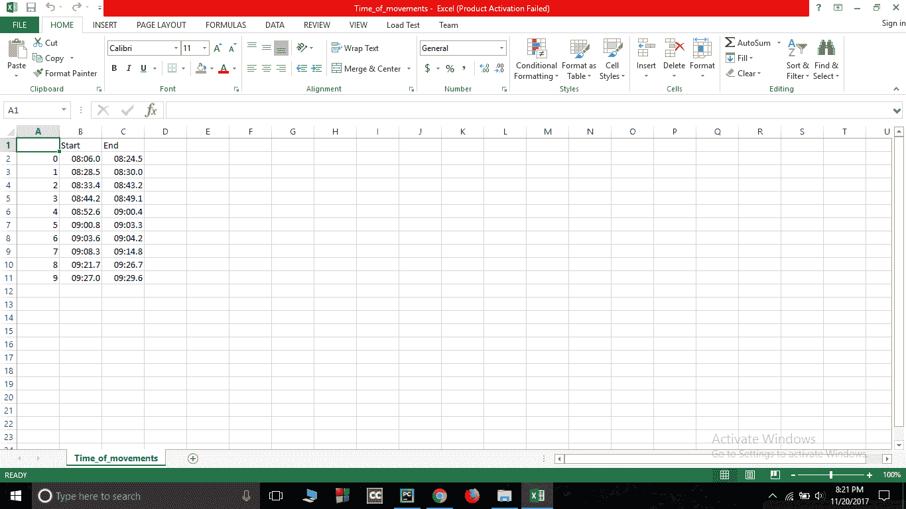

# Python 中的网络摄像头运动检测器

> 原文:[https://www . geesforgeks . org/网络摄像头-运动检测器-python/](https://www.geeksforgeeks.org/webcam-motion-detector-python/)

这个 python 程序将允许您检测运动，并存储运动的时间间隔。

**要求:**

1.  蟒蛇 3
2.  库
3.  熊猫(图书馆)

**安装要求:**安装[蟒 3](https://www.python.org/downloads/) ，安装[熊猫](https://stackoverflow.com/questions/42907331/how-to-install-pandas-from-pip-on-windows-cmd)和 [OpenCV](https://pypi.python.org/pypi/opencv-python) 库。

**主逻辑:**视频可以看成一堆图片，叫做帧。这里我比较不同的帧(图片)和第一帧应该是静态的(最初没有运动)。我们通过比较每个像素的强度值来比较两幅图像。在 python 中，我们可以很容易地做到这一点，您可以在下面的代码中看到:

## 蟒蛇 3

```py
# Python program to implement
# Webcam Motion Detector

# importing OpenCV, time and Pandas library
import cv2, time, pandas
# importing datetime class from datetime library
from datetime import datetime

# Assigning our static_back to None
static_back = None

# List when any moving object appear
motion_list = [ None, None ]

# Time of movement
time = []

# Initializing DataFrame, one column is start
# time and other column is end time
df = pandas.DataFrame(columns = ["Start", "End"])

# Capturing video
video = cv2.VideoCapture(0)

# Infinite while loop to treat stack of image as video
while True:
    # Reading frame(image) from video
    check, frame = video.read()

    # Initializing motion = 0(no motion)
    motion = 0

    # Converting color image to gray_scale image
    gray = cv2.cvtColor(frame, cv2.COLOR_BGR2GRAY)

    # Converting gray scale image to GaussianBlur
    # so that change can be find easily
    gray = cv2.GaussianBlur(gray, (21, 21), 0)

    # In first iteration we assign the value
    # of static_back to our first frame
    if static_back is None:
        static_back = gray
        continue

    # Difference between static background
    # and current frame(which is GaussianBlur)
    diff_frame = cv2.absdiff(static_back, gray)

    # If change in between static background and
    # current frame is greater than 30 it will show white color(255)
    thresh_frame = cv2.threshold(diff_frame, 30, 255, cv2.THRESH_BINARY)[1]
    thresh_frame = cv2.dilate(thresh_frame, None, iterations = 2)

    # Finding contour of moving object
    cnts,_ = cv2.findContours(thresh_frame.copy(),
                       cv2.RETR_EXTERNAL, cv2.CHAIN_APPROX_SIMPLE)

    for contour in cnts:
        if cv2.contourArea(contour) < 10000:
            continue
        motion = 1

        (x, y, w, h) = cv2.boundingRect(contour)
        # making green rectangle around the moving object
        cv2.rectangle(frame, (x, y), (x + w, y + h), (0, 255, 0), 3)

    # Appending status of motion
    motion_list.append(motion)

    motion_list = motion_list[-2:]

    # Appending Start time of motion
    if motion_list[-1] == 1 and motion_list[-2] == 0:
        time.append(datetime.now())

    # Appending End time of motion
    if motion_list[-1] == 0 and motion_list[-2] == 1:
        time.append(datetime.now())

    # Displaying image in gray_scale
    cv2.imshow("Gray Frame", gray)

    # Displaying the difference in currentframe to
    # the staticframe(very first_frame)
    cv2.imshow("Difference Frame", diff_frame)

    # Displaying the black and white image in which if
    # intensity difference greater than 30 it will appear white
    cv2.imshow("Threshold Frame", thresh_frame)

    # Displaying color frame with contour of motion of object
    cv2.imshow("Color Frame", frame)

    key = cv2.waitKey(1)
    # if q entered whole process will stop
    if key == ord('q'):
        # if something is movingthen it append the end time of movement
        if motion == 1:
            time.append(datetime.now())
        break

# Appending time of motion in DataFrame
for i in range(0, len(time), 2):
    df = df.append({"Start":time[i], "End":time[i + 1]}, ignore_index = True)

# Creating a CSV file in which time of movements will be saved
df.to_csv("Time_of_movements.csv")

video.release()

# Destroying all the windows
cv2.destroyAllWindows()
```

**分析所有窗口**
运行完那里的代码后屏幕上会出现 4 个新窗口。我们来逐一分析一下:

**1。灰色帧:**在灰色帧中，图像有点模糊，在灰度中，我们这样做是因为，在灰色图片中只有一个强度值，而在 RGB(红色、绿色和蓝色)图像中有三个强度值。因此，计算灰度中的强度差将很容易。



**2。差异帧:**差异帧显示第一帧与当前帧的强度差异。



**3。阈值帧:**如果特定像素的亮度差大于 30(在我的情况下)，则该像素将是白色的，如果该差小于 30，则该像素将是黑色的



**4。颜色框:**在此框中，您可以看到彩色框中的彩色图像以及移动对象周围的绿色轮廓



**动作时间记录**

移动时间文件将存储在存储代码文件的文件夹中。该文件将采用 csv 扩展名。在该文件中，将记录运动的开始时间和结束时间。如图所示:



**视频演示**

<video class="wp-video-shortcode" id="video-165165-1" width="640" height="360" preload="metadata" controls=""><source type="video/mp4" src="https://media.geeksforgeeks.org/wp-content/uploads/Motion-Detector.mp4?_=1">[https://media.geeksforgeeks.org/wp-content/uploads/Motion-Detector.mp4](https://media.geeksforgeeks.org/wp-content/uploads/Motion-Detector.mp4)</video>