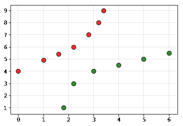
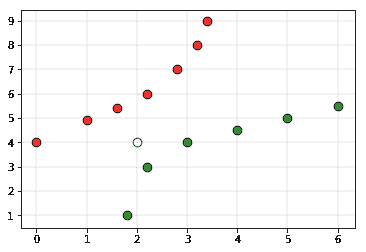

# 加权 K-NN

> 原文:[https://www.geeksforgeeks.org/weighted-k-nn/](https://www.geeksforgeeks.org/weighted-k-nn/)

加权 kNN 是 [k 最近邻](https://www.geeksforgeeks.org/k-nearest-neighbours/)的修改版本。影响 kNN 算法性能的众多问题之一是超参数 k 的选择，如果 k 太小，算法对异常值会更加敏感。如果 k 太大，那么邻域可能包含太多来自其他类的点。
另一个问题是组合类标签的方法。最简单的方法是获得多数票，但是如果最近的邻居距离相差很大，并且最近的邻居更可靠地指示对象的类别，这可能是一个问题。

**直觉:**
考虑以下训练集

红色标签表示 0 级分，绿色标签表示 1 级分。
将白点视为查询点(类标签必须被预测的点)

如果我们将上述数据集交给基于 kNN 的分类器，那么分类器将声明查询点属于类 0。但是在剧情中，很明显的一点是，比起 0 分的档次，1 分的档次更接近。为了克服这个缺点，使用了加权 kNN。在加权 kNN 中，使用称为核函数的函数给最近的 k 个点赋予权重。加权 kNN 背后的直觉是，给附近的点更多的权重，给较远的点更少的权重。任何函数都可以用作加权 knn 分类器的核函数，其值随着距离的增加而减小。使用的简单函数是距离反函数。

**算法:**

*   设 L = { ( x <sub>i</sub> ，y <sub>i</sub> ，i = 1，。。。，n }是具有给定类 y <sub>i</sub> 的观测值 x <sub>i</sub> 的训练集，并且让 x 是新的观测值(查询点)，其类标签 y 必须被预测。
*   计算 d(x <sub>i</sub> ，x)为 i = 1，。。。n，查询点和训练集中每隔一个点之间的距离。
*   选择距离查询点最近的 k 个训练数据点的集合 D' ⊆ D
*   Predict the class of the query point, using distance-weighted voting. The v represents the class labels. Use the following formula

    

**实现:**
将 0 作为类 0 的标签，将 1 作为类 1 的标签。下面是加权-kNN 算法的实现。

## C/C++

```
// C++ program to implement the 
// weighted K nearest neighbour algorithm. 
#include <bits/stdc++.h> 
using namespace std; 

struct Point 
{ 
    int val;     // Class of point 
    double x, y;     // Co-ordinate of point 
    double distance; // Distance from test point 
}; 

// Used to sort an array of points by increasing 
// order of weighted distance 
bool comparison(Point a, Point b) 
{ 
    return (a.distance < b.distance); 
} 

// This function finds classification of point p using 
// weighted k nearest neighbour algorithm. It assumes only  
// two groups and returns 0 if p belongs to class 0, else 
// 1 (belongs to class 1). 
int weightedkNN(Point arr[], int n, int k, Point p) 
{ 
    // Fill weighted distances of all points from p 
    for (int i = 0; i < n; i++) 
        arr[i].distance = 
            (sqrt((arr[i].x - p.x) * (arr[i].x - p.x) + 
                (arr[i].y - p.y) * (arr[i].y - p.y))); 

    // Sort the Points by weighted distance from p 
    sort(arr, arr+n, comparison); 

    // Now consider the first k elements and only 
    // two groups 
    double freq1 = 0;     // weighted sum of group 0 
    double freq2 = 0;     // weighted sum of group 1 
    for (int i = 0; i < k; i++) 
    { 
        if (arr[i].val == 0) 
            freq1 += double(1/arr[i].distance); 
        else if (arr[i].val == 1) 
            freq2 += double(1/arr[i].distance); 
    } 
    return (freq1 > freq2 ? 0 : 1); 
} 

// Driver code 
int main() 
{ 
    int n = 13; // Number of data points 
    Point arr[n]; 

    arr[0].x = 0; 
    arr[0].y = 4; 
    arr[0].val = 0; 

    arr[1].x = 1; 
    arr[1].y = 4.9; 
    arr[1].val = 0; 

    arr[2].x = 1.6; 
    arr[2].y = 5.4; 
    arr[2].val = 0; 

    arr[3].x = 2.2; 
    arr[3].y = 6; 
    arr[3].val = 0; 

    arr[4].x = 2.8; 
    arr[4].y = 7; 
    arr[4].val = 0; 

    arr[5].x = 3.2; 
    arr[5].y = 8; 
    arr[5].val = 0; 

    arr[6].x = 3.4; 
    arr[6].y = 9; 
    arr[6].val = 0; 

    arr[7].x = 1.8; 
    arr[7].y = 1; 
    arr[7].val = 1; 

    arr[8].x = 2.2; 
    arr[8].y = 3; 
    arr[8].val = 1; 

    arr[9].x = 3; 
    arr[9].y = 4; 
    arr[9].val = 1; 

    arr[10].x = 4; 
    arr[10].y = 4.5; 
    arr[10].val = 1; 

    arr[11].x = 5; 
    arr[11].y = 5; 
    arr[11].val = 1; 

    arr[12].x = 6; 
    arr[12].y = 5.5; 
    arr[12].val = 1; 

    /*Testing Point*/
    Point p; 
    p.x = 2; 
    p.y = 4; 

    // Parameter to decide the class of the query point 
    int k = 5; 
    printf ("The value classified to query point"
            " is: %d.\n", weightedkNN(arr, n, k, p)); 
    return 0; 
} 
```

## 蟒蛇 3

```
# Python3 program to implement the
# weighted K nearest neighbour algorithm. 

import math 

def weightedkNN(points,p,k=3): 
    ''' 
    This function finds classification of p using 
    weighted k nearest neighbour algorithm. It assumes only two 
    two classes and returns 0 if p belongs to class 0, else 
    1 (belongs to class 1). 

    Parameters - 
        points : Dictionary of training points having two keys - 0 and 1 
            Each key have a list of training data points belong to that 

        p : A tuple ,test data point of form (x,y) 

        k : number of nearest neighbour to consider, default is 3 
    '''

    distance=[] 
    for group in points: 
        for feature in points[group]: 

            #calculate the euclidean distance of p from training points 
            euclidean_distance = math.sqrt((feature[0]-p[0])**2 +(feature[1]-p[1])**2) 

            # Add a tuple of form (distance,group) in the distance list 
            distance.append((euclidean_distance,group)) 

    # sort the distance list in ascending order 
    # and select first k distances 
    distance = sorted(distance)[:k] 

    freq1 = 0 # weighted sum of group 0 
    freq2 = 0 # weighted sum of group 1 

    for d in distance:
        if d[1] == 0:
            freq1 += (1 / d[0])

        elif d[1] == 1: 
            freq2 += (1 /d[0])

    return 0 if freq1>freq2 else 1

# Driver function 
def main(): 

    # Dictionary of training points having two keys - 0 and 1 
    # key 0 have points belong to class 0 
    # key 1 have points belong to class 1 

    points = {0:[(0, 4),(1, 4.9),(1.6, 5.4),(2.2, 6),(2.8, 7),(3.2, 8),(3.4, 9)], 
            1:[(1.8, 1),(2.2, 3),(3, 4),(4, 4.5),(5, 5),(6, 5.5)]} 

    # query point p(x,y) 
    p = (2, 4) 

    # Number of neighbours 
    k = 5

    print("The value classified to query point is: {}".format(weightedkNN(points,p,k))) 

if __name__ == '__main__': 
    main() 
```

**Output:**

```
The value classified to query point is: 1

```