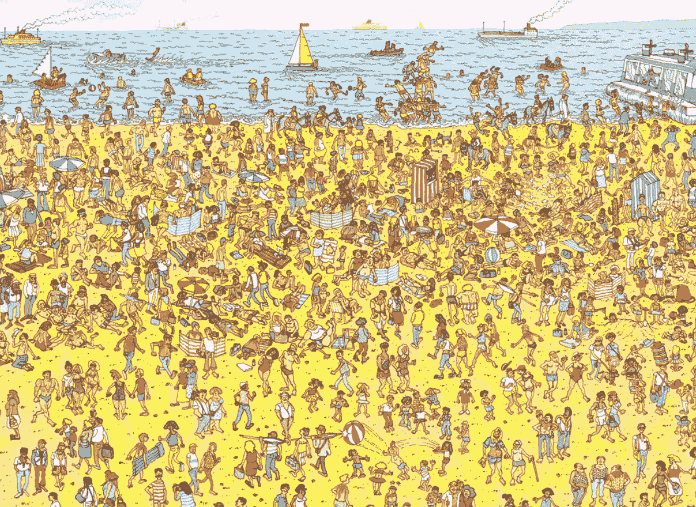
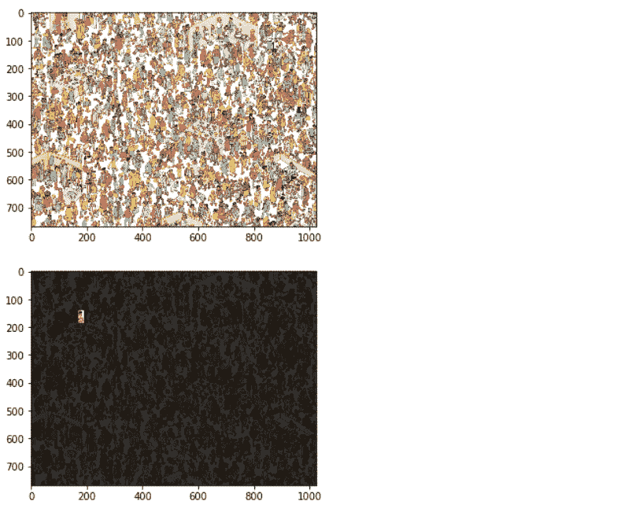

# 沃利使用 Mahotas 的问题在哪里

> 原文:[https://www . geesforgeks . org/where s-wally-problem-use-maho tas/](https://www.geeksforgeeks.org/wheres-wally-problem-using-mahotas/)

在本文中，我们将看到如何在给定的图像中找到沃利。沃利在哪里？，也叫*沃尔多在哪里？*在北美是英国的益智类书籍。这些书由一系列详细的双页展开插图组成，展示了几十个或更多的人在给定的地点做各种有趣的事情。读者面临的挑战是找到隐藏在小组中的一个名叫沃利的角色。
程序中使用的图像–



**沃利描述:**沃利是通过他的红白条纹衬衫、摇头帽和眼镜来识别的，但许多插图都含有涉及欺骗性使用红白条纹物体的转移注意力的内容。
为了做到这一点，我们将使用 **mahotas 库**。 **Mahotas** 是 Python 的计算机视觉和图像处理库。它包括许多用 C++实现的算法，以提高速度，同时在 numpy 数组中运行，并具有非常干净的 Python 界面。
命令安装 maho tas–

```py
pip install mahotas
```

下面是实现–

## 蟒蛇 3

```py
# importing required libraries
from pylab import imshow, show
import mahotas
import mahotas.demos
import numpy as np

# loading the image
wally = mahotas.demos.load('wally')

# showing the original image
imshow(wally)
show()

# getting float type value
# float values are better to use
wfloat = wally.astype(float)

# splitting image into red, green and blue channel
r, g, b = wfloat.transpose((2, 0, 1))

# white channel
w = wfloat.mean(2)

# pattern of wally shirt
# pattern + 1, +1, -1, -1 on vertical axis
pattern = np.ones((24, 16), float)
for i in range(2):
    pattern[i::4] = -1

# convolve with the red minus white
# increase the response where shirt is
v = mahotas.convolve(r-w, pattern)

# getting maximum value
mask = (v == v.max())

# creating mask to tone down the image
# except the region where wally is
mask = mahotas.dilate(mask, np.ones((48, 24)))

# subtraction mask from the wally
np.subtract(wally, .8 * wally * ~mask[:, :, None],
                   out = wally, casting ='unsafe')

# show the new image
imshow(wally)
show()
```

**输出:**

