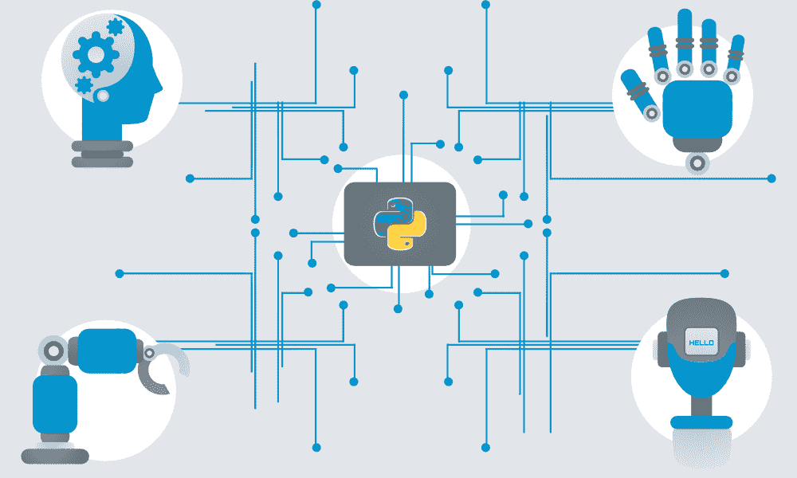

# 为什么 Python 是最适合机器学习的编程语言？

> 原文:[https://www . geesforgeks . org/为什么 python 是最适合机器学习的编程语言/](https://www.geeksforgeeks.org/why-is-python-the-best-suited-programming-language-for-machine-learning/)

机器学习是现代最热门的趋势。根据[福布斯](https://www.forbes.com/sites/louiscolumbus/2018/02/18/roundup-of-machine-learning-forecasts-and-market-estimates-2018/#de7aa232225c)的数据，2013 年至 2017 年间，机器学习专利以 **34%** 的速度增长，而且这一数字只会在未来增加。而**[【Python】](https://www.geeksforgeeks.org/python-programming-language/)**是 **[【机器学习】](https://www.geeksforgeeks.org/machine-learning/)** 中大量研发使用的主要编程语言。以至于根据 [Github](https://github.blog/2019-01-24-the-state-of-the-octoverse-machine-learning/) ，Python 是机器学习的顶级编程语言。然而，虽然很明显 Python 是最受欢迎的，但本文关注的是**这个至关重要的问题:“为什么 Python 是最适合机器学习的编程语言？”**

### Python 最适合机器学习的原因？

Python 是目前机器学习中研究和开发最流行的编程语言。但是你不需要相信我的话！根据**谷歌趋势**，对于机器学习 Python 的兴趣已经和其他 ML 语言如 R、 [Java](https://www.geeksforgeeks.org/java/) 、 [Scala](https://www.geeksforgeeks.org/scala-programming-language/) 、Julia 等一起飙升到了一个全新的高度。远远落后。

因此，既然我们已经确定 Python 是迄今为止最受欢迎的机器学习编程语言，那么 **WHY** 仍然存在。现在让我们理解为什么 Python 如此受欢迎，以及为什么它最适合 ML。其中一些原因如下:

### 1.Python 易于使用

没有人喜欢过于复杂的东西，所以 Python 的易用性是它在机器学习中如此受欢迎的主要原因之一。它很简单，有一个易于阅读的 T2 语法，这使得它深受经验丰富的开发人员和实验学生的喜爱。Python 的简单性意味着开发人员可以专注于实际解决机器学习问题，而不是花费所有的时间(和精力！)只理解语言的技术细微差别。

除此之外，Python 还非常高效。它允许开发人员用更少的代码完成更多的工作。Python 代码也很容易被人类理解，这使得它非常适合制作机器学习模型。有了这些优点，还有什么不爱呢？！！

### 2.Python 有多个库和框架

Python 已经非常流行，因此，它有数百种不同的库和框架可供开发人员使用。这些库和框架在节省时间方面非常有用，这反过来又使 Python 更加流行(这是一个有益的循环！！！).

有许多 Python 库对人工智能和机器学习特别有用。其中一些如下:

*   **Keras** 是一个开源库，特别专注于深度神经网络的实验。
*   **TensorFlow** 是一个自由软件库，用于许多机器学习应用，如神经网络。(他们好像挺受欢迎的！)
*   **Scikit-learn** 是一个免费的机器学习软件库，包含与此相关的各种分类、回归和聚类算法。此外，Scikit-learn 可以与 NumPy 和 SciPy 结合使用。

### 3.Python 有社区和公司支持

Python 从 1990 年就已经存在，这是创建一个支持社区的充足时间。因为有了这种支持，Python 学习者可以轻松地提高他们的机器学习知识，这只会导致越来越受欢迎。这还不是全部！网上有很多资源可以推广 Python 语言，从[极客博客](https://www.geeksforgeeks.org/machine-learning/)机器学习教程到对学习者有很大帮助的 YouTube 教程。

还有，**企业支持**是 Python 对于 ML 成功的一个非常重要的部分。谷歌、脸书、Instagram、网飞、Quora 等很多顶级公司的产品都使用 Python。事实上，谷歌独自负责为机器学习创建了许多 Python 库，如 Keras、TensorFlow 等。

### 4.Python 是可移植和可扩展的

这是 Python 在机器学习中如此受欢迎的一个重要原因。由于**的可移植性和可扩展性质**，很多跨语言操作都可以在 Python 上轻松执行。有许多数据科学家更喜欢在自己的机器上使用图形处理单元(GPU)来训练他们的 ML 模型，Python 的可移植性非常适合这种情况。

还有，很多不同的平台都支持 Python，比如 Windows、Macintosh、Linux、Solaris 等。除此之外，Python 还可以与 Java、。NET 组件或 [C](https://www.geeksforgeeks.org/c-programming-language/) / [C++](https://www.geeksforgeeks.org/c-plus-plus/) 库，因为它的可扩展特性。