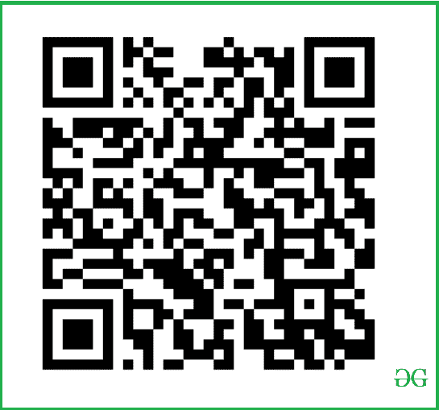
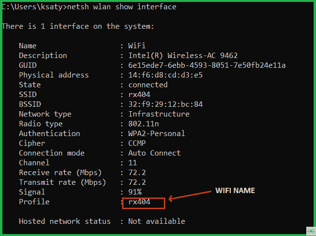
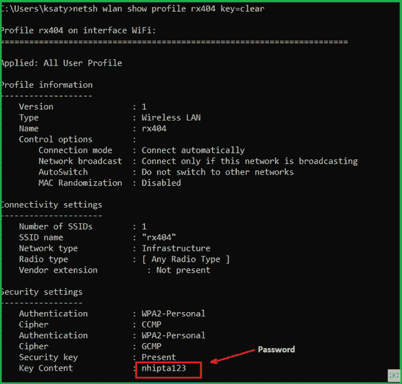
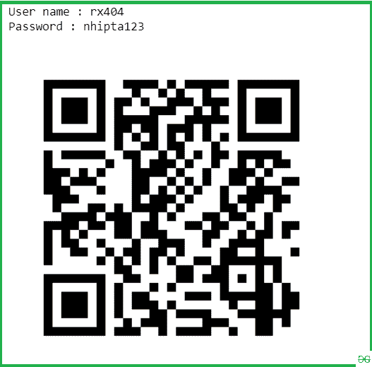

# 使用 Python 的 Wi-Fi 二维码生成器

> 原文:[https://www . geesforgeks . org/wi-fi-QR-code-generator-use-python/](https://www.geeksforgeeks.org/wi-fi-qr-code-generator-using-python/)

**先决条件:** [使用 Python 获取保存的 Wifi 密码](https://www.geeksforgeeks.org/getting-saved-wifi-passwords-using-python/)

我们知道无线网络是当今最常见的网络适配器，因为它支持便携性和用户友好性。在本文中，我们将看到如何获取当前保存的 Wi-Fi 名称和密码，并使用 Python 生成二维码来连接其他设备。

在开始之前，我们需要安装 **wifi 二维码生成器**模块，为您的 Wi-Fi 生成一个二维码，让其他人快速连接您的 Wi-Fi:

### 安装:

这个模块没有内置 Python。要安装此软件，请在终端中键入以下命令。

```py
pip install wifi-qrcode-generator
```

用法:

## 蟒蛇 3

```py
# Import module
import wifi_qrcode_generator as qr

# Use wifi_qrcode() to create a QR image
qr.wifi_qrcode('wifi name ', False, 'WPA', 'password')
```

**输出:**



**现在我们来获取 cmd 中当前的 Wi-Fi 名称和密码:**

如果你把这个 **netsh wlan 显示界面**代码写入 cmd 终端，那么你会得到各种细节:



如果您将此**netsh WLAN show Profile { Profile Name }密钥=clear** 代码写入您的终端，那么您将获得网络密钥。



**进场:**

1.  导入模块**子流程**和 **wifi 二维码生成器**模块。
2.  使用**子进程获取命令**网络无线局域网显示界面**的输出。**
3.  用 utf-8 解码输出，根据行分割元数据。
4.  现在获取分割字符串，找到您当前的 Wi-Fi 名称( *SSID 名称*)。
5.  现在对密码做同样的操作，找到 Wi-Fi 密码(*密钥内容*)。
6.  现在生成你的无线二维码。

下面是实现。

## 蟒蛇 3

```py
# import modules
import subprocess
import wifi_qrcode_generator

# try catch block begins
# try block
try:

    # traverse the profile
    Id = subprocess.check_output(
        ['netsh', 'wlan', 'show', 'interfaces']).decode('utf-8').split('\n')

    id_results = str([b.split(":")[1][1:-1]
                      for b in Id if "Profile" in b])[2:-3]

    # traverse the password
    password = subprocess.check_output(
        ['netsh', 'wlan', 'show', 'profiles',
         id_results, 'key=clear']).decode('utf-8').split('\n')

    pass_results = str([b.split(":")[1][1:-1]
                        for b in password if "Key Content" in b])[2:-2]
    print("User name :", id_results)
    print("Password :", pass_results)

except:
    print("something wrong")

# generate Qr code
wifi_qrcode_generator.wifi_qrcode(id_results, False, 'WPA', pass_results)
```

**输出:**

