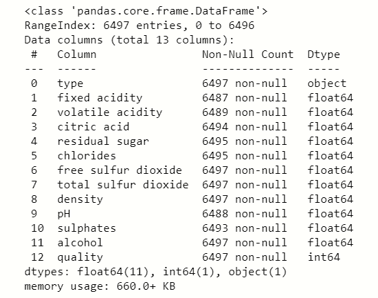
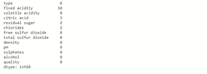
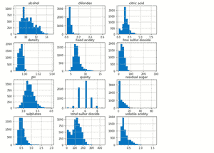
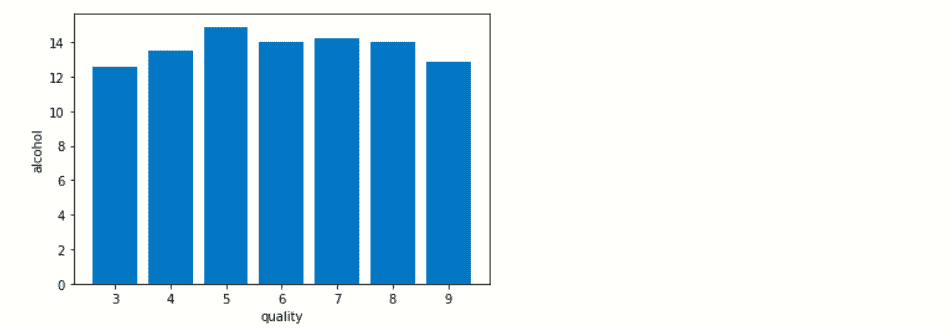
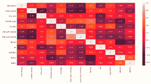
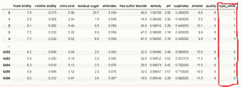
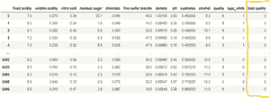
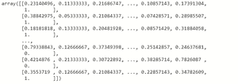

# 葡萄酒质量预测-机器学习

> 原文:[https://www . geesforgeks . org/wine-quality-prediction-machine-learning/](https://www.geeksforgeeks.org/wine-quality-prediction-machine-learning/)

这里我们将在给出特征的基础上预测葡萄酒的质量。我们使用来自卡格尔的葡萄酒质量数据集。该数据集具有影响葡萄酒质量的基本特征。通过使用几个机器学习模型，我们将预测葡萄酒的质量。这里我们将只处理白葡萄酒的质量，我们使用分类技术来进一步检查葡萄酒的质量，即它是好的还是坏的。

**数据集** : [此处](https://www.kaggle.com/rajyellow46/wine-quality)

**数据集描述:**

在这个数据集中，类是有序的，但它不是平衡的。在这里，红酒实例出现率很高，而白酒实例比红酒少。

这些是数据集中要素的名称:

1.  类型
2.  固定酸度
3.  挥发性酸度
4.  柠檬酸
5.  残糖
6.  氯化物
7.  游离二氧化硫
8.  二氧化硫总量
9.  密度
10.  pH 值
11.  硫酸盐
12.  酒精
13.  质量

### 导入重要库:

## 蟒蛇 3

```
# import libraries

import pandas as pd
import numpy as np
import matplotlib.pyplot as plt
import seaborn as sb
```

**Pandas** 是数据分析中有用的库， **Numpy** 库用于处理数组， **Seaborn** 和 **Matplotlib** 用于数据可视化。

### 阅读日期

## 蟒蛇 3

```
# loading the data
Dataframe = pd.read_csv(R'D:\\xdatasets\winequalityN.csv')
```

熊猫 **read_csv** 功能用于读取 csv 文件。

### 数据检查:

## 蟒蛇 3

```
# show rows and columns
Dataframe.head()
```

**输出:**


## 蟒蛇 3

```
# getting info.
Dataframe.info()
```

**输出:**



## 蟒蛇 3

```
Dataframe.describe()
```

**输出:**


### 检查空值:

## 蟒蛇 3

```
# null value check
Dataframe.isnull().sum()
```

**输出:**



### 数据可视化:

## 计算机编程语言

```
# plot pairplot
sb.pairplot(Dataframe)
#show graph
plt.show()
```

**输出:**


## 蟒蛇 3

```
#plot histogram
Dataframe.hist(bins=20,figsize=(10,10))
#plot showing
plt.show()
```

**输出:**



## 蟒蛇 3

```
plt.figure(figsize=[15,6])
plt.bar(df['quality'],df['alcohol'])
plt.xlabel('quality')
plt.ylabel('alcohol')
plt.show()
```

**输出:**



s

我们检查葡萄酒的质量如何随着葡萄酒中酒精含量的增加而提高。

### 检查相关性:

这里我们使用统计方法来评估两个定量变量之间的关系的结合强度。

## 蟒蛇 3

```
# correlation by visualization
plt.figure(figsize=[18,7])
# plot correlation
sb.heatmap(Dataframe.corr(),annot=True)
plt.show()
```

**输出:**



从这个相关性可视化，我们将发现哪些特征与其他特征相关。所以我们将使用 python 程序来找到这些特性。

## 蟒蛇 3

```
colm = []
# loop for columns
for i in range(len(Dataframe.corr().keys())):
# loop for rows
  for j in range(j):
    if abs(Dataframe.corr().iloc[i,j]) > 0.7:
      colm = Dataframe.corr().columns[i]
```

通过这些代码，我们将发现**“总二氧化硫”**具有大于 0.7 的相关值，因此，我们删除此列。

## 蟒蛇 3

```
# drop column
new_df = Dataframe.drop('total sulfur dioxide',axis = 1)
```

### 填充空值:

我们用特定特征的均值填充所有空值，直接用 *update()* 方法更新数据集。

## 计算机编程语言

```
new_df.update(new_df.fillna(new_df.mean()))
```

### 处理分类列:

## 蟒蛇 3

```
# no of categorical columns
cat = new_df.select_dtypes(include='O')
# create dummies of categorical columns
df_dummies = pd.get_dummies(new_df,drop_first = True)
print(df_dummies)
```



我们使用熊猫***get _ dummies()*****函数来处理分类列，在这个数据集中**‘Type’**特征包含两种类型**红色**和**白色，**所以 *get_dummies()* 函数将其转换为二进制格式，因为计算机不理解对象类型。因为红酒是 1，白酒是 0。**

### ****从属和独立特征:****

**基本上，我们将使用分类技术将我们的模型拟合到数据集中，以获得更好的精度，因此我们将对相关特征进行一些基本的更改。**

## **蟒蛇 3**

```
df_dummies['best quality']=[1 if x>=7 else 0 for x in Dataframe.quality]
print(df_dummies)
```

**

我们创建一个程序，其中如果从属特征“**质量”**值大于 7，那么它将被认为是 **1** ，如果它们小于 7，那么我们认为它是 **0** ，并且这将被存储在新创建的列**“最佳质量”**中。

### 将数据集分割成训练和测试:

## 蟒蛇 3

```
# import libraries
from sklearn.preprocessing import train_test_split

# independent variables
x = df_dummies.drop(['quality','best quality'],axis=1)
# dependent variable
y = df_dummies['best quality']

# creating train test splits
xtrain,xtest,ytrain,ytest = train_test_split(x,y,test_size=0.2,random_state=40)
```

### 数字特征的标准化；

我们将使用归一化技术来缩放我们的数据，因为在我们的要素中，数据范围很大，所以该技术平衡了 0 到 1 之间的范围。

## 蟒蛇 3

```
# code
# import libraries

from sklearn.preprocessing import MinMaxScaler
# creating scaler scale var.
norm = MinMaxScaler()
# fit the scale
norm_fit = norm.fit(xtrain)
# transformation of training data
scal_xtrain = norm_fit.transform(xtrain)
# transformation of testing data
scal_xtest = norm_fit.transform(xtest)
print(scal_xtrain)
```



转换后的训练和测试数据自动转换成 n 维数组的形式。

### 应用模型:

我们将应用多个**回归**和**分类**模型来检查准确性分数，但是**随机森林分类器**与另一个模型相比给我们最好的准确性，因此我们使用随机森林分类器。

### 随机应变分类器:

## 蟒蛇 3

```
# code
#import libraries
from sklearn.ensemble import RandomForestClassifier

# for error checking
from sklearn.matrics import mean_squared_error

from sklearn.metrics import classification_report

# create model variable
rnd = RandomForestClassifier()

# fit the model
fit_rnd = rnd.fit(new_xtrain,ytrain)

# checking the accuracy score
rnd_score = rnd.score(new_xtest,ytest)

print('score of model is : ',rnd_score)

print('.................................')

print('calculating the error')

# checking mean_squared error
MSE = mean_squared_error(ytest,y_predict)

# checking root mean squared error
RMSE = np.sqrt(MSE)

print('mean squared error is : ',MSE)

print('root mean squared error is : ',RMSE)

print(classification_report(ytest,x_predict))
```

**输出:**


随机森林分类器的准确率为 **88%** ，与其他模型相比，错误率也较低。该模型预测白酒质量的准确率为 88%。

### 数值预测:

将预测值与我们的原始值进行比较，以检查我们的模型是否预测了真实值:

## 蟒蛇 3

```
# code
x_predict = list(rnd.predict(xtest))
df = {'predicted':x_predict,'original':ytest}
pd.DataFrame(df).head(10)
```

**输出:**


根据我们的输出，我们看到原始测试值与我们的 RandomForestClassifier 模型预测值非常相似。这里 **1** 代表优质酒认为大于 0.7 的品质，0 代表 0.7 以下不认为是优质酒的品质。**