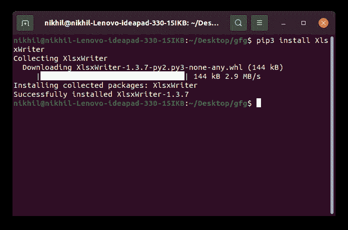
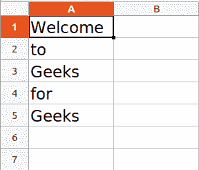

# 使用 XlsxWriter 模块–Python

> 原文:[https://www . geesforgeks . org/work-with-xlsxwriter-module-python/](https://www.geeksforgeeks.org/working-with-xlsxwriter-module-python/)

**XlsxWriter** 是一个 Python 模块，提供了使用 Python 处理 Excel 的各种方法。它可以用来读、写、应用公式。此外，它还支持格式、图像、图表、页面设置、自动过滤器、条件格式等功能。

本教程旨在借助解释良好的示例和概念，从基础到高级提供关于 XlsxWriter 模块的知识。

## 装置

在深入学习模块之前，让我们先安装它。要安装它，请在终端中键入以下命令。

```
pip install XlsxWriter
```



您应该会看到成功安装的消息。现在，安装完成后，让我们深入了解该模块。

## 创建和写入 Excel

安装后，让我们从编写简单的代码开始，然后我们将理解代码。

**示例:**

## 蟒蛇 3

```
# import xlsxwriter module 
import xlsxwriter 

# Workbook() takes one, non-optional, argument 
# which is the filename that we want to create. 
workbook = xlsxwriter.Workbook('sample.xlsx') 

# The workbook object is then used to add new 
# worksheet via the add_worksheet() method. 
worksheet = workbook.add_worksheet() 

# Use the worksheet object to write 
# data via the write() method. 
worksheet.write('A1', 'Hello..') 
worksheet.write('B1', 'Geeks') 
worksheet.write('C1', 'For') 
worksheet.write('D1', 'Geeks') 

# Finally, close the Excel file 
# via the close() method. 
workbook.close() 
```

**输出:**


在上面的例子中，我们调用了函数 **Workbook()** ，用于创建一个空的工作簿。Excel 文件将以 sample.xlsx 的名称创建，然后使用 **add_worksheet()** 方法向工作簿中添加电子表格，该电子表格保存在对象名称工作表下。然后使用 **write()** 方法将数据写入电子表格。第一个参数用于传递单元格名称。单元格名称也可以通过索引名称传递，例如 A1 被索引为(0，0)，B1 是(0，1)，A2 是(1，0)，B2 是(1，1)。

**注意:**在 XlsxWriter 中，行和列是零索引的。

现在让我们看看如何向特定的行或列添加数据。见下面的例子。

**示例:**

## 蟒蛇 3

```
# import xlsxwriter module 
import xlsxwriter 

workbook = xlsxwriter.Workbook('sample.xlsx') 
worksheet = workbook.add_worksheet() 

# Start from the first cell. 
# Rows and columns are zero indexed. 
row = 0
column = 0

content = ["Welcome", "to", "Geeks", "for", "Geeks"] 

# iterating through content list 
for item in content : 

    # write operation perform 
    worksheet.write(row, column, item) 

    # incrementing the value of row by one 
    # with each iterations. 
    row += 1

workbook.close()
```

**输出:**



您可能已经看到，我们正在使用索引号来写入特定的行。同样，我们可以使用类似的方式写入特定的列。

XlsxWriter 模块还提供了 **write_row()** 和 **write_column()** 方法来写入特定的行或列。

**示例:**

## 蟒蛇 3

```
# import xlsxwriter module 
import xlsxwriter 

workbook = xlsxwriter.Workbook('sample.xlsx') 
worksheet = workbook.add_worksheet() 

content = ["Welcome", "to", "Geeks", "for", "Geeks"] 

# Writing to row and column respectively
worksheet.write_row(0, 1, content)
worksheet.write_column(1, 0, content)

workbook.close()
```