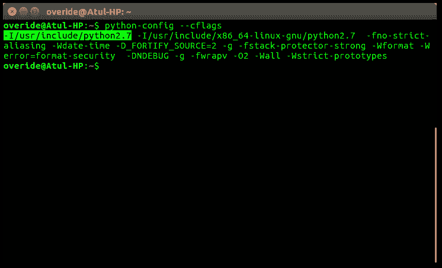
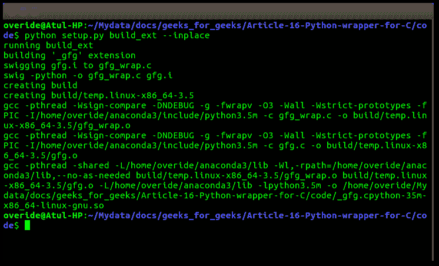

# 使用 SWIG 包装 Python 的 C/c++–设置 1

> 原文:[https://www . geesforgeks . org/wrapping-cc-python-using-swig-set-1/](https://www.geeksforgeeks.org/wrapping-cc-python-using-swig-set-1/)

毫无疑问 [C 比 Python 更快](https://www.geeksforgeeks.org/c-considered-faster-languages/)那么像**T3】NumpyT5 这样的 Python 库是如何如此快速高效地执行庞大的数字运算工作的呢？事实上，像 Numpy 这样的库并不是完全用 Python 编写的，库的某些部分是用 C 编写的，这提供了性能提升。在用 C 语言编写代码之后，我们用 Python 代码包装它们，这就像是这些 C 代码的接口。然后，我们可以使用 Python 语法调用 C 函数，其中实际处理在场景后面用 C 语言完成，结果作为 Python 对象返回。在本文中，我们将看到如何使用名为 **SWIG** 的软件在 Linux 系统上为我们的 C 程序创建 Python 包装器。**

**什么是 SWIG**

简而言之，SWIG 是一个编译器，它接受 C/C++声明，并创建一个从 Python、Tcl、Ruby 等其他语言访问这些声明所需的包装器。
它通常不需要改变现有代码，并在一分钟内创建一个接口。

**创建包装的原因**

在许多情况下，我们需要包装器，以下是其中的一些–

*   为现有的 C 程序构建解释接口。
*   为脚本语言构建高性能的 C 模块
*   测试大型 C 程序是一件非常痛苦的事情，所以我们用一些脚本语言编写包装器，比如 Python，在那里编写测试非常容易。等等

**安装 SWIG**

要直接从 apt 存储库中下载 SWIG，请键入以下命令–

```py
sudo apt-get update
sudo apt-get install swig

```

**使用 SWIG 书写包装**

考虑这段 C 代码，它有两个函数和一个全局变量

```py
/* file : gfg.c */

#include <stdio.h>
#include <math.h>

//our header file
#include "gfg.h"
#define ll long long

double myvar = 3.4;

// calculate factorial
ll int fact(ll int n)
{
    if(n <= 1)
        return 1;
    else
        return (n * fact(n-1));
}

//find mod
int my_mod(int n, int m)
{
  return(n % m);
}
```

这是我们的头文件*gfg . h*–

```py
long long int fact(long long int n);
int my_mod(int n, int m);
```

首先，我们要创建一个 **SWIG 接口**文件。这个文件包含 ANSI C 函数原型和变量声明。这里–

*   **%模块**指令指定了我们将在 Python 中使用的模块的名称。
*   **% { 0..%** }块提供了一个位置，可以将附加代码(如 C 头文件或附加 C 声明)插入到生成的包装代码中。
*   **%include** 指令让我们包含头文件之类的附加文件。

```py
/* file : gfg.i */

/* name of module to use*/
%module gfg
%{
    /* Every thing in this file is being copied in 
     wrapper file. We include the C header file necessary
     to compile the interface */
    #include "gfg.h"

    /* variable declaration*/
    double myvar;
%}

/* explicitly list functions and variables to be interfaced */
double myvar;
long long int fact(long long int n1);
int my_mod(int m, int n);

/* or if we want to interface all functions then we can simply
   include header file like this - 
   %include "gfg.h"
*/
```

现在我们将使用类似*$ swig-target _ language _ interface _ file . I*的命令创建包装代码

```py
$ swig -python gfg.i

```

执行此命令后，将创建名为**“gfg _ wrap . c”**的包装代码。这个文件包含了我们原始 C 代码的一个臃肿版本，带有各种错误处理代码等。另一个文件**“gfg . py”**被生成，这是我们将在 python 脚本中导入的模块。

之后，我们必须通过使用以下命令编译**“gfg _ wrap . c”**和**“gfg . c”**来生成将在共享库中使用的位置无关代码–

```py
$ gcc -c -fpic gfg_wrap.c gfg.c -I/use/include/python2.7

```

用您的 python 版本替换 python2.7。这将生成两个对象文件
**【gfg _ wrap . o】**和**【gfg . o】**。在上述命令中–

*   *-fpic* 生成适合在共享库中使用的位置无关代码(pic)，如果目标机器支持的话。这样的代码通过全局偏移表(GOT)访问所有的常量地址

**注意:**如果出现类似*“…‘python . h’文件找不到”*的错误，以下可能是原因–

*   您可能没有“Python.h”文件或
*   您向编译器提供了错误的“Python.h”文件位置

要获得“Python.h ”,您必须使用以下命令安装**Python-dev**—

```py
$ sudo apt-get install python-dev

```

要找到“Python.h”的正确路径，请执行以下命令–

```py
$ python-config --cflags

```

这将输出类似于这样的内容–

现在用 python2.7 的路径替换编译命令中的路径，或者将 python3.5 的版本更改为**【Python 3.5 的 T4】。**

现在，最后，我们必须将生成的对象文件链接在一起，以创建一个类似于 windows 中 **dll** 文件的共享对象。使用以下命令，这将生成一个**“_ gfg . so”**共享对象文件–

```py
$ gcc -shared gfg.o gfg_wrap.o -o _gfg.so

```

现在，我们准备通过导入 python 包装器来测试它。确保您在包含此包装文件的目录中。

```py
>>> import gfg
>>> res = fact(5)
>>> res
120
>>> res = my_mod(5,2)
>>> res
1
>>> gfg.cvar.myvar
3.4

```

这里 C 变量作为*模块. cvar.var_name* 访问。

**使用 distutils 编译和链接**

我们可以使用 distutils 自动完成，而不是键入命令并弄清楚编译文件需要哪些编译选项。如下所示创建*设置*

```py
# File : setup.py

from distutils.core import setup, Extension
#name of module
name  = "gfg"

#version of module
version = "1.0"

# specify the name of the extension and source files
# required to compile this
ext_modules = Extension(name='_gfg',sources=["gfg.i","gfg.c"])

setup(name=name,
      version=version,
      ext_modules=[ext_modules])
```

现在编写以下命令来编译和安装模块–

```py
$ python setup.py build_ext --inplace

```

终端上应该是这样的–


**可能的替代方案**

显然，SWIG 不是创建包装器的唯一方法，可以根据需求考虑以下替代方法

*   [手动包装](https://docs.python.org/2/extending/extending.html)
*   [派热克斯](https://www.cosc.canterbury.ac.nz/greg.ewing/python/Pyrex/)
*   ctypes(内置模块)
*   [SIP](https://pypi.python.org/pypi/SIP/4.19.2)

在下一篇文章中，我们将看到如何为 C++代码创建包装器(OPP)

**参考文献**

*   [http://www.swig.org/Doc3.0/Introduction.html](http://www.swig.org/Doc3.0/Introduction.html)

本文由 [**阿图尔·库马尔**](https://www.linkedin.com/in/atul-kumar-733b32136/) 供稿。如果你喜欢 GeeksforGeeks 并想投稿，你也可以使用[contribute.geeksforgeeks.org](http://www.contribute.geeksforgeeks.org)写一篇文章或者把你的文章邮寄到 contribute@geeksforgeeks.org。看到你的文章出现在极客博客主页上，帮助其他极客。

如果你发现任何不正确的地方，或者你想分享更多关于上面讨论的话题的信息，请写评论。