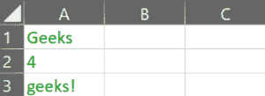
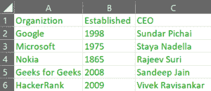

# 逐行将数据从 Python 列表写入 CSV

> 原文:[https://www . geesforgeks . org/writing-data-from-a-python-list-to-CSV-row-wise/](https://www.geeksforgeeks.org/writing-data-from-a-python-list-to-csv-row-wise/)

[逗号分隔值(CSV)](https://www.geeksforgeeks.org/working-csv-files-python/) 文件是一种纯文本文档，其中表格信息是使用特定格式构建的。CSV 文件是一种有界文本格式，使用逗号分隔值。将列表中的数据写入 CSV 文件最常见的方法是`writer`和`DictWriter`类的`writerow()`方法。

**示例 1:**
创建一个 CSV 文件，并使用`writer`类向其中逐行写入数据。

```
# Importing library
import csv

# data to be written row-wise in csv fil
data = [['Geeks'], [4], ['geeks !']]

# opening the csv file in 'w+' mode
file = open('g4g.csv', 'w+', newline ='')

# writing the data into the file
with file:    
    write = csv.writer(file)
    write.writerows(data)
```

**输出:**

**示例 2:**
使用`DictWriter`类将数据逐行写入现有 CSV 文件。

```
# importing library
import csv

# opening the csv file in 'w' mode
file = open('g4g.csv', 'w', newline ='')

with file:
    # identifying header  
    header = ['Organization', 'Established', 'CEO']
    writer = csv.DictWriter(file, fieldnames = header)

    # writing data row-wise into the csv file
    writer.writeheader()
    writer.writerow({'Organization' : 'Google', 
                     'Established': '1998', 
                     'CEO': 'Sundar Pichai'})
    writer.writerow({'Organization' : 'Microsoft', 
                     'Established': '1975',
                     'CEO': 'Satya Nadella'})
    writer.writerow({'Organization' : 'Nokia',
                     'Established': '1865',
                     'CEO': 'Rajeev Suri'})
```

**输出:**


**示例 3:**
使用`writer`类将数据逐行追加到现有 CSV 文件中。

```
# Importing library
import csv

# data to be written row-wise in csv fil
data = [['Geeks for Geeks', '2008', 'Sandeep Jain'],
        ['HackerRank', '2009', 'Vivek Ravisankar']]

# opening the csv file in 'a+' mode
file = open('g4g.csv', 'a+', newline ='')

# writing the data into the file
with file:    
    write = csv.writer(file)
    write.writerows(data)
```

**输出:**
