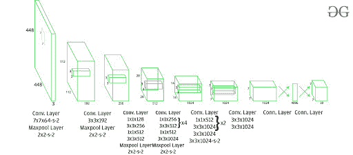
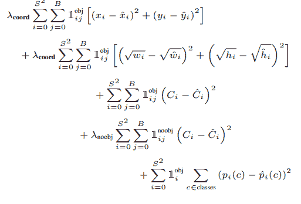
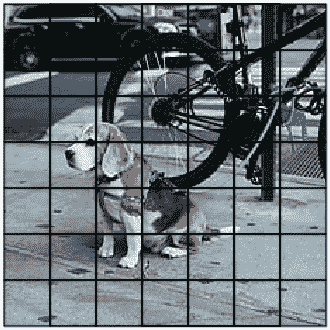
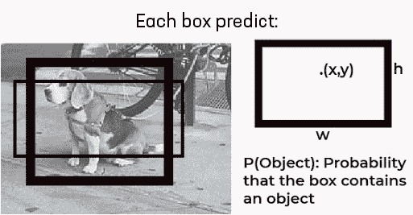
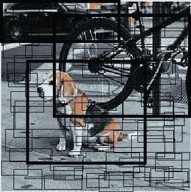
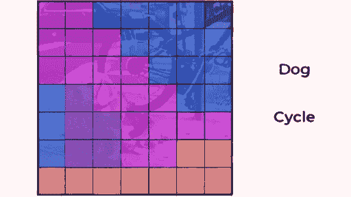
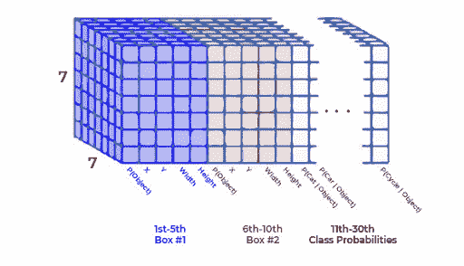
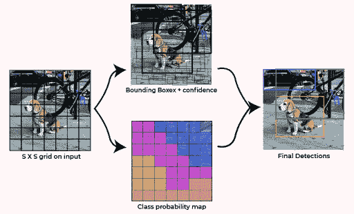

# YOLO:你只看一次——实时物体检测

> 原文:[https://www . geesforgeks . org/yolo-you-only-look-only-time-object-detection/](https://www.geeksforgeeks.org/yolo-you-only-look-once-real-time-object-detection/)

YOLO 是约瑟夫·雷德蒙*等人*在 2015 年提出的。提出应对当时的物体识别模型所面临的问题，Fast R-CNN 是当时最先进的模型之一，但它也有自己的挑战，比如这个网络不能实时使用，因为预测一幅图像需要 2-3 秒，因此不能实时使用。

**架构:**

该架构以一幅图像为输入，通过保持长宽比不变并进行填充，将其大小调整为 *448*448* 。这张照片随后在美国有线电视新闻网上传播。该模型有 *24 个卷积层，4 个最大池层，后面是 2 个全连接层*。为了减少层数(通道)，我们使用 *1*1* 卷积，然后是 *3*3* 卷积。请注意，YOLOv1 的最后一层预测了长方体输出。这是通过从最终完全连接的层生成 *(1，1470)* 并将其整形至尺寸 *(7，7，30)* 来完成的。

除了使用线性激活函数的层之外，该体系结构在整个体系结构中使用泄漏 ReLU 作为其激活函数。漏 ReLU 的定义可以在[这里](https://www.geeksforgeeks.org/understanding-activation-functions-in-depth)找到。批处理规范化也有助于规范模型。通过批处理规范化，我们可以在不过度拟合的情况下消除模型中的遗漏。

**训练:**
该模型在 *ImageNet-1000* 数据集上训练。该模型经过一周多的训练，在 ImageNet 2012 验证上达到 *88%的前 5 名准确率，与当时最先进的模型 GoogLeNet (2014 ILSVRC 获得者)相当。快速 YOLO 使用更少的图层 *(9 层而不是 24 层)*和更少的滤镜。除此之外，快速 YOLO 的所有参数都与 YOLO 相似。YOLO 使用易于优化的平方和误差损失函数。然而，该功能对分类和本地化任务给予同等的权重。在 YOLO 定义的损失函数如下:* 

其中，
表示对象是否存在于单元格 *i* 中。
表示边界框，负责预测单元格 *i* 中的对象。

和是平衡损失函数所需的正则化参数。
在这个模型中，我们取和

上述损失方程的前两部分代表局部化均方误差，但另外三部分代表分类误差。在定位误差中，第一项计算与地面真实边界框的偏差。第二项计算边界框的高度和宽度之差的平方根。在第二项中，我们取宽度和高度的平方根，因为我们的损失函数应该能够根据边界框的大小考虑偏差。对于小边界框，与大边界框相比，小偏差应该更重要。
分类损失有三项，第一项计算每个单元格中每个包围盒的预测置信度得分和地面真实值之间的平方和误差。类似地，第二项计算不包含任何边界框的单元的均方和，并且正则化参数用于使这种损失变小。第三项计算属于这些网格单元的类的平方和误差。

**检测:**
这个架构将图像分割成 *S*S* 大小的网格。如果对象的边界框的中心在该网格中，则该网格负责检测该对象。每个网格用它们的置信度得分来预测边界框。每个置信度得分显示预测的边界包含一个对象的精确度，以及它预测边界框坐标 wrt 的精确度。地面真实预测。

YOLO 图像(分为 S*S 网格)

在测试时，我们将条件类概率和单个盒子置信度预测相乘。我们将信心得分定义如下:

注意，当网格中不存在物体时，置信度得分应为 *0* 。如果图像中存在物体，置信分数应等于地面真实值和预测值框之间的 IoU。每个边界框由 5 个预测组成: *(x，y，w，h)* 和置信度得分。 *(x，y)* 坐标表示相对于网格单元边界的盒子中心。 *h，w* 坐标表示边界框相对于 *(x，y)* 的高度、宽度。置信度得分表示边界框中对象的存在。

YOLO 单网格边界框

这导致每个网格的边界框组合如下。

YOLO 边界框组合

每个网格还预测 C 条件类概率，P r (类 i | Object)。

YOLO 条件概率图

这种概率是以网格单元中存在物体为条件的。不管盒子的数量是多少，每个网格单元只预测一组类概率。这些预测被编码在大小为 S * S * (5*B +C)的 3D 张量中。

现在，我们将条件类概率和单个框置信度预测相乘，

YOLO 输出特征图

YOLO 测试结果

它给出了每个盒子的特定类别的置信度得分。这些分数编码了该类出现在框中的概率以及预测框与对象的匹配程度。然后在我们应用非最大抑制来预测生成输入的最终结果
之后，YOLO 在测试时非常快，因为它只使用单个 CNN 架构来预测结果，并且 lass 的定义方式是将分类视为回归问题。

**结果:**
单纯的 YOLO 在 2007 年和 2012 年进行 VOC 训练时的 mAP 为*的 63.4%* ，在结果生成上几乎快于*3 倍*的快速 YOLO 的 mAP 为 52%。这低于最佳快速 R-CNN 型号实现的 *(71% mAP)* ，也低于 R-CNN 实现的 *(66% mAP)* 。然而，它在准确性上胜过其他实时检测器，如 *(DPMv5 33% mAP)* 。

**YOLO 的好处:**

*   以 *45 fps* (较大网络)到 *150 fps* (较小网络)的速率处理帧，比实时性更好。
*   网络能够更好地概括图像。

**YOLO 的劣势:**

*   相对于较快的无线网络，召回率较低，定位误差较大。
*   很难检测到接近的物体，因为每个网格只能提出 2 个边界框。
*   努力探测小物体。