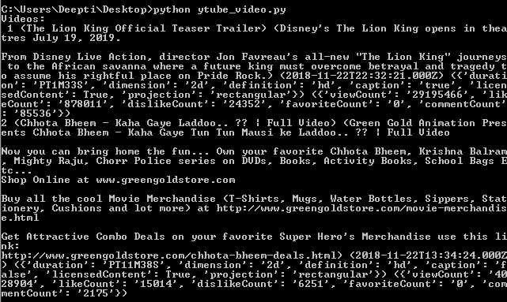
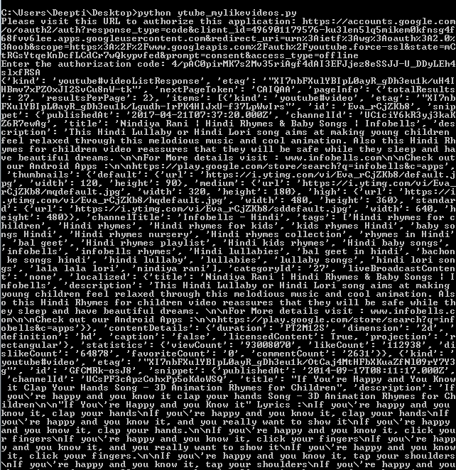
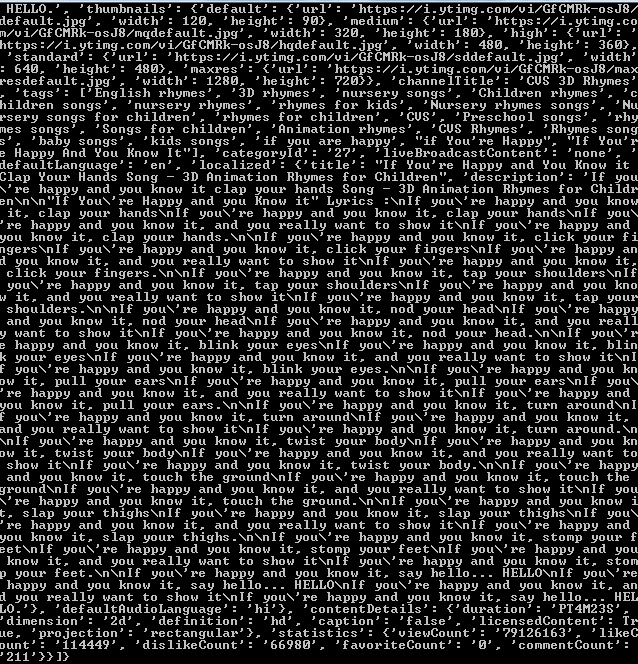

# 处理视频的 Youtube 数据 API | Set-2

> 原文:[https://www . geesforgeks . org/YouTube-data-API-for-handling-videos-set-2/](https://www.geeksforgeeks.org/youtube-data-api-for-handling-videos-set-2/)

前提条件:[处理视频的 Youtube 数据 API | Set-1](https://www.geeksforgeeks.org/youtube-data-api-for-handling-videos-set-1/)

我们最近讨论了视频列表方法的前两种变体，按视频标识列出视频列表和按多个视频标识列出视频列表。现在，让我们讨论另外两个变体–

*   视频列表最受欢迎的视频
*   视频列表我喜欢的视频

*   **List most popular videos:** The `regionCode` parameter states the country for which you are retrieving videos. `videoCategoryId` parameter can be set to retrieve most popular videos in a particular category.

    ```
    # import libraries
    from apiclient.discovery import build
    import pprint

    # arguments to be passed to build function
    DEVELOPER_KEY = "Your_developer_key"
    YOUTUBE_API_SERVICE_NAME = "youtube"
    YOUTUBE_API_VERSION = "v3"

    # creating youtube resource object
    # for interacting with API
    youtube = build(YOUTUBE_API_SERVICE_NAME, 
                         YOUTUBE_API_VERSION,
                developerKey = DEVELOPER_KEY)

    def mostpopular_video_details():

        # Call the videos.list method to retrieve video info
        list_videos_byid = youtube.videos().list(
            part = "id, snippet, contentDetails, statistics",
                      chart ='mostPopular', regionCode ='IN', 
               maxResults = 2, videoCategoryId ='').execute()

        # extracting the results from search response
        results = list_videos_byid.get("items", [])

        # empty list to store video details
        videos = []
        n = 1
        for result in results:
            videos.append("% s (% s) (% s) (% s) (% s) (% s)"
                            % (n, result["snippet"]["title"],
                            result['snippet']['description'],
                            result["snippet"]["publishedAt"],
                                    result['contentDetails'],
                                       result["statistics"]))
            n = n + 1

        print ("Videos:\n", "\n".join(videos), "\n")

    if __name__ == "__main__":
        mostpopular_video_details()
    ```

    **输出:**
    

*   **List my liked videos:** This requires user’s authorization to retrieve a user’s liked videos. By setting the `myRating` parameter to dislike, one can retrieve the disliked videos. `myRating` parameter indicates that the search should be done within the authorized user’s account. Since this method requires user’s authentication so we will be creating `OAuth` type of credential for this example. Follow the steps below to generate a Client Id and a Secret Key.
    1.  进入谷歌[谷歌开发者控制台](https://developers.google.com/)，点击页面右上角的登录。使用有效谷歌帐户的凭据登录。如果您没有谷歌帐户，请先设置一个帐户，然后使用详细信息登录谷歌开发者主页。
    2.  现在导航到开发人员仪表板并创建一个新项目。
    3.  单击启用应用编程接口选项。
    4.  在搜索字段中，搜索 Youtube 数据应用编程接口，并选择下拉列表中的 Youtube 数据应用编程接口选项。
        
    5.  您将被重定向到一个显示关于 Youtube 数据应用编程接口信息的屏幕，以及两个选项:*启用和尝试应用编程接口*。
    6.  点击**启用**选项开始使用应用编程接口。
    7.  在侧栏的“应用程序接口和服务”下，选择`Credentials`。
    8.  在页面顶部，选择`OAuth consent screen`选项卡。选择电子邮件地址，输入产品名称(如果尚未设置)，然后单击保存按钮。
    9.  在凭据选项卡中，选择创建凭据下拉列表，然后选择`OAuth Client Id`。OAuth 通常用于需要授权的地方，比如检索用户喜欢的视频。
    10.  选择应用类型其他，输入名称“YouTube 数据 API 我的视频”，点击创建按钮，点击确定。
    11.  点击客户端标识右侧的下载按钮，下载 JSON 文件。
    12.  将文件保存并重命名为`client_secret.json`并移动到工作目录。

    使用`pip`命令安装附加库:

    ```
    pip install --upgrade google-auth google-auth-oauthlib google-auth-httplib2
    ```

    以下是示例:

    ```
    # importing libraries
    import os
    import google.oauth2.credentials
    import google_auth_oauthlib.flow
    from googleapiclient.discovery import build
    from googleapiclient.errors import HttpError
    from google_auth_oauthlib.flow import InstalledAppFlow

    # The CLIENT_SECRETS_FILE variable specifies
    # the name of a file that contains
    # client_id and client_secret.
    CLIENT_SECRETS_FILE = "client_secret.json"

    # This scope allows for full read / write
    # access to the authenticated user's account
    # and requires requests to use an SSL connection.
    SCOPES = ['https://www.googleapis.com / auth / youtube.force-ssl']
    API_SERVICE_NAME = 'youtube'
    API_VERSION = 'v3'

    def get_authenticated_service():

        flow = InstalledAppFlow.from_client_secrets_file(
                            CLIENT_SECRETS_FILE, SCOPES)

        credentials = flow.run_console()
        return build(API_SERVICE_NAME, API_VERSION,
                        credentials = credentials)

    def print_response(response):
        print(response)

    # Build a resource based on a list 
    # of properties given as key-value pairs.
    # Leave properties with empty values
    # out of the inserted resource.
    def build_resource(properties):
        resource = {}

        for p in properties:

            # Given a key like "snippet.title", split
            # into "snippet" and "title", where
            # "snippet" will be an object and "title"
            # will be a property in that object.
            prop_array = p.split('.')
            ref = resource

            for pa in range(0, len(prop_array)):
                is_array = False
                key = prop_array[pa]

                # For properties that have array values,
                # convert a name like "snippet.tags[]"
                # to snippet.tags, and set a flag to 
                # handle the value as an array.
                if key[-2:] == '[]':
                    key = key[0:len(key)-2:]
                    is_array = True

                if pa == (len(prop_array) - 1):

                    # Leave properties without values
                    # out of inserted resource.
                    if properties[p]:
                        if is_array:
                            ref[key] = properties[p].split(', ')
                        else:
                            ref[key] = properties[p]

                elif key not in ref:

                    # For example, the property is "snippet.title",
                    # but the resource does not yet have a "snippet"
                    # object. Create the snippet object here.
                    # Setting "ref = ref[key]" means that in the
                    # next time through the "for pa in range ..."
                    # loop, we will be setting a property in the
                    # resource's "snippet" object.
                    ref[key] = {}
                    ref = ref[key]

                else:
                    # For example, the property is 
                    # "snippet.description", and the resource
                    # already has a "snippet" object.
                    ref = ref[key]
        return resource

    # Remove keyword arguments that are not set
    def remove_empty_kwargs(**kwargs):

        good_kwargs = {}
        if kwargs is not None:
            for key, value in kwargs.items():
                if value:
                    good_kwargs[key] = value
        return good_kwargs

    def videos_list_my_liked_videos(client, **kwargs): 
        kwargs = remove_empty_kwargs(**kwargs)
        response = client.videos().list(**kwargs).execute()

        return print_response(response)

    if __name__ == '__main__':

        # When running locally, disable OAuthlib's
        # HTTPs verification. When running in production
        # *do not * leave this option enabled.
        os.environ['OAUTHLIB_INSECURE_TRANSPORT'] = '1'

        client = get_authenticated_service()

        videos_list_my_liked_videos(client,
            part ='snippet, contentDetails, statistics',
                    myRating ='like', maxResults = 2)
    ```

    **输出:**

    在执行代码时，它会询问授权代码。要获取代码，我们需要遵循命令行上方的命令提示符屏幕中提到的链接:输入授权代码。
    

    现在按照链接复制粘贴通过授予权限获得的授权码。
    

    为了方便起见，我们将`maxResults` 参数设置为 2。
    

    

    完整的参数列表请参考 [Youtube 数据 API 文档-video.list()](https://developers.google.com/youtube/v3/docs/videos/list) 。

    **参考:**T2】https://developers.google.com/youtube/v3/docs/videos/list