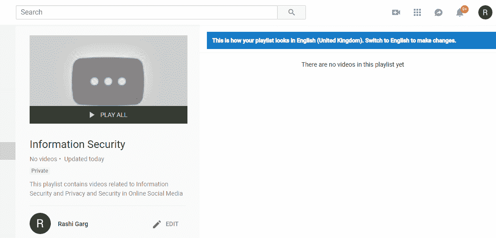
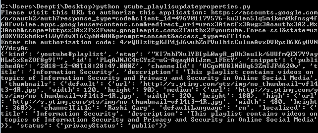
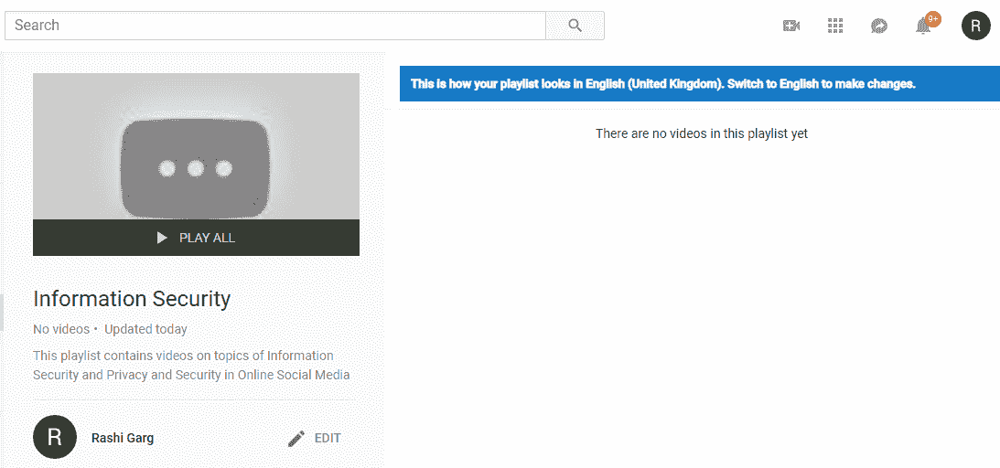
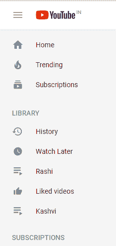

# Youtube 数据 API 播放列表| Set-2

> 原文:[https://www . geesforgeks . org/YouTube-data-API-playlist-set-2/](https://www.geeksforgeeks.org/youtube-data-api-playlist-set-2/)

我们已经讨论了播放列表的前两种方法——列出与频道标识相关联的所有播放列表，检索我的播放列表，即授权用户帐户的播放列表。

现在，我们将讨论另外三种方法:插入播放列表、更新播放列表和删除播放列表。这意味着我们可以只使用应用编程接口来插入，或者我们可以说创建一个新的播放列表，然后我们可以只使用应用编程接口将视频上传到播放列表，或者我们可以给视频评级，将其添加到所需的播放列表中。
现在我们可以推导出一个相关性，通过观察事物是如何相互联系的，以及所有的操作是如何使用 API 完成的。您只需要一组有效的凭据来授权访问。所有这些方法都需要用户授权，所以我们将首先讨论如何创建 *OAuth 凭证*，然后我们将研究这些功能的实现。

按照以下步骤生成客户端标识和密钥。

1.  进入谷歌[谷歌开发者控制台](https://developers.google.com/)点击页面右上角**登录**。使用有效谷歌帐户的凭据登录。如果您没有谷歌帐户，请先设置一个帐户，然后使用详细信息登录谷歌开发者主页。
2.  现在导航到[开发者仪表盘](https://console.developers.google.com/apis/credentials?project=norse-strata-223521)并创建一个新项目。
3.  点击**启用 API 选项**。
4.  在搜索栏中，搜索 **Youtube 数据应用编程接口**，并选择下拉列表中的 Youtube 数据应用编程接口选项。
    T3】
5.  您将被重定向到一个显示关于 Youtube 数据应用编程接口信息的屏幕，以及两个选项:**启用和尝试应用编程接口**。
6.  点击**启用**选项开始使用应用编程接口。
7.  在侧栏的“应用程序接口和服务”下，选择**凭证**。
8.  在页面顶部，选择*审核同意屏幕*选项卡。选择电子邮件地址，输入产品名称(如果尚未设置)，然后单击保存按钮。
9.  在**凭证选项卡**中，选择创建凭证下拉列表，然后选择**验证客户端标识**。OAuth 通常用于需要授权的地方，比如检索用户喜欢的视频。
10.  选择应用类型其他，输入名称“YouTube 数据 API 我的视频”，点击创建按钮，点击确定。
11.  点击客户端 Id 右侧*下载按钮*下载 JSON 文件。
12.  将文件保存并重命名为 client_secret.json，并将其移动到工作目录。

使用 **pip** 命令安装附加库:

```py
pip install --upgrade google-auth google-auth-oauthlib google-auth-httplib2
```

**插入播放列表的代码:**此示例显示了如何在授权用户的帐户中插入/创建播放列表。**片段。标题**是创建新播放列表时的强制属性。其他的是可选的。

```py
import os
import google.oauth2.credentials
import google_auth_oauthlib.flow
from googleapiclient.discovery import build
from googleapiclient.errors import HttpError
from google_auth_oauthlib.flow import InstalledAppFlow

# The CLIENT_SECRETS_FILE variable specifies
# the name of a file that contains
# client_id and client_secret.
CLIENT_SECRETS_FILE = "client_secret.json"

# This scope allows for full read/write
# access to the authenticated user's account
# and requires requests to use an SSL connection.
SCOPES = ['https://www.googleapis.com/auth/youtube.force-ssl']
API_SERVICE_NAME = 'youtube'
API_VERSION = 'v3'

def get_authenticated_service():
    flow = InstalledAppFlow.from_client_secrets_file(
                         CLIENT_SECRETS_FILE, SCOPES)
    credentials = flow.run_console()
    return build(API_SERVICE_NAME, API_VERSION, credentials = credentials)

def print_response(response):
    print(response)

# Build a resource based on a list of 
# properties given as key-value pairs.
# Leave properties with empty values 
# out of the inserted resource.
def build_resource(properties):
    resource = {}
    for p in properties:
        # Given a key like "snippet.title", split
        # into "snippet" and "title", where
        # "snippet" will be an object and "title" 
        # will be a property in that object.
        prop_array = p.split('.')
        ref = resource
        for pa in range(0, len(prop_array)):
        is_array = False
        key = prop_array[pa]

        # For properties that have array values,
        # convert a name like "snippet.tags[]" to 
        # snippet.tags, and set a flag to handle
        # the value as an array.
        if key[-2:] == '[]':
            key = key[0:len(key)-2:]
            is_array = True

        if pa == (len(prop_array) - 1):
            # Leave properties without values 
            # out of inserted resource.
            if properties[p]:
            if is_array:
                ref[key] = properties[p].split(',')
            else:
                ref[key] = properties[p]
        elif key not in ref:
            # For example, the property is "snippet.title",
            # but the resource does not yet have a "snippet"
            # object. Create the snippet object here.
            # Setting "ref = ref[key]" means that in the next
            # time through the "for pa in range ..." loop,
            # we will be setting a property in the
            # resource's "snippet" object.
            ref[key] = {}
            ref = ref[key]
        else:
            # For example, the property is "snippet.description",
            # and the resource already has a "snippet" object.
            ref = ref[key]
    return resource

# Remove keyword arguments that are not set
def remove_empty_kwargs(**kwargs):
    good_kwargs = {}
    if kwargs is not None:
        for key, value in kwargs.items():
        if value:
            good_kwargs[key] = value
    return good_kwargs

def playlists_insert(client, properties, **kwargs):
    resource = build_resource(properties)
    kwargs = remove_empty_kwargs(**kwargs)
    response = client.playlists().insert(
        body=resource,
        **kwargs
    ).execute()

    return print_response(response)

if __name__ == '__main__':
    # When running locally, disable OAuthlib's
    # HTTPs verification. When running in production 
    # *do not* leave this option enabled.
    os.environ['OAUTHLIB_INSECURE_TRANSPORT'] = '1'
    client = get_authenticated_service()

    playlists_insert(client,
        {'snippet.title':'Information Security',
        'snippet.description':'This playlist contains videos \
                   related to Information Security and Privacy \
                   and Security in Online Social Media',

        'snippet.tags[]':'',
        'snippet.defaultLanguage':'EN',
        'status.privacyStatus':''},
        part='snippet,status',
        onBehalfOfContentOwner='')
```

**输出:**
当你执行代码时，你会被要求输入授权码。要获取代码，您需要遵循命令行上方的命令提示符屏幕中提到的链接:输入授权代码。


现在，按照链接复制并粘贴授权代码，您将通过授予权限获得该代码。




从上面的输出中，你可以看到我的帐户中有一个新的播放列表，它的标题和描述与代码中提到的相同，没有添加视频。
我们可以根据您的选择通过代码或从 youtube 手动将视频添加到播放列表中，或者您也可以对视频进行评分以将其添加到播放列表中。
**注意:**你可以通过点击你的首字母的 youtube 页面右上角的图标，然后转到第一个选项注册的电子邮件 id，从可用的库菜单中查看你拥有的播放列表列表。这将在最左侧的垂直菜单中显示库选项。图库列出了您帐户中的所有播放列表。

**更新播放列表的代码:**此示例向您展示了如何更新播放列表属性，如标题、描述或隐私状态。 **id** 和**片段。标题**是强制属性，所有其他属性都是可选的。

```py
import os
import google.oauth2.credentials
import google_auth_oauthlib.flow
from googleapiclient.discovery import build
from googleapiclient.errors import HttpError
from google_auth_oauthlib.flow import InstalledAppFlow

# The CLIENT_SECRETS_FILE variable specifies
# the name of a file that contains
# client_id and client_secret.
CLIENT_SECRETS_FILE = "client_secret.json"

# This scope allows for full read/write
# access to the authenticated user's account
# and requires requests to use an SSL connection.
SCOPES = ['https://www.googleapis.com/auth/youtube.force-ssl']
API_SERVICE_NAME = 'youtube'
API_VERSION = 'v3'

def get_authenticated_service():
    flow = InstalledAppFlow.from_client_secrets_file(
                         CLIENT_SECRETS_FILE, SCOPES)

    credentials = flow.run_console()
    return build(API_SERVICE_NAME, API_VERSION, credentials = credentials)

    def print_response(response):
        print(response)

# Build a resource based on a list of properties
# given as key-value pairs. Leave properties with
# empty values out of the inserted resource.
def build_resource(properties):
    resource = {}
    for p in properties:
        # Given a key like "snippet.title", split into
        # "snippet" and "title", where "snippet" will be
        # an object and "title" will be a property in that object.
        prop_array = p.split('.')
        ref = resource
        for pa in range(0, len(prop_array)):
            is_array = False
            key = prop_array[pa]

        # For properties that have array values,
        # convert a name like "snippet.tags[]" to
        # snippet.tags, and set a flag to handle
        # the value as an array.
        if key[-2:] == '[]':
            key = key[0:len(key)-2:]
            is_array = True

        if pa == (len(prop_array) - 1):
            # Leave properties without values
            # out of inserted resource.
            if properties[p]:
            if is_array:
                ref[key] = properties[p].split(',')
            else:
                ref[key] = properties[p]
        elif key not in ref:
            # For example, the property is "snippet.title",
            # but the resource does not yet have a "snippet"
            # object. Create the snippet object here.
            # Setting "ref = ref[key]" means that in the next
            # time through the "for pa in range ..." loop, 
            # we will be setting a property in the
            # resource's "snippet" object.
            ref[key] = {}
            ref = ref[key]
        else:
            # For example, the property is "snippet.description",
            # and the resource already has a "snippet" object.
            ref = ref[key]
    return resource

# Remove keyword arguments that are not set
def remove_empty_kwargs(**kwargs):
    good_kwargs = {}
    if kwargs is not None:
        for key, value in kwargs.items():
        if value:
            good_kwargs[key] = value
    return good_kwargs

def playlists_updateproperties(client, properties, **kwargs):

    resource = build_resource(properties)
    kwargs = remove_empty_kwargs(**kwargs)
    response = client.playlists().update(
        body=resource,**kwargs).execute()

    return print_response(response)

if __name__ == '__main__':
    # When running locally, disable OAuthlib's
    # HTTPs verification. When running in production 
    # *do not* leave this option enabled.
    os.environ['OAUTHLIB_INSECURE_TRANSPORT'] = '1'
    client = get_authenticated_service()

    playlists_updateproperties(client, 
        {'id': 'PLqAJNJC4tCYs2-uG-AqaqHAIJzm_1FEtY',
        'snippet.title': 'Information Security',
        'snippet.description': 'This playlist contains videos on\
                    topics of Information Security and Privacy and \
                    Security in Online Social Media',

        'snippet.tags[]': '',
        'status.privacyStatus': 'public'},
        part='snippet,status',
        onBehalfOfContentOwner='')
```

**输出:**

当您执行代码时，您将被要求输入授权代码。要获取代码，您需要遵循命令行上方的命令提示符屏幕中提到的链接:输入授权代码。


现在，按照链接复制并粘贴授权代码，您将通过授予权限获得该代码。






如果您比较上一个输出和这个输出的播放列表快照，您可以看到我已经更新了播放列表的描述和隐私状态。

**删除播放列表的代码:**现在是时候删除我们在第一个示例中创建的播放列表了。

```py
import os
import google.oauth2.credentials
import google_auth_oauthlib.flow
from googleapiclient.discovery import build
from googleapiclient.errors import HttpError
from google_auth_oauthlib.flow import InstalledAppFlow

# The CLIENT_SECRETS_FILE variable specifies
# the name of a file that contains
# client_id and client_secret.
CLIENT_SECRETS_FILE = "client_secret.json"

# This scope allows for full read/write access to the
# authenticated user's account and requires requests to use an SSL connection.
SCOPES = ['https://www.googleapis.com/auth/youtube.force-ssl']
API_SERVICE_NAME = 'youtube'
API_VERSION = 'v3'

def get_authenticated_service():
    flow = InstalledAppFlow.from_client_secrets_file(
                         CLIENT_SECRETS_FILE, SCOPES)

    credentials = flow.run_console()
    return build(API_SERVICE_NAME, API_VERSION, credentials = credentials)

def print_response(response):
    print(response)

# Build a resource based on a list of properties
# given as key-value pairs. Leave properties with
# empty values out of the inserted resource.
def build_resource(properties):
resource = {}
for p in properties:
    # Given a key like "snippet.title", split into
    # "snippet" and "title", where "snippet" will be
    # an object and "title" will be a property in that object.
    prop_array = p.split('.')
    ref = resource
    for pa in range(0, len(prop_array)):
    is_array = False
    key = prop_array[pa]

    # For properties that have array values,
    # convert a name like "snippet.tags[]" to
    # snippet.tags, and set a flag to handle
    # the value as an array.
    if key[-2:] == '[]':
        key = key[0:len(key)-2:]
        is_array = True

    if pa == (len(prop_array) - 1):
        # Leave properties without values 
        # out of inserted resource.
        if properties[p]:
        if is_array:
            ref[key] = properties[p].split(', ')
        else:
            ref[key] = properties[p]
    elif key not in ref:
        # For example, the property is "snippet.title",
        # but the resource does not yet have a "snippet"
        # object. Create the snippet object here.
        # Setting "ref = ref[key]" means that in the next
        # time through the "for pa in range ..." loop, we 
        # will be setting a property in the
        # resource's "snippet" object.
        ref[key] = {}
        ref = ref[key]
    else:
        # For example, the property is "snippet.description",
        # and the resource already has a "snippet" object.
        ref = ref[key]
return resource

# Remove keyword arguments that are not set
def remove_empty_kwargs(**kwargs):
    good_kwargs = {}
    if kwargs is not None:
        for key, value in kwargs.items():
        if value:
            good_kwargs[key] = value
    return good_kwargs

    def playlists_delete(client, **kwargs):
    kwargs = remove_empty_kwargs(**kwargs)
    response = client.playlists().delete(**kwargs).execute()

    return print_response(response)

if __name__ == '__main__':
    # When running locally, disable OAuthlib's
    # HTTPs verification. When
    # running in production * do not * 
    # leave this option enabled.
    os.environ['OAUTHLIB_INSECURE_TRANSPORT'] = '1'
    client = get_authenticated_service()

    playlists_delete(client,
        id ='PLqAJNJC4tCYs2-uG-AqaqHAIJzm_1FEtY',
        onBehalfOfContentOwner ='')
```

**输出:**
当你执行代码时，你会被要求输入授权码。要获取代码，您需要遵循命令行上方的命令提示符屏幕中提到的链接:输入授权代码。


现在，按照链接复制并粘贴授权代码，您将通过授予权限获得该代码。


现在，如果您查看 youtube 中的“库”菜单，您将看到播放列表不再存在，并且已被成功删除。


有关属性/属性的完整列表，请查看 [Youtube 数据应用编程接口播放列表](https://developers.google.com/youtube/v3/docs/playlists)的完整文档。

**参考文献:**

1.  https://developers.google.com/youtube/v3/docs/playlists/delete
2.  https://developers.google.com/youtube/v3/docs/playlists/insert
3.  https://developers.google.com/youtube/v3/docs/playlists/update