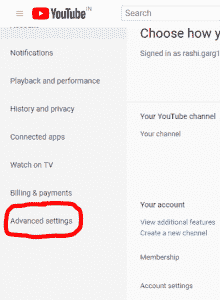

# Youtube 数据 API 订阅| Set-1

> 原文:[https://www . geesforgeks . org/YouTube-data-API-subscription-set-1/](https://www.geeksforgeeks.org/youtube-data-api-subscription-set-1/)

在本文中，我们将讨论 Youtube 订阅。如何使用 API 来检索和操作这些订阅。

我们将讨论三种操作:

1.  列出所有与 Youtube 频道相关的订阅
2.  插入新订阅
3.  删除订阅。

所有这些方法都需要用户授权，因此我们将首先讨论如何获取 OAuth 凭据。
按照以下步骤生成客户端标识和密钥。

1.  进入谷歌[谷歌开发者控制台](https://developers.google.com/)点击页面右上角**登录**。使用有效谷歌帐户的凭据登录。如果您没有谷歌帐户，请先设置一个帐户，然后使用详细信息登录谷歌开发者主页。
2.  现在导航到[开发者仪表盘](https://console.developers.google.com/apis/credentials?project=norse-strata-223521)并创建一个新项目。
3.  点击*启用 API 选项*。
4.  在搜索栏中，搜索 *Youtube 数据应用编程接口*，并选择下拉列表中的 Youtube 数据应用编程接口选项。
    T3】
5.  您将被重定向到一个显示关于 Youtube 数据应用编程接口信息的屏幕，以及两个选项:*启用和尝试应用编程接口*。
6.  点击*启用*选项开始使用应用编程接口。
7.  在侧栏的“应用程序接口和服务”下，选择*凭证*。
8.  在页面顶部，选择*审核同意屏幕*选项卡。选择电子邮件地址，输入产品名称(如果尚未设置)，然后单击保存按钮。
9.  在*凭证选项卡*中，选择创建凭证下拉列表，然后选择*验证客户端标识*。OAuth 通常用于需要授权的地方，比如检索用户喜欢的视频。
10.  选择应用类型其他，输入名称“YouTube 数据 API 我的视频”，点击创建按钮。
11.  单击确定。
12.  点击客户端 Id 右侧*下载按钮*下载 JSON 文件。
13.  将文件保存并重命名为 client_secret.json，并将其移动到工作目录。

使用 **pip** 命令安装附加库:

> pip 安装–升级 Google-auth Google-auth-oauthlib Google-auth-httplicb 2

**注意:**我们来讨论如何找到频道 Id，并在第一个代码中将其用作参数——列出与某个 Youtube 频道 Id 相关联的所有订阅。

按照以下步骤查找频道标识:

1.  登录您的 Youtube 帐户。
2.  在左上角，单击三行图标并转到设置。
    
3.  现在在左侧的同一菜单中，它将显示高级设置选项。
    
4.  您将在**账户信息**下看到您的频道号。

**代码列出订阅:**这里有三种方法可以完成这个任务。我们将详细讨论这些。

1.  列出与频道标识相关联的订阅
2.  列出自己账户的订阅
3.  检查所需订阅是否存在

**列出与频道 Id 相关联的所有订阅的代码:**此示例显示了如何将频道 Id 用作参数来检索该特定 Youtube 频道的所有订阅。

```py
import os
import google.oauth2.credentials
import google_auth_oauthlib.flow
from googleapiclient.discovery import build
from googleapiclient.errors import HttpError
from google_auth_oauthlib.flow import InstalledAppFlow

# The CLIENT_SECRETS_FILE variable specifies 
# the name of a file that contains
# client_id and client_secret.
CLIENT_SECRETS_FILE = "client_secret.json"

# This scope allows for full read/write access 
# to the authenticated user's account and 
# requires requests to use an SSL connection.
SCOPES = ['https://www.googleapis.com/auth/youtube.force-ssl']
API_SERVICE_NAME = 'youtube'
API_VERSION = 'v3'

def get_authenticated_service():
  flow = InstalledAppFlow.from_client_secrets_file(CLIENT_SECRETS_FILE, SCOPES)
  credentials = flow.run_console()
  return build(API_SERVICE_NAME, API_VERSION, credentials = credentials)

def print_response(response):
  print(response)

# Build a resource based on a list of properties
# given as key-value pairs. Leave properties with
# empty values out of the inserted resource.
def build_resource(properties):
  resource = {}
  for p in properties:
    # Given a key like "snippet.title", split into
    # "snippet" and "title", where "snippet" will be
    # an object and "title" will be a property in that object.
    prop_array = p.split('.')
    ref = resource
    for pa in range(0, len(prop_array)):
      is_array = False
      key = prop_array[pa]

      # For properties that have array values, convert a name like
      # "snippet.tags[]" to snippet.tags, and set a flag to handle
      # the value as an array.
      if key[-2:] == '[]':
        key = key[0:len(key)-2:]
        is_array = True

      if pa == (len(prop_array) - 1):
        # Leave properties without values
        # out of inserted resource.
        if properties[p]:
          if is_array:
            ref[key] = properties[p].split(', ')
          else:
            ref[key] = properties[p]
      elif key not in ref:
        # For example, the property is "snippet.title", 
        # but the resource does not yet have a "snippet" object.
        # Create the snippet object here.
        # Setting "ref = ref[key]" means that in the next time
        # through the "for pa in range ..." loop, we will be 
        # setting a property in the resource's "snippet" object.
        ref[key] = {}
        ref = ref[key]
      else:
        # For example, the property is "snippet.description",
        # and the resource already has a "snippet" object.
        ref = ref[key]
  return resource

# Remove keyword arguments that are not set
def remove_empty_kwargs(**kwargs):
  good_kwargs = {}
  if kwargs is not None:
    for key, value in kwargs.items():
      if value:
        good_kwargs[key] = value
  return good_kwargs

def subscriptions_list_by_channel_id(client, **kwargs):
  kwargs = remove_empty_kwargs(**kwargs)

  response = client.subscriptions().list(**kwargs).execute()

  return print_response(response)

if __name__ == '__main__':
  # When running locally, disable OAuthlib's HTTPs verification. 
  # When running in production * do not * leave this option enabled.
  os.environ['OAUTHLIB_INSECURE_TRANSPORT'] = '1'
  client = get_authenticated_service()

  subscriptions_list_by_channel_id(client,
    part ='snippet, contentDetails',
    channelId ='UCqoMU8lNdUq63ZmTJFd620w',
    maxResults = 3)
```

**输出:**

在执行代码时，您将被要求输入授权代码。要获取代码，您需要遵循命令行上方的命令提示符屏幕中提到的链接:输入授权代码。


现在，按照链接复制并粘贴授权代码，您将通过授予权限获得该代码。


我们已经将 maxResults 参数设置为 3，即为什么输出只显示前三个订阅名称。但是你可以从*TotalResurlst*值中看到 38，这意味着在相关的频道中总共有 38 个订阅。
T3】

**参考文献:**https://developers.google.com/youtube/v3/docs/subscriptions